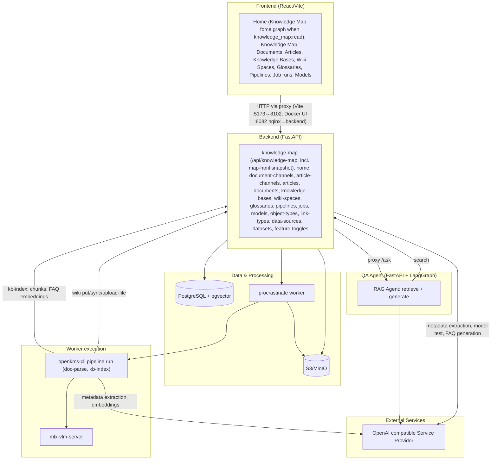
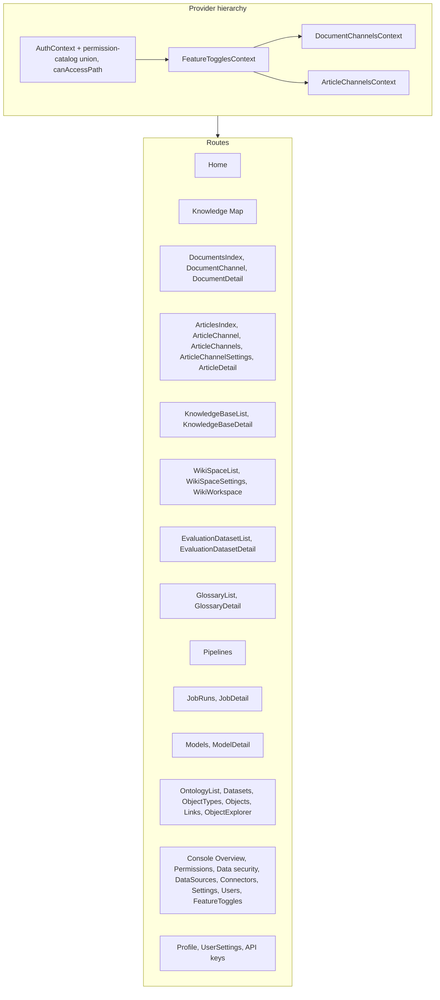
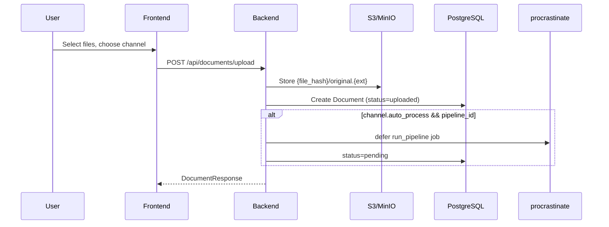
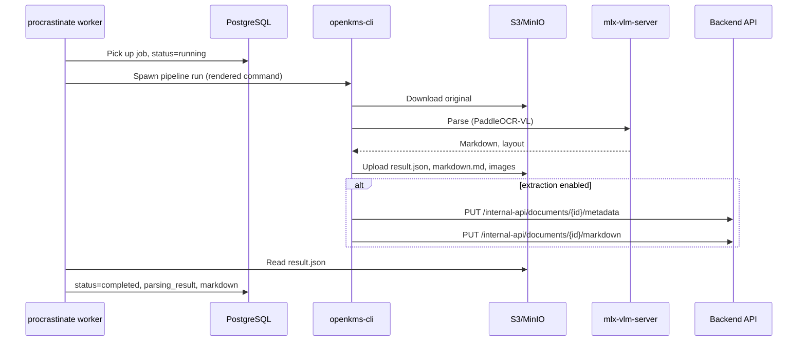
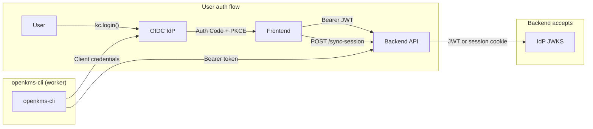

# openKMS Architecture

**`docker/docker-compose.yml`** runs the full stack (Postgres/pgvector, MinIO, **Neo4j** for ontology graph storage, backend, procrastinate worker with `openkms-cli` parse, nginx frontend at **http://localhost:8082**). The **worker** image is **`platform: linux/amd64`** (Paddle wheels on Apple Silicon via emulation) and installs **`libgl1`** for OpenCV/PaddleX plus **LibreOffice (writer + impress)** for **DOCX/PPTX** and **mupdf-tools** (`mutool`) for **EPUB** → PDF before parsing. **Postgres**, **MinIO**, and the **backend** are not published on the host; services use Docker DNS (`postgres`, `minio`, `backend:8102`), and the browser uses **8082** with nginx proxying **`/api`**, **`/internal-api`**, auth routes, and **`/buckets/...`**. Images: **`docker/Dockerfile`** (`backend`, `worker`), **`docker/Dockerfile.frontend`**. From repo root: **`docker compose -f docker/docker-compose.yml`** for **`build`**, **`up -d --build`**, **`down`** (**`docker/README.md`**).

## High-Level Diagram



| Layer | Role |
|-------|------|
| **PostgreSQL + pgvector** | System of record — metadata, permissions, and vector embeddings. Domains: **auth & ACL** (users, roles, groups, resource ACLs), **channels & content** (documents, articles, versions, relationships), **knowledge** (KBs, chunks, FAQs, wiki pages, glossaries), **ontology** (object/link types and instances, datasets), **operations** (pipelines, jobs, models, evaluations, knowledge map), **system** (settings, feature toggles). Full table list: [data-models.md](features/data-models.md). |
| **S3/MinIO** | Large blobs — document originals (`{file_hash}/…`), article bundles, wiki vault mirror and ad-hoc files, cached wiki link-graph JSON. Browser access via presigned redirects from the API. |
| **Worker** | procrastinate worker runs deferred jobs (document parse, KB index, …) by spawning **openkms-cli**; updates status in PostgreSQL. |
| **LLM providers** | External OpenAI-compatible APIs configured as **api_providers** / **api_models** — metadata extraction, FAQ generation, embeddings, playground. |
| **QA Agent** | Separate FastAPI + LangGraph service per knowledge base; searches via backend API only (no direct DB). |
| **Wiki Copilot** | In-process LangGraph agent in the **main** API (`/api/agent/*`) for the wiki UI — page search, linked documents, optional upsert. Not the QA Agent. Details: [wiki_agent_prototype.md](./wiki_agent_prototype.md). |

## Frontend Structure



Ontology SPA sources live under `frontend/src/pages/ontology/`. Console admin screens live under `frontend/src/pages/console/`.

### Layout (`frontend/src/`)

| Area | Purpose |
|------|---------|
| **`App.tsx`** | Route table, provider nesting (see diagram), `ErrorBoundary`, lazy-loaded pages |
| **`pages/`** | One screen per route, grouped by domain (`documents/`, `articles/`, `wiki/`, `ontology/`, `console/`, …). Match the diagram above — do not mirror every filename here |
| **`components/`** | UI shared across routes (layout shell, markdown, graphs, errors). Keep page-only UI next to its page |
| **`data/`** | HTTP clients per API area; always go through **`authAwareFetch`** in `apiClient.ts` |
| **`contexts/`** | Cross-route React state (auth, toggles, channel lists) |
| **`config/`** | API base URL and `PERM_*` mirrors for UI gating |
| **`styles/`** | Global design system — details in [`frontend/src/styles/README.md`](../frontend/src/styles/README.md) |
| **`i18n/`** | Locales and namespaces (see below) |
| **`graph/`** | Shared graph types/builders when 2D and 3D (or wiki + home) reuse the same model |

```
frontend/src/
├── App.tsx, main.tsx, index.scss
├── pages/
│   ├── documents/, articles/, wiki/, knowledge-bases/, knowledge-map/
│   ├── evaluation/, glossaries/, ontology/, console/
│   ├── agents/, pipelines/, jobs/, models/, auth/, connectors/
│   └── Home.tsx, Profile.tsx, UserSettings.tsx, GlobalSearch.tsx
├── components/
│   ├── Layout/                 # shell: sidebar, header, route gate
│   ├── markdown/, wiki/, agents/, knowledge-bases/, jobs/, ui/
│   └── KnowledgeMapForceGraph*.tsx, ErrorBoundary, …
├── data/                       # *Api.ts per backend domain (+ apiClient.ts)
├── contexts/                   # Auth, FeatureToggles, DocumentChannels, ArticleChannels
├── config/                     # API URL, PERM_* mirrors
├── styles/
│   ├── design-system/          # tokens, mixins, globals — see styles/README.md
│   └── account-page.scss
├── i18n/locales/{en,zh-CN}/    # namespaces per surface
├── graph/                      # shared Knowledge Map graph model
└── utils/                      # permissionPatterns, helpers
```

### Conventions

- **New feature screen** — add `pages/<domain>/Feature.tsx` + colocated `Feature.scss`; register a lazy route in `App.tsx`; add or extend a module under `data/` for HTTP calls.
- **Styles** — `@use` design-system tokens/mixins in SCSS; use `var(--space-*)` and `var(--text-*)` for rhythm; settings pages cap width with `ds.$km-layout-max`; Profile / personal Settings reuse `account-page.scss` (`account-*` classes).
- **Navigation & access** — sidebar uses `canAccessPath` and feature toggles; backend permissions remain authoritative.
- **Naming** — `*List` / `*Detail` / `*Settings` for browse → drill-down → configure flows; documents and articles follow the same channel pattern (index → channel tree → channel view → settings).
- **Where to look** — route → `App.tsx`; API shape → `data/*Api.ts`; shell chrome → `components/Layout/`; tokens and spacing rules → `styles/README.md`.

### Internationalization (SPA)

The SPA uses **i18next** + **react-i18next** ([`frontend/src/i18n/`](https://github.com/yingrui/openKMS/tree/main/frontend/src/i18n)): locales **`en`** and **`zh-CN`**, with namespaces per surface (e.g. **`layout`**, **`knowledgeBase`**, **`wikiSpace`**) registered in **`frontend/src/i18n/config.ts`**. When signed in, the chosen language is persisted in **`user_preferences`** (JWT `sub`) via **`PATCH /api/auth/me`** and reapplied on **`GET /api/auth/me`**; **`localStorage`** (`openkms_locale`) still caches the active locale for **`Accept-Language`** ([`getAuthHeaders`](https://github.com/yingrui/openKMS/blob/main/frontend/src/data/apiClient.ts)) and first paint before profile loads. Core shell strings use translation keys.

## Backend Structure

### Layout (`backend/`)

| Layer | Purpose |
|-------|---------|
| **`app/main.py`** | FastAPI app, router registration, lifespan |
| **`app/api/`** | HTTP routes — one module (or `admin/` package) per domain; mirrors frontend `data/*Api.ts` |
| **`app/models/`** | SQLAlchemy ORM — one module per table cluster |
| **`app/schemas/`** | Pydantic request/response types for API bodies |
| **`app/services/`** | Business logic, LLM calls, S3, permissions, guards — keep routers thin |
| **`app/jobs/`** | procrastinate app + deferred tasks (`run_pipeline`, `run_kb_index`, …) |
| **`app/i18n/`** | Localized API error catalog + `Accept-Language` |
| **`app/middleware/`** | Optional strict permission-pattern enforcement |
| **`scheduler.py` / `worker.py`** | Cron hub (single replica) and job workers (scalable) — see below |
| **`scripts/`** | Bootstrap helpers (`ensure_pgvector.py`, …) |

```
backend/
├── app/
│   ├── main.py, config.py, database.py
│   ├── api/
│   │   ├── auth.py, channels.py, documents.py, articles.py, …
│   │   ├── admin/              # console: groups, security roles, health
│   │   └── internal/           # worker / openkms-cli only
│   ├── models/                 # document, wiki, knowledge_base, evaluation, …
│   ├── schemas/                # paired with api domains
│   ├── services/
│   │   ├── agent/, evaluation/, connector_sync/, connector_search/, …
│   │   └── *.py                # kb_search, wiki_vault_import, permission_*, guards, storage
│   ├── jobs/tasks.py
│   ├── i18n/
│   └── middleware/
├── scripts/
├── scheduler.py
└── worker.py
```

### Conventions

- **New HTTP feature** — add `api/<domain>.py` router, `schemas/<domain>.py`, `models/` if new tables (Alembic migration), logic in `services/`; register router in `main.py`.
- **Permissions** — `require_permission` on routes; resource ACL via `context_guard` / `resource_acl_service` for channels, documents, articles; catalog in `services/permission_*`.
- **Long work** — defer from API into `jobs/tasks.py`; worker runs openkms-cli subprocesses where needed.
- **Internal-only** — defaults and credentials for CLI under `api/internal/` (not exposed to browser).
- **Where to look** — route list → `app/api/`; table shape → `app/models/`; side effects → `app/services/`; async work → `app/jobs/tasks.py`.

**Background processes:** **API** (`uvicorn`) serves HTTP and holds the in-memory process heartbeat registry. **Scheduler** (`scheduler.py`, one replica) reads `scheduled_triggers` each minute and defers jobs. **Worker** (`worker.py`, scalable) executes procrastinate tasks only — no cron scanning.

**Public (no-auth) API layout:** Endpoints that return read-only data without a session, beyond auth bootstrap (`/api/auth/public-config`, login/register), use **`/api/public/<resource>`** (for example **`GET /api/public/system`**). Each such route must be listed in **`strict_permission_patterns._UNAUTH_EXACT`** when strict pattern enforcement is enabled.

## openkms-cli

Standalone CLI for document parsing, designed for backend integration. Developers can add CLI tools for pipeline steps.

```
openkms-cli/
├── pyproject.toml           # typer>=0.9.0, optional [parse], [pipeline], [metadata], [kb], [dev] (pytest)
├── tests/                   # pytest: backend_defaults, baidu_parser, parse_result schema, parser helpers
├── schemas/                 # document_parse_result.schema.json (canonical result.json)
├── openkms_cli/
│   ├── __init__.py
│   ├── __main__.py          # python -m openkms_cli
│   ├── app.py               # Typer app, registers subcommands
│   ├── settings.py          # CliSettings: explicit env var names (validation_alias); pydantic-settings
│   ├── auth.py              # OIDC client credentials or local HTTP Basic (try_api_request_auth)
│   ├── backend_defaults.py  # VLM URL/model/key merge from internal-api (optional model_name)
│   ├── baidu_parser.py      # Baidu Cloud PaddleOCR-VL API (baidu-doc-parse); optional pymupdf for page previews
│   ├── parse_result.py      # Pydantic + validate_parse_result for canonical result.json
│   ├── extract.py           # Metadata extraction via pydantic-ai (optional [metadata])
│   ├── parse_cli.py         # parse run command
│   ├── parser.py            # PaddleOCR-VL wrapper (optional [parse]); optional content_hash_source for converted Office inputs
│   ├── office_convert.py    # LibreOffice (DOCX/PPTX) + MuPDF mutool (EPUB) → PDF for VLM parse
│   ├── pipeline_cli.py      # pipeline list, pipeline run (paddleocr-doc-parse, baidu-doc-parse, kb-index); optional [pipeline], [kb]
│   └── kb_indexer.py        # Chunking, embedding, pgvector bulk insert (optional [kb])
└── README.md
```

- **Purpose**: Decouple parsing from backend; run via subprocess in worker/job context
- **Tests**: `pip install -e ".[dev]" && pytest tests/` from **`openkms-cli/`** (no Paddle required for the current suite)
- **Configuration**: `openkms_cli/settings.py` maps each environment variable explicitly (no hidden prefix); loads `openkms-cli/.env` then cwd `.env`; CLI flags override when passed
- **Commands**: `parse run` (`--method paddleocr-doc-parse|baidu-doc-parse`), `pipeline list`, `pipeline run`
- **Pipeline run**: Download from S3 → (optional LibreOffice for DOCX/PPTX, mutool for EPUB) → parse → upload to S3. **`baidu-doc-parse`** uses Baidu Cloud API (no local VLM). When channel has extraction_model_id and extraction_schema, worker passes `--extract-metadata --extraction-model-name <model_name>`; CLI fetches model config via `GET /internal-api/models/config-by-name`, extracts via pydantic-ai, PUTs to backend; extraction errors after a successful parse are logged and do not fail the job
- **Output**: result.json, markdown.md, layout_det_*, block_*, markdown_out/* (compatible with openKMS backend)
- **KB indexing**: `openkms-cli pipeline run --pipeline-name kb-index --knowledge-base-id <id> [--wiki-space-id <id>] --api-url <url>` – documents use KB **`chunk_config`**; wiki pages use **one page per chunk** (≤ 8000 chars, else markdown-header split). **`--wiki-space-id`** re-indexes one linked space only (deletes its prior wiki chunks first). Writes chunks via internal **`POST …/chunks/batch`**; full runs also refresh FAQ embeddings
- **Extensible**: Add new Typer subapps in app.py for additional CLI tools

## openkms-skill (OpenCode / external agents)

Optional repo folder **`openkms-skill/`** (not part of the Docker stack) packages a small **Python CLI** plus **`SKILL.md`** for [OpenCode](https://opencode.ai/docs/skills)-style agents. It calls the **same public `/api/...` routes** as the SPA, using a **personal API key** created in the app (**Settings** → **API keys**, `/settings`). Install target: **`~/.config/opencode/skills/openkms/`** via **`openkms-skill/install.sh`** (preserves an existing **`config.yml`** on reinstall).

Full how-to, `config.yml`, and command list: **[OpenCode skill (`openkms-skill`)](features/opencode-openkms-skill.md)**. Distinct from **`openkms-cli`** (worker subprocess, env-based auth to internal + public APIs).

## QA Agent Service

```
qa-agent/
├── pyproject.toml           # FastAPI, LangGraph, langchain-openai, httpx
├── qa_agent/
│   ├── __init__.py
│   ├── main.py              # FastAPI app with /ask and /ask/stream (NDJSON)
│   ├── config.py            # Settings (backend URL, LLM)
│   ├── agent.py             # LangGraph agent: retrieve → generate (with tools) → tools
│   ├── retriever.py         # Calls backend search API (no DB access)
│   ├── ontology_client.py   # GET object-types, link-types; POST ontology/explore (Cypher)
│   ├── tools.py             # get_ontology_schema_tool, run_cypher_tool
│   └── schemas.py           # AskRequest/AskResponse
├── .env.example
└── README.md
```

- **Purpose**: Separate RAG + ontology service for Q&A against knowledge bases; configurable per KB via `agent_url`
- **Architecture**: LangGraph state graph: `retrieve` (KB search) → `generate` (LLM with tools) ⇄ `tools` (ontology). RAG via `POST /api/knowledge-bases/{id}/search`; ontology via `GET /api/object-types`, `GET /api/link-types`, `POST /api/ontology/explore` (Cypher). Does not access the database directly.
- **Ontology skills**: For coverage questions (e.g. "Which insurance products cover heart attack?"), the agent calls `get_ontology_schema_tool` to learn node labels and relationship types, then `run_cypher_tool` to query Neo4j.
- **Integration**: Backend proxies `POST /api/knowledge-bases/{kb_id}/ask` and **`POST …/ask/stream`** to `{kb.agent_url}/ask` and **`/ask/stream`**, passing the user's access token so the agent can call the backend APIs. For **persisted threads**, **`POST /api/knowledge-bases/{kb_id}/agent-conversations/{cid}/messages`** stores each turn in PostgreSQL and streams by forwarding qa-agent NDJSON (then writes the final assistant message, **`kb_qa_sources_v1`**, and optional tool traces). The SPA full-page Q&A uses the same **`delta` / `tool_*` / `done`** shapes as Wiki Copilot for the live rail.
- **Port**: 8103 by default

## Data Flow

### Document Upload (Decoupled)



1. Frontend opens upload modal on channel page; user selects files; `POST /api/documents/upload` (multipart: file + channel_id)
2. Backend stores original file to S3/MinIO under `{file_hash}/original.{ext}`; creates Document with `status=uploaded` (no parsing at upload time)
3. If channel has `auto_process=true` and a linked pipeline, a procrastinate job is deferred automatically (`status=pending`)
4. Response: DocumentResponse with status

### Document Processing (Job Queue)



1. Jobs can be created: manually via `POST /api/jobs`, or automatically on upload (if channel has auto_process)
2. The job references a Pipeline configuration (command template with `{variable}` placeholders, default_args, optional linked model)
3. procrastinate worker picks up the job, renders the command template (substituting `{input}`, `{s3_prefix}`, `{vlm_url}`, `{model_name}`, etc.; model-linked values override defaults), sets `Document.status=running`
4. If document's channel has extraction_model_id and extraction_schema, worker appends `--extract-metadata --document-id ... --api-url ... --extraction-schema-file ... --extraction-model-base-url ... --extraction-model-name ...` and passes `EXTRACTION_MODEL_API_KEY` in env
5. Worker spawns the rendered command (e.g. `openkms-cli pipeline run --pipeline-name paddleocr-doc-parse --input s3://bucket/{file_hash}/original.{ext} --s3-prefix {file_hash}`)
6. CLI authenticates to the API (OIDC client credentials Bearer token, or HTTP Basic in `OPENKMS_AUTH_MODE=local`), parses document via PaddleOCR-VL, uploads results to S3; syncs markdown/metadata via **`PUT /internal-api/documents/{id}/markdown`** and **`PUT /internal-api/documents/{id}/metadata`** (internal service client only — no channel write ACL); optional **`POST /internal-api/documents/{id}/versions`** with tag Pipeline
7. Worker reads result.json (and optional `{file_hash}/extracted_metadata.json`) from S3, updates Document (parsing_result, markdown, metadata merge, `status=completed`)
8. On failure: `status=failed`; user can retry via `POST /api/jobs/{id}/retry`

### Document Detail

1. Frontend fetches `GET /api/documents/{id}` – document includes parsing_result, markdown, and status
2. Document files (images, markdown assets): frontend requests `GET /api/documents/{id}/files/{file_hash}/{path}`; backend redirects (302) to presigned S3 URL via frontend proxy
3. If document status is `uploaded` or `failed`, a "Process" button appears to trigger processing
4. If document status is `pending` or `failed`, a "Reset" button appears to reset status to `uploaded` (only if no active jobs exist)
5. Metadata section: single unified METADATA section (extracted + manual labels); extract via pydantic-ai Agent + StructuredDict (channel's extraction_model_id + extraction_schema, supports object_type and list[object_type]); `POST /api/documents/{id}/extract-metadata`; manual edit via `PUT /api/documents/{id}/metadata` (editable fields per extraction_schema and label_config)
6. Document info: Name editable via Edit button; `PUT /api/documents/{id}` with `{ name }`
7. Markdown edit: Edit/View toggle in markdown panel; edit mode shows textarea with Save (`PUT /api/documents/{id}/markdown`) and Restore (`POST /api/documents/{id}/restore-markdown`) from S3 `{file_hash}/markdown.md`; only for real documents (not examples)
8. Document versions: **Save version** / **Versions** in Document Information section (version column); explicit snapshots via `POST /api/documents/{id}/versions` (current markdown + metadata); list, preview, restore (`POST .../versions/{vid}/restore`); routine saves do not create versions

### Channel Tree

1. Frontend `DocumentChannelsContext` fetches `GET /api/document-channels`
2. Backend returns nested `ChannelNode[]` (id, name, description, children)
3. Sidebar and Documents pages use `channelUtils` (flattenChannels, getDocumentChannelName, etc.)

### Document List by Channel

- Frontend fetches `GET /api/documents?channel_id=` for the current channel; `channel_id` optional (all documents)
- Optional `search` param filters by document name; `limit` defaults to 200
- Backend returns documents in channel and descendants (or all if no channel)

## Authentication (`OPENKMS_AUTH_MODE`)

Two modes (default **`oidc`**). Deployments should keep **backend** `OPENKMS_AUTH_MODE` and **frontend** behavior in sync: the SPA calls **`GET /api/auth/public-config`** (no auth) for **`auth_mode`** and **`allow_signup`** only (no infrastructure hints). **openkms-cli** and **qa-agent** call **`/internal-api/models/...`** with **internal service** auth only (`sub=local-cli` from HTTP Basic, or OIDC client credentials whose **`azp`** is on **`OPENKMS_INTERNAL_SERVICE_CLIENT_IDS`**); human SPA tokens are rejected. **`document-parse-defaults`** supplies VLM **`base_url`**, **`model_name`**, and **`api_key`** (optional query **`model_name`** for a row with **`document-parse`** capability). **`kb-index`** uses **`kb-embedding-credentials?knowledge_base_id=…`** for embedding credentials. The **`/internal-api`** prefix is outside optional strict permission-pattern middleware (which only inspects **`/api/...`** today), so operators can attach separate ingress or policy later without mixing worker/CLI surfaces with catalog-governed **`/api`** routes. The SPA may call **`GET /api/public/system`** (no auth) for **`system_name`** (trimmed from DB, possibly empty; the sidebar stays blank until the response, then shows **`openKMS`** when empty). The app chooses **OIDC (Authorization Code + PKCE via `oidc-client-ts`)** vs local forms from the API, and shows a banner if `VITE_AUTH_MODE` is set and disagrees. `VITE_AUTH_MODE` is only a fallback when that request fails.

### OIDC mode (standards-compliant OpenID Connect IdP)



- **Backend**: Resolves **`OPENKMS_OIDC_ISSUER`** or **`{OPENKMS_OIDC_AUTH_SERVER_BASE_URL}/realms/{OPENKMS_OIDC_REALM}`**, fetches **`{issuer}/.well-known/openid-configuration`**, validates JWTs with **`jwks_uri`**, and uses discovery **`authorization_endpoint`**, **`token_endpoint`**, **`end_session_endpoint`**. Session cookie optional after `POST /sync-session`.
- **Frontend**: **`oidc-client-ts`** (`UserManager`) when `public-config` reports `oidc`; redirect URIs **`/auth/callback`** and **`/auth/silent-renew`**; `POST /sync-session` after login.
- `GET /login` / `GET /login/oauth2/code/oidc` (and legacy `/login/oauth2/code/keycloak`) – backend OAuth redirect and callback for the confidential client.
- `GET /logout` – clears session; redirects to IdP logout when configured.

### Local mode (PostgreSQL users)

- **Backend**: `OPENKMS_AUTH_MODE=local`. Users in `users` table; passwords hashed (bcrypt); access tokens are HS256 JWTs signed with `OPENKMS_SECRET_KEY` (claims mirror OIDC-style `sub`, `realm_access.roles`, etc.).
- **Endpoints**: `POST /api/auth/register`, `POST /api/auth/login`, `GET /api/auth/me` (returns `is_admin` and `roles` from `realm_access.roles`), `POST /api/auth/logout`. `POST /sync-session` accepts local JWT for cookie-backed requests.
- **CLI**: `OPENKMS_CLI_BASIC_USER` / `OPENKMS_CLI_BASIC_PASSWORD` → `Authorization: Basic` (use only on trusted networks without TLS).
- **Frontend**: `/login` and `/signup` when `public-config` reports `local`; signup link hidden if `allow_signup` is false; session cookie after sync-session; API calls use `credentials: 'include'`.
- OIDC redirect routes redirect to `/login?notice=local_auth` when hit in local mode.

### Shared

- **Invalid JWT on API calls**: Authenticated SPA requests use **`authAwareFetch`** (`frontend/src/data/apiClient.ts`) for backend `fetch`es. A **`401`** whose body indicates session/auth failure (legacy **`Invalid or expired token`** / **`Invalid token`**, localized **`detail.code`** values such as **`AUTHENTICATION_REQUIRED`**, **`BEARER_TOKEN_REQUIRED`**, **`INVALID_OR_EXPIRED_TOKEN`**, **`INVALID_TOKEN`**, or JWT parse phrases) first runs **one silent retry** registered from **`AuthContext`**: OIDC **`signinSilent`** + **`POST /sync-session`**; local mode checks **`GET /api/auth/me`** with the session cookie. The request is retried once with refreshed **`Authorization`** from **`getAuthHeaders()`**. If the response is still a session-type **`401`**, the session-expired handler clears OIDC user / local session state and **`POST /clear-session`**, shows a short **session ended** toast, then sends the user to sign-in again (**`/login`** in local mode, **interactive OIDC redirect** in OIDC mode). The fetch resolves to a **synthetic 401** JSON body with user-facing copy (`SESSION_EXPIRED_API_DETAIL`) so callers that surface `detail` in toasts or banners do not show raw status lines. **`MainLayout`** then shows the same **Authentication Required** screen as for an unauthenticated visit.
- **Route protection**: **`/`** (home) is public for guests (static marketing shell); all other **`MainLayout`** pages require auth (and `/login`, `/signup` in local mode live outside that shell). **`/profile`** shows the current user from `GET /api/auth/me` (administrator flag, role list, header user menu).
- **Console**: `admin` in `realm_access.roles` (OIDC) grants full permissions (all keys from `security_permissions`). Other OIDC users: each JWT realm role whose **name equals** a `security_roles.name` row contributes that role’s permission keys (union). Local: `is_admin` or `user_security_roles`.
- `POST /clear-session` – clears backend session cookie.

## Configuration

| Layer | Config |
|-------|--------|
| Backend | `.env` / `OPENKMS_*` – database, **`OPENKMS_VLM_URL`** (mlx-vlm base URL; not embedding/OpenAI gateway), PaddleOCR defaults, `OPENKMS_EXTRACTION_MODEL_ID`, `OPENKMS_BACKEND_URL` (for CLI metadata extraction), **OPENKMS_PIPELINE_TIMEOUT_SECONDS** (default 3600) for **`run_pipeline`** subprocess. **Not used:** `OPENKMS_VLM_API_KEY`, `OPENKMS_EMBEDDING_MODEL_*` (CLI / KB models only) |
| Backend | `OPENKMS_DEBUG` (e.g. dev secret check in `main`), **`OPENKMS_SQL_ECHO`** (SQLAlchemy `echo`; default off so debug compose is not flooded with `SELECT` lines), **`OPENKMS_PERMISSION_CATALOG_CACHE_SECONDS`** (TTL for `GET /api/auth/permission-catalog`; default 5; `0` disables; cleared on admin security-permission writes) |
| Backend | `OPENKMS_AUTH_MODE` – `oidc` (default) or `local`; `OPENKMS_ALLOW_SIGNUP`, `OPENKMS_CLI_BASIC_*`, `OPENKMS_LOCAL_JWT_EXP_HOURS` |
| Backend | `OPENKMS_OIDC_*`, `OPENKMS_FRONTEND_URL` – issuer, confidential client, SPA origin, post-logout client id, service client id (`azp`) for CLI JWT |
| Backend | `AWS_*` – S3/MinIO for file storage (optional) |
| Frontend | `config/index.ts` – `apiUrl`, `authMode` (fallback), `oidc` (`VITE_OIDC_*`). Runtime mode from `GET /api/auth/public-config`. Optional `VITE_AUTH_MODE` fallback if the API is unreachable |
| Vite dev | Proxy **`/api`**, **`/internal-api`**, **`/sync-session`**, **`/clear-session`** → backend (**8102**); **`/buckets/openkms`** → MinIO (**9000** when MinIO is published on the host) |
| Alembic | `alembic.ini` – uses `settings.database_url_sync` |
| Cursor | `.cursor/rules/` – project rules (e.g. docs-before-commit, alembic-migrations) |
