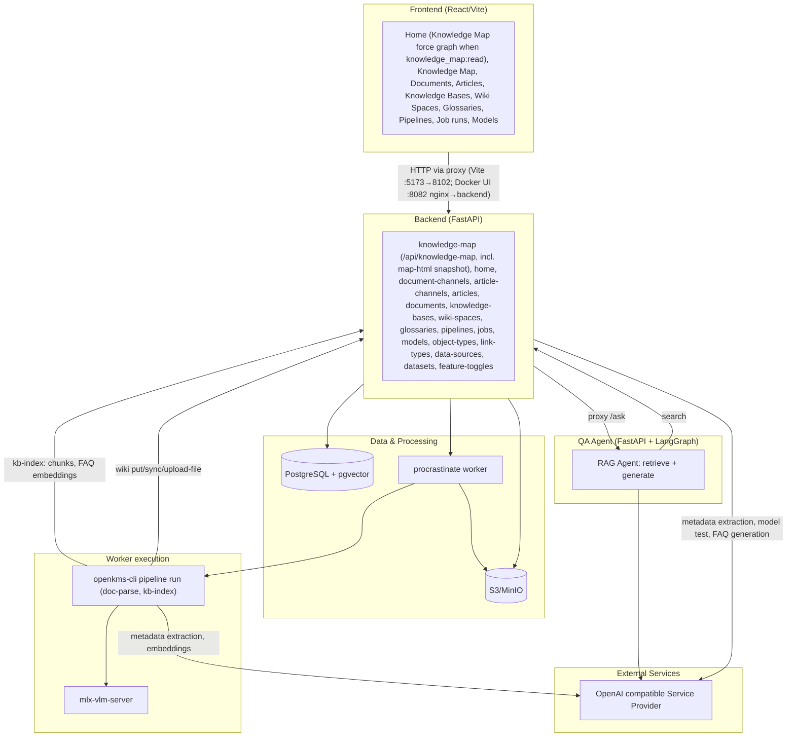
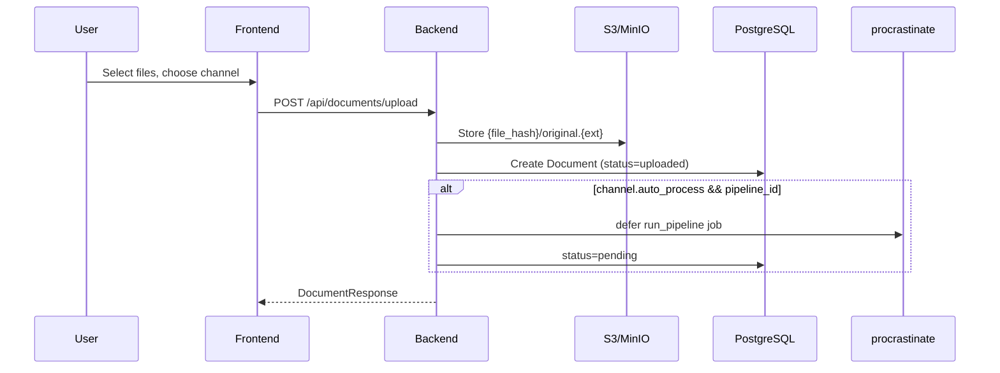
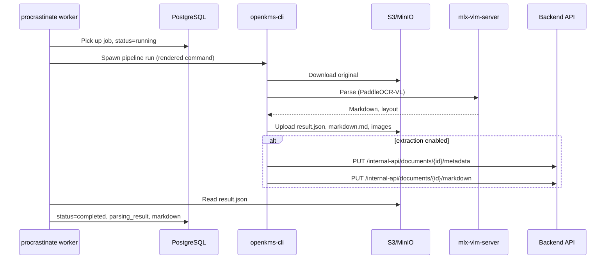
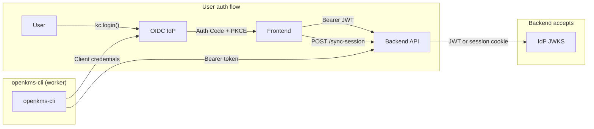

# openKMS Architecture

**`docker/docker-compose.yml`** runs the full stack (Postgres/pgvector, MinIO, **Neo4j** for ontology graph storage, backend, procrastinate worker with `openkms-cli` parse, nginx frontend at **http://localhost:8082**). The **worker** image is **`platform: linux/amd64`** (Paddle wheels on Apple Silicon via emulation) and installs **`libgl1`** for OpenCV/PaddleX plus **LibreOffice (writer + impress)** for **DOCX/PPTX** and **mupdf-tools** (`mutool`) for **EPUB** → PDF before parsing. **Postgres**, **MinIO**, and the **backend** are not published on the host; services use Docker DNS (`postgres`, `minio`, `backend:8102`), and the browser uses **8082** with nginx proxying **`/api`**, **`/internal-api`**, auth routes, and **`/buckets/...`**. Images: **`docker/Dockerfile`** (`backend`, `worker`), **`docker/Dockerfile.frontend`**. From repo root: **`docker compose -f docker/docker-compose.yml`** for **`build`**, **`up -d --build`**, **`down`** (**`docker/README.md`**).

## High-Level Diagram



| Layer | Components |
|-------|------------|
| **PostgreSQL + pgvector** | users (local auth), **user_api_keys** (hashed personal API tokens; Bearer `okms.{id}.{secret}` authenticates as owner), **security_permissions** (permission key catalog: label, route/API patterns), **security_roles**, **security_role_permissions**, **user_security_roles** (local user ↔ role), **access_groups**, **access_group_members** (subject ↔ group), **resource_acl_entries** (per-resource sharing: r/w/m grants to user, group, or authenticated; container inheritance),  **system_settings** (singleton row: `system_name`, `default_timezone`, `api_base_url_note`), **knowledge_map_nodes** (self-referential tree of terms for the Knowledge Map), **knowledge_map_resource_links** (maps document channel, article channel id, or wiki space → one node; managed per term in the Knowledge Map UI), **knowledge_map_html_artifact** (singleton cached LLM HTML overview + semantic `content_hash`), **article_channels** (tree; no parsing pipeline), **articles** (markdown working copy + `series_id`, lifecycle dates, `origin_article_id`, `last_synced_at`; metadata JSONB), **article_versions**, **article_attachments**, documents (**series_id**, **effective_from** / **effective_to**, **lifecycle_status** for policy-style validity; **document_relationships** for directed edges: supersedes, amends, implements, see_also), document_versions (explicit markdown+metadata snapshots per document), doc_channels, pipelines, api_providers, api_models, feature_toggles, object_types, object_instances, link_types, link_instances, data_sources, datasets, knowledge_bases, kb_documents, faqs, chunks, **wiki_spaces**, **wiki_pages**, **wiki_files**, evaluation_datasets, evaluation_dataset_items, evaluation_runs, evaluation_run_items, glossaries, glossary_terms, procrastinate_jobs |
| **S3/MinIO** | File storage under `{file_hash}/original.{ext}`; **article bundles** `articles/{article_id}/content.md`, `articles/{article_id}/images/…`, `articles/{article_id}/attachments/…`, optional `origin.html` (served via authenticated `GET /api/articles/{id}/files/{path}` → presigned redirect); wiki **vault mirror** `wiki/{space_id}/vault/{relative-path}` for vault imports and multipart uploads with normalizeable paths (binaries + `.md` bodies); markdown pages also written as `…/vault/{wiki_path}.md` when storage is enabled; **Graph View** cache JSON `wiki/{space_id}/link-graph.json` (invalidated when `max(wiki_pages.updated_at)` is newer than the object’s `LastModified`); ad-hoc uploads with non-normalizeable names use `wiki/{space_id}/files/{file_id}/…` |
| **Worker** | Picks up jobs, spawns openkms-cli subprocess, updates document status / indexes knowledge bases |
| **OpenAI compatible Service Provider** | OpenAI, Anthropic, etc.; metadata extraction, FAQ generation, embeddings, and model playground (configured via api_models) |
| **QA Agent** | Separate FastAPI + LangGraph service; retrieves via backend search API (no DB access), generates answers via LLM; configurable per knowledge base |
| **Wiki embedded agent (MVP)** | **Wiki Copilot** in the wiki UI: in-process LangGraph in the **main** FastAPI app: `POST/GET/DELETE/PATCH` **`/api/agent/conversations`** (list filtered by `wiki_space_id`), messages routes, wiki tools (`list_wiki_pages`, **`search_wiki_pages`**, `get_wiki_page`, `list_linked_channel_documents`; **`upsert_wiki_page`** when JWT has `wikis:write`); **streaming** messages use LangGraph `astream_events` (v2) so the NDJSON stream can include **`tool_start` / `tool_end` / `tool_error`** in addition to token `delta` lines. System prompt includes **vendored** [wiki-skills](https://github.com/kfchou/wiki-skills) `SKILL.md` text under `third-party/wiki-skills` (git subtree) plus an openKMS mapping; **wiki_space_documents** + linked-doc API. **Distinct** from qa-agent. [wiki_agent_prototype.md](./wiki_agent_prototype.md) |

## Frontend Structure

```mermaid
flowchart TB
  subgraph Providers["Provider hierarchy"]
    Auth[AuthContext + permission-catalog union / canAccessPath]
    FT[FeatureTogglesContext]
    DC[DocumentChannelsContext]
    AC[ArticleChannelsContext]
    Auth --> FT
    FT --> DC
    FT --> AC
  end

  subgraph Pages["Routes"]
    Home[Home]
    KnowledgeMapPage[Knowledge Map]
    Docs[DocumentsIndex, DocumentChannel, DocumentDetail]
    Articles[ArticlesIndex, ArticleChannel, ArticleChannels, ArticleChannelSettings, ArticleDetail]
    KB[KnowledgeBaseList, KnowledgeBaseDetail]
    Wiki[WikiSpaceList, WikiSpaceSettings, WikiWorkspace]
    Eval[EvaluationDatasetList, EvaluationDatasetDetail]
    Glossaries[GlossaryList, GlossaryDetail]
    Pipelines[Pipelines]
    JobRuns[JobRuns, JobDetail]
    Models[Models, ModelDetail]
    Ontology[OntologyList; Datasets, DatasetDetail, ObjectTypesPage, LinkTypesPage; ObjectsList, ObjectTypeDetail; LinksList, LinkTypeDetail; ObjectExplorer] — SPA sources under **`frontend/src/pages/ontology/`**
    Console[Console: Overview, Permission management, Data security, DataSources, Connectors, Settings, Users, FeatureToggles]
    UserSettings[Profile, UserSettings /settings API keys]
  end

  Providers --> Pages
```

```
frontend/src/
├── main.tsx                 # Entry (`index.scss` → design-system variables, globals, utilities)
├── index.scss               # `@use` design-system: `css-variables`, `global`, `utilities`
├── styles/design-system/    # SCSS + CSS vars: `_css-variables` (palette, spacing incl. **`--gap-compact`** / **`--padding-compact-*`**, type, motion, z-index, status pills, **`--color-ontology-*`** for KB graph source chrome, **`@media print`** **`--print-*`** paper palette), `_tokens` (breakpoints, **`$grid-min-*`**, **`$playground-messages-*`**, **`$bp-dialog-sm`**, `$space-*` / `$z-*`), `_mixins`, `_global`, optional `_index` barrel, `knowledge-map/`
├── App.tsx                  # Routes, providers (Auth → FeatureToggles → DocumentChannels → ArticleChannels), ErrorBoundary, Suspense + lazy routes
├── utils/permissionPatterns.ts  # Frontend glob rules aligned with backend; union of catalog patterns for SPA gate
├── config/index.ts          # API URL; config/permissions.ts (PERM_* mirrors for UI gating)
├── components/Layout/       # MainLayout (route gate; **`app-content--home`** padding on `/`), Sidebar (nav gated by canAccessPath + toggles; **Glossaries** and **Ontology** are sibling top-level links, ontology sub-routes indented under Ontology when active; **collapsible** left rail—when narrow, **icon-only** top-level links + labels hidden + channel/ontology subnavs hidden; preference in **`localStorage`**), Header
├── components/KnowledgeMapForceGraph.tsx (+ `.scss`)  # Home hub: when **`GET /api/knowledge-map/map-html/status`** has no saved HTML, **`react-force-graph-2d`** graph (same interaction model as wiki Graph View) from Knowledge Map tree + resource links; when a published HTML snapshot exists, **`Home`** shows it in an **`iframe`** instead. Term click → `/knowledge-map?node=…`; resource click → channel/wiki/articles route
├── components/KnowledgeMapForceGraph3D.tsx  # Optional 3D exploration: **`react-force-graph-3d`** (lazy-loaded from `/knowledge-map` **Explore (3D)** tab only); shared graph build via `src/graph/knowledgeMapGraphModel.ts`
├── graph/knowledgeMapGraphModel.ts  # `walkTree` + `KMNode` / `KMLink` types shared by 2D and 3D Knowledge Map force graphs
├── components/ErrorBoundary.tsx   # Catches uncaught errors, fallback UI with retry
├── components/ErrorBanner.tsx    # Page-level error banner (toast for transient errors)
├── components/markdown/     # `richMarkdown.tsx`: GFM + KaTeX + `rehype-raw` + **Mermaid** fenced blocks; **WikiWorkspace** / **WikiPagePanel** preview, **WikiAgentMessageBody**, **DocumentDetail** markdown
├── contexts/                # DocumentChannelsContext, ArticleChannelsContext, FeatureTogglesContext, AuthContext
├── data/                    # apiClient (getAuthHeaders, authAwareFetch + session-expired hook), systemApi (`/api/public/system`, `/api/system/settings`), channelsApi, articleChannelsApi, articlesApi, knowledgeMapApi (`/api/knowledge-map/*`), …, featureTogglesApi, securityAdminApi, channelUtils, **userApiKeysApi** (`/api/auth/api-keys`)
└── pages/
    ├── Home.tsx
    ├── Profile.tsx            # /profile — `GET /api/auth/me`
    ├── UserSettings.tsx       # /settings — personal API keys
    ├── DocumentsIndex.tsx   # /documents – overview
    ├── DocumentChannel.tsx  # /documents/channels/:channelId
    ├── DocumentChannels.tsx # /documents/channels – manage
    ├── DocumentChannelSettings.tsx
    ├── DocumentDetail.tsx
    ├── ArticlesIndex.tsx     # /articles – overview (like DocumentsIndex)
    ├── ArticleChannel.tsx   # /articles/channels/:channelId – list in channel
    ├── ArticleChannels.tsx  # /articles/channels – manage tree
    ├── ArticleChannelSettings.tsx  # /articles/channels/:id/settings – name, description, parent
    ├── ArticleDetail.tsx   # /articles/view/:id — shares **DocumentDetail.scss** layout (info card, **Relationships** panel like document lineage, markdown Edit/Save)
    ├── KnowledgeBaseList.tsx, KnowledgeBaseDetail.tsx
    ├── WikiSpaceList.tsx, WikiSpaceSettings.tsx (`/wikis/:id/settings`; sectioned settings UI; **Build index** for offline wiki page embeddings (default embedding ApiModel); folder vault import: modal with skip options + folder picker; import runs after browser file-access prompt), WikiSpaceGraph.tsx (`react-force-graph-2d`; **WikiSpaceGraphPanel** embedded in **WikiWorkspace** graph tab), **WikiWorkspace.tsx** + **WikiPagePanel.tsx** (multi-tab pages + graph tab; optional **WikiSpaceAgentPanel** Copilot rail toggled from the toolbar; **WikiPageEditor** re-exports workspace), WikiPageEditor.tsx (re-export only)
    ├── EvaluationDatasetList.tsx, EvaluationDatasetDetail.tsx
    ├── KnowledgeMap.tsx, GlossaryList.tsx, GlossaryDetail.tsx
    ├── Pipelines.tsx, JobRuns.tsx, JobDetail.tsx, Models.tsx, ModelDetail.tsx
    ├── ontology/            # OntologyList, ObjectsList, ObjectTypeDetail, LinksList, LinkTypeDetail, ObjectExplorer, ObjectTypesPage, LinkTypesPage; ontology-admin.scss; co-located SCSS per page
    └── console/             # ConsoleLayout, Overview, ConsolePermissionManagement, ConsoleDataSecurityGroups, ConsoleGroupDataAccess, DataSources, Connectors, Settings, Users, FeatureToggles (datasets & schema UIs live under /ontology/*)
```

### Internationalization (SPA)

The SPA uses **i18next** + **react-i18next** ([`frontend/src/i18n/`](https://github.com/yingrui/openKMS/tree/main/frontend/src/i18n)): locales **`en`** and **`zh-CN`**, with namespaces per surface (e.g. **`layout`**, **`knowledgeBase`**, **`wikiSpace`**) registered in **`frontend/src/i18n/config.ts`**. When signed in, the chosen language is persisted in **`user_preferences`** (JWT `sub`) via **`PATCH /api/auth/me`** and reapplied on **`GET /api/auth/me`**; **`localStorage`** (`openkms_locale`) still caches the active locale for **`Accept-Language`** ([`getAuthHeaders`](https://github.com/yingrui/openKMS/blob/main/frontend/src/data/apiClient.ts)) and first paint before profile loads. Core shell strings use translation keys.

## Backend Structure

```
backend/
├── app/
│   ├── i18n/                  # API error catalogs (`catalog.py`) + `Accept-Language` resolution + structured HTTP errors (`errors.py`)
│   ├── middleware/
│   │   └── strict_permission_patterns.py  # Optional OPENKMS_ENFORCE_PERMISSION_PATTERNS_STRICT: catalog pattern match + permission key check
│   ├── config.py                # Settings (env: OPENKMS_*); vlm_url primary for VLM
│   ├── oidc_discovery.py        # Cached GET {issuer}/.well-known/openid-configuration (JWKS + OAuth endpoints)
│   ├── constants.py             # DocumentStatus enum (uploaded, pending, running, completed, failed)
│   ├── database.py              # Async engine, get_db (no DDL at startup; pgvector via dev.sh / Alembic)
│   ├── api/
│   │   ├── auth.py              # OIDC (discovery + JWKS) or local HS256 JWT; require_auth, require_admin, require_permission; /api/auth/* (me, permission-catalog, **api-keys** CRUD, sync-session)
│   │   ├── admin/
│   │   │   ├── health_status.py   # GET /api/admin/health-status (console:access): core deps + optional Langfuse public health when LANGFUSE_BASE_URL set
│   │   │   ├── groups.py        # CRUD /api/admin/groups, scopes PUT (any auth); members PUT local-only (OIDC: GET empty, PUT 403)
│   │   │   ├── security_roles.py  # GET /api/admin/security-roles, PUT …/permissions
│   │   │   ├── security_permissions.py  # CRUD /api/admin/security-permissions (catalog rows)
│   │   │   └── permission_reference.py  # GET /api/admin/permission-reference (routes + APIs + operation_key_hints for admins)
│   │   ├── channels.py         # GET/POST/PUT /api/document-channels
│   │   ├── documents.py        # POST upload (store only), GET (channel_id, search, offset, limit), DELETE, PUT (name, channel_id), PUT metadata, PUT markdown, POST restore-markdown, POST rebuild-page-index, POST/GET versions, GET version, POST version restore, POST extract-metadata, GET page-index, GET section (by line range)
│   │   ├── object_types.py     # CRUD /api/object-types; Neo4j index from linked dataset or object_instances when no dataset; is_master_data, display_property; master-data filter for label config; instances from Neo4j when available
│   │   ├── link_types.py       # CRUD /api/link-types; Neo4j index from junction/source dataset or link_instances; count_from_neo4j; instances from Neo4j when available
│   │   ├── ontology_explore.py # POST /api/ontology/explore; execute read-only Cypher against Neo4j (Object Explorer)
│   │   ├── data_sources.py     # CRUD /api/data-sources (admin), POST /{id}/test, POST /{id}/neo4j-delete-all; credentials encrypted
│   │   ├── datasets.py         # CRUD /api/datasets (admin), GET /from-source/{id} lists PG tables, GET /{id}/rows and /{id}/metadata
│   │   ├── feature_toggles.py  # GET/PUT /api/feature-toggles (PUT admin-only); hasNeo4jDataSource for sidebar visibility
│   │   ├── system_settings.py  # GET /api/public/system (no auth); GET/PUT /api/system/settings (`console:settings`)
│   │   ├── knowledge_bases.py  # CRUD /api/knowledge-bases, documents, FAQs, chunks, search, ask proxy
│   │   ├── wiki_spaces.py      # /api/wiki-spaces: spaces, pages, **…/documents** (channel doc links: list includes `linked_at` + each linked **document** `updated_at`), files, page-index, **GET …/graph**, **POST …/semantic-index** (offline pgvector embeddings per page); POST import/vault (zip/bulk), POST import/vault/markdown-file
│   │   ├── agent.py            # /api/agent: **conversations** + **messages** (embedded LangGraph; Wiki Copilot in the wiki-space UI)
│   │   ├── evaluations.py  # CRUD /api/evaluations, items, import (CSV), run (search_retrieval | qa_answer | wiki_content_coverage), runs list/get/delete/compare
│   │   ├── glossaries.py       # CRUD /api/glossaries, terms, export, import
│   │   ├── home_hub.py         # GET /api/home/hub (signed-in knowledge operations hub aggregates)
│   │   ├── knowledge_map.py    # `/api/knowledge-map/*` — Knowledge Map node tree + CRUD + resource-links + map-html (status, get, regenerate, designer chat, preview, publish) via `knowledge_map_html`
│   │   ├── pipelines.py       # CRUD /api/pipelines, template-variables
│   │   ├── models.py           # CRUD /api/models, POST test
│   │   ├── internal/           # package: internal/models.py — document-parse-defaults, llm-defaults, config-by-name, kb-embedding-credentials
│   │   ├── providers.py        # CRUD /api/providers (service providers: OpenAI, Anthropic, etc.)
│   │   ├── users_admin.py      # GET/POST/PATCH/DELETE /api/admin/users (console:users; local user CRUD + OIDC notice)
│   │   └── jobs.py             # GET/POST/DELETE /api/jobs, POST retry
│   ├── models/
│   │   ├── document.py          # Document model (+ status, metadata JSONB)
│   │   ├── document_version.py  # DocumentVersion (document_id FK, version_number, tag, note, markdown, metadata JSONB snapshot, created_by_*)
│   │   ├── document_channel.py  # DocumentChannel (+ pipeline_id, auto_process, extraction_model_id, extraction_schema, label_config, object_type_extraction_max_instances, created_by)
│   │   ├── pipeline.py         # Pipeline model (name, command, default_args, model_id)
│   │   ├── api_provider.py      # ApiProvider (name, base_url, api_key)
│   │   ├── api_model.py        # ApiModel (provider_id FK, api_kind, capabilities[], model_name; inherits base_url/api_key from provider)
│   │   ├── feature_toggle.py  # FeatureToggle (key-value flags)
│   │   ├── user.py            # User (local auth: email, username, password_hash, is_admin)
│   │   ├── user_api_key.py   # UserApiKey (user_id FK, name, key_prefix, key_hash bcrypt; Bearer `okms.{id}.{secret}` for HTTP)
│   │   ├── security_role.py # SecurityRole, SecurityRolePermission, UserSecurityRole
│   │   ├── security_permission.py # SecurityPermission (key, label, description, JSONB route/API patterns, sort_order)
│   │   ├── access_group.py  # AccessGroup, AccessGroupMember
│   │   ├── resource_acl.py  # ResourceAclEntry
│   │   ├── object_type.py     # ObjectType (name, description, properties JSONB, dataset_id FK, key_property, is_master_data, display_property)
│   │   ├── object_instance.py # ObjectInstance (object_type_id FK, data JSONB)
│   │   ├── link_type.py       # LinkType (source_object_type_id, target_object_type_id)
│   │   ├── link_instance.py   # LinkInstance (link_type_id, source_object_id, target_object_id)
│   │   ├── data_source.py     # DataSource (kind, host, port, database, username_encrypted, password_encrypted)
│   │   ├── dataset.py         # Dataset (data_source_id FK, schema_name, table_name)
│   │   ├── knowledge_base.py  # KnowledgeBase (name, description, embedding_model_id, judge_model_id, agent_url, chunk_config, faq_prompt, metadata_keys)
│   │   ├── kb_document.py     # KBDocument join table (knowledge_base_id, document_id)
│   │   ├── faq.py             # FAQ (knowledge_base_id, question, answer, embedding via pgvector)
│   │   ├── chunk.py           # Chunk (knowledge_base_id, document_id, content, embedding via pgvector)
│   │   ├── evaluation.py  # Evaluation, EvaluationItem (query + expected answer)
│   │   ├── evaluation_run.py   # EvaluationRun, EvaluationRunItem (persisted run + per-item detail JSONB)
│   │   ├── glossary.py        # Glossary (name, description)
│   │   ├── glossary_term.py   # GlossaryTerm (glossary_id, primary_en, primary_cn, definition, synonyms_en, synonyms_cn)
│   │   └── knowledge_map.py   # KnowledgeMapNode, KnowledgeMapResourceLink, KnowledgeMapHtmlArtifact → `knowledge_map_nodes`, `knowledge_map_resource_links`, `knowledge_map_html_artifact`
│   ├── schemas/
│   │   ├── document.py
│   │   ├── channel.py           # ChannelNode, ChannelCreate, ChannelUpdate, LabelConfigItem (label_config)
│   │   ├── pipeline.py         # PipelineCreate/Update/Response (+ model_id)
│   │   ├── api_model.py        # ApiModelCreate/Update/Response (+ provider_id)
│   │   ├── api_provider.py     # ApiProviderCreate/Update/Response
│   │   ├── job.py              # JobCreate/Response
│   │   ├── knowledge_base.py  # KB/FAQ/Chunk/Search/Ask schemas
│   │   ├── glossary.py        # Glossary/Term Create/Update/Response, Export/Import schemas
│   │   ├── ontology.py        # ObjectType/LinkType/ObjectInstance/LinkInstance schemas
│   │   └── data_source.py     # DataSourceCreate/Response; dataset.py for Dataset schemas
│   ├── jobs/
│   │   ├── __init__.py          # procrastinate App (PsycopgConnector)
│   │   └── tasks.py            # run_pipeline, run_spreadsheet_preview (.xlsx preview), run_kb_index (subprocess openkms-cli where applicable)
│   └── services/
│       ├── credential_encryption.py # Fernet encrypt/decrypt for DataSource credentials
│       ├── model_testing.py         # Model playground: build URL/headers/payload by api_kind; vision when capability set
│       ├── metadata_extraction.py   # pydantic-ai Agent + StructuredDict for metadata extraction (abstract, author, tags, object_type, list[object_type])
│       ├── faq_generation.py             # LLM-based FAQ pair generation from document markdown
│       ├── glossary_term_suggestion.py   # LLM suggests translation, definition, synonyms for glossary terms
│       ├── knowledge_map_html.py         # LLM-built Knowledge Map HTML overview: semantic content hash, placeholder hydration, nh3 sanitize
│       ├── kb_search.py                  # Semantic search over chunks and FAQs (used by search route and evaluation)
│       ├── search_judge.py               # LLM judges: search retrieval vs expected answer; QA answer vs expected answer
│       ├── evaluation/execute.py         # Run strategies: search_retrieval, qa_answer (agent HTTP + judge)
│       ├── page_index.py                 # md_to_tree_from_markdown (# headings); used when saving/restoring markdown
│       ├── spreadsheet_preview.py      # openpyxl: XLSX grid preview + markdown for upload / spreadsheet job
│       ├── wiki_semantic_index.py        # Offline: embed all wiki pages in a space (default **embedding** ApiModel → `wiki_pages.embedding`)
│       ├── wiki_vault_import.py          # Obsidian vault bulk import: S3 vault mirror `wiki/{space_id}/vault/{path}`, upsert wiki_files on same path, markdown mirrors, link rewrite; strip NUL for PostgreSQL
│       ├── agent/                        # Embedded LangGraph (wiki): `llm.py`, `wiki_tools.py`, `wiki_runner.py`, `prompts.py`
│       ├── wiki_link_graph.py            # Parse `[[wikilinks]]` + relative `[text](href)` (skip fenced code); build directed graph JSON; path resolution aligned with vault import / frontend preview
│       ├── storage.py                    # S3/MinIO client (upload, delete, `object_last_modified` via HEAD for wiki graph cache)
│       ├── permission_catalog.py       # PERM_* constants, OPERATION_KEY_HINTS for admin reference UI
│       ├── permission_seed.py          # Alembic seed: only ``all`` row for security_permissions when table empty
│       ├── permission_pattern_engine.py   # Compile ``backend_api_patterns`` / match method+path; frontend-style glob helpers
│       ├── permission_pattern_cache.py    # TTL cache for compiled rules; invalidated on admin catalog mutations
│       ├── permission_default_patterns.py # Default frontend/backend pattern lists per PERM_* (used by Alembic backfill)
│       ├── permission_reference.py     # Frontend route catalog + OpenAPI-derived API list for admin permission setup
│       ├── security_permission_service.py  # List/sort permissions from DB; keys set for role validation
│       ├── permission_resolution.py    # Permissions: local via user_security_roles; OIDC via JWT realm role name matching security_roles.name
│       ├── user_roles_sync.py          # Sync user_security_roles from users.is_admin; create member role with `all` if missing
│       ├── data_scope.py               # Re-exports resource ACL helpers; channel subtree expansion
│       ├── resource_guard.py           # Layer 2 guard (standalone types)
│       ├── context_guard.py            # Layer 2 guard (channels, documents, articles)
│       ├── resource_acl_service.py     # ACL resolve, list filters, acl_check_required
│       └── data_resource_policy.py     # Visibility helpers delegating to resource ACL
├── scripts/
│   ├── ensure_pgvector.py       # Pre-start: check/create pgvector extension; auto-install in Docker if missing
│   └── seed_mock_insurance_data.py  # Create mock diseases, insurance_products, disease_insurance_product tables in schema 'mock'
├── pyproject.toml               # Dependencies (uv.lock for reproducible installs)
└── worker.py                    # procrastinate worker entry point
```

**Public (no-auth) API layout:** Endpoints that return read-only data without a session, beyond auth bootstrap (`/api/auth/public-config`, login/register), use **`/api/public/<resource>`** (for example **`GET /api/public/system`**). Each such route must be listed in **`strict_permission_patterns._UNAUTH_EXACT`** when strict pattern enforcement is enabled.

## openkms-cli

Standalone CLI for document parsing, designed for backend integration. Developers can add CLI tools for pipeline steps.

```
openkms-cli/
├── pyproject.toml           # typer>=0.9.0, optional [parse], [pipeline], [metadata], [kb], [dev] (pytest)
├── tests/                   # pytest: backend_defaults, baidu_parser, parse_result schema, parser helpers
├── schemas/                 # document_parse_result.schema.json (canonical result.json)
├── openkms_cli/
│   ├── __init__.py
│   ├── __main__.py          # python -m openkms_cli
│   ├── app.py               # Typer app, registers subcommands
│   ├── settings.py          # CliSettings: explicit env var names (validation_alias); pydantic-settings
│   ├── auth.py              # OIDC client credentials or local HTTP Basic (try_api_request_auth)
│   ├── backend_defaults.py  # VLM URL/model/key merge from internal-api (optional model_name)
│   ├── baidu_parser.py      # Baidu Cloud PaddleOCR-VL API (baidu-doc-parse); optional pymupdf for page previews
│   ├── parse_result.py      # Pydantic + validate_parse_result for canonical result.json
│   ├── extract.py           # Metadata extraction via pydantic-ai (optional [metadata])
│   ├── parse_cli.py         # parse run command
│   ├── parser.py            # PaddleOCR-VL wrapper (optional [parse]); optional content_hash_source for converted Office inputs
│   ├── office_convert.py    # LibreOffice (DOCX/PPTX) + MuPDF mutool (EPUB) → PDF for VLM parse
│   ├── pipeline_cli.py      # pipeline list, pipeline run (paddleocr-doc-parse, baidu-doc-parse, kb-index); optional [pipeline], [kb]
│   └── kb_indexer.py        # Chunking, embedding, pgvector bulk insert (optional [kb])
└── README.md
```

- **Purpose**: Decouple parsing from backend; run via subprocess in worker/job context
- **Tests**: `pip install -e ".[dev]" && pytest tests/` from **`openkms-cli/`** (no Paddle required for the current suite)
- **Configuration**: `openkms_cli/settings.py` maps each environment variable explicitly (no hidden prefix); loads `openkms-cli/.env` then cwd `.env`; CLI flags override when passed
- **Commands**: `parse run` (`--method paddleocr-doc-parse|baidu-doc-parse`), `pipeline list`, `pipeline run`
- **Pipeline run**: Download from S3 → (optional LibreOffice for DOCX/PPTX, mutool for EPUB) → parse → upload to S3. **`baidu-doc-parse`** uses Baidu Cloud API (no local VLM). When channel has extraction_model_id and extraction_schema, worker passes `--extract-metadata --extraction-model-name <model_name>`; CLI fetches model config via `GET /internal-api/models/config-by-name`, extracts via pydantic-ai, PUTs to backend; extraction errors after a successful parse are logged and do not fail the job
- **Output**: result.json, markdown.md, layout_det_*, block_*, markdown_out/* (compatible with openKMS backend)
- **KB indexing**: `openkms-cli pipeline run --pipeline-name kb-index --knowledge-base-id <id> --api-url <url>` – fetches KB config and documents from backend API, splits documents into chunks (**fixed_size**, **markdown_header**, **paragraph**; default **8000**-char **`chunk_size`**; header/paragraph strategies subdivide oversized sections before embedding), propagates document metadata to chunks/FAQs per `metadata_keys`, loads embedding **base_url**, **model_name**, and **api_key** via **`GET /internal-api/models/kb-embedding-credentials`** (optional **`OPENKMS_EMBEDDING_MODEL_*`** in **`openkms-cli/.env`** overrides); writes chunks via internal **`POST …/chunks/batch`** and FAQ embeddings via **`PUT …/faqs/batch-embeddings`** (no direct DB access)
- **Extensible**: Add new Typer subapps in app.py for additional CLI tools

## openkms-skill (OpenCode / external agents)

Optional repo folder **`openkms-skill/`** (not part of the Docker stack) packages a small **Python CLI** plus **`SKILL.md`** for [OpenCode](https://opencode.ai/docs/skills)-style agents. It calls the **same public `/api/...` routes** as the SPA, using a **personal API key** created in the app (**Settings** → **API keys**, `/settings`). Install target: **`~/.config/opencode/skills/openkms/`** via **`openkms-skill/install.sh`** (preserves an existing **`config.yml`** on reinstall).

Full how-to, `config.yml`, and command list: **[OpenCode skill (`openkms-skill`)](features/opencode-openkms-skill.md)**. Distinct from **`openkms-cli`** (worker subprocess, env-based auth to internal + public APIs).

## QA Agent Service

```
qa-agent/
├── pyproject.toml           # FastAPI, LangGraph, langchain-openai, httpx
├── qa_agent/
│   ├── __init__.py
│   ├── main.py              # FastAPI app with /ask and /ask/stream (NDJSON)
│   ├── config.py            # Settings (backend URL, LLM)
│   ├── agent.py             # LangGraph agent: retrieve → generate (with tools) → tools
│   ├── retriever.py         # Calls backend search API (no DB access)
│   ├── ontology_client.py   # GET object-types, link-types; POST ontology/explore (Cypher)
│   ├── tools.py             # get_ontology_schema_tool, run_cypher_tool
│   └── schemas.py           # AskRequest/AskResponse
├── .env.example
└── README.md
```

- **Purpose**: Separate RAG + ontology service for Q&A against knowledge bases; configurable per KB via `agent_url`
- **Architecture**: LangGraph state graph: `retrieve` (KB search) → `generate` (LLM with tools) ⇄ `tools` (ontology). RAG via `POST /api/knowledge-bases/{id}/search`; ontology via `GET /api/object-types`, `GET /api/link-types`, `POST /api/ontology/explore` (Cypher). Does not access the database directly.
- **Ontology skills**: For coverage questions (e.g. "Which insurance products cover heart attack?"), the agent calls `get_ontology_schema_tool` to learn node labels and relationship types, then `run_cypher_tool` to query Neo4j.
- **Integration**: Backend proxies `POST /api/knowledge-bases/{kb_id}/ask` and **`POST …/ask/stream`** to `{kb.agent_url}/ask` and **`/ask/stream`**, passing the user's access token so the agent can call the backend APIs. For **persisted threads**, **`POST /api/knowledge-bases/{kb_id}/agent-conversations/{cid}/messages`** stores each turn in PostgreSQL and streams by forwarding qa-agent NDJSON (then writes the final assistant message, **`kb_qa_sources_v1`**, and optional tool traces). The SPA full-page Q&A uses the same **`delta` / `tool_*` / `done`** shapes as Wiki Copilot for the live rail.
- **Port**: 8103 by default

## Data Flow

### Document Upload (Decoupled)



1. Frontend opens upload modal on channel page; user selects files; `POST /api/documents/upload` (multipart: file + channel_id)
2. Backend stores original file to S3/MinIO under `{file_hash}/original.{ext}`; creates Document with `status=uploaded` (no parsing at upload time)
3. If channel has `auto_process=true` and a linked pipeline, a procrastinate job is deferred automatically (`status=pending`)
4. Response: DocumentResponse with status

### Document Processing (Job Queue)



1. Jobs can be created: manually via `POST /api/jobs`, or automatically on upload (if channel has auto_process)
2. The job references a Pipeline configuration (command template with `{variable}` placeholders, default_args, optional linked model)
3. procrastinate worker picks up the job, renders the command template (substituting `{input}`, `{s3_prefix}`, `{vlm_url}`, `{model_name}`, etc.; model-linked values override defaults), sets `Document.status=running`
4. If document's channel has extraction_model_id and extraction_schema, worker appends `--extract-metadata --document-id ... --api-url ... --extraction-schema-file ... --extraction-model-base-url ... --extraction-model-name ...` and passes `EXTRACTION_MODEL_API_KEY` in env
5. Worker spawns the rendered command (e.g. `openkms-cli pipeline run --pipeline-name paddleocr-doc-parse --input s3://bucket/{file_hash}/original.{ext} --s3-prefix {file_hash}`)
6. CLI authenticates to the API (OIDC client credentials Bearer token, or HTTP Basic in `OPENKMS_AUTH_MODE=local`), parses document via PaddleOCR-VL, uploads results to S3; syncs markdown/metadata via **`PUT /internal-api/documents/{id}/markdown`** and **`PUT /internal-api/documents/{id}/metadata`** (internal service client only — no channel write ACL); optional **`POST /internal-api/documents/{id}/versions`** with tag Pipeline
7. Worker reads result.json (and optional `{file_hash}/extracted_metadata.json`) from S3, updates Document (parsing_result, markdown, metadata merge, `status=completed`)
8. On failure: `status=failed`; user can retry via `POST /api/jobs/{id}/retry`

### Document Detail

1. Frontend fetches `GET /api/documents/{id}` – document includes parsing_result, markdown, and status
2. Document files (images, markdown assets): frontend requests `GET /api/documents/{id}/files/{file_hash}/{path}`; backend redirects (302) to presigned S3 URL via frontend proxy
3. If document status is `uploaded` or `failed`, a "Process" button appears to trigger processing
4. If document status is `pending` or `failed`, a "Reset" button appears to reset status to `uploaded` (only if no active jobs exist)
5. Metadata section: single unified METADATA section (extracted + manual labels); extract via pydantic-ai Agent + StructuredDict (channel's extraction_model_id + extraction_schema, supports object_type and list[object_type]); `POST /api/documents/{id}/extract-metadata`; manual edit via `PUT /api/documents/{id}/metadata` (editable fields per extraction_schema and label_config)
6. Document info: Name editable via Edit button; `PUT /api/documents/{id}` with `{ name }`
7. Markdown edit: Edit/View toggle in markdown panel; edit mode shows textarea with Save (`PUT /api/documents/{id}/markdown`) and Restore (`POST /api/documents/{id}/restore-markdown`) from S3 `{file_hash}/markdown.md`; only for real documents (not examples)
8. Document versions: **Save version** / **Versions** in Document Information section (version column); explicit snapshots via `POST /api/documents/{id}/versions` (current markdown + metadata); list, preview, restore (`POST .../versions/{vid}/restore`); routine saves do not create versions

### Channel Tree

1. Frontend `DocumentChannelsContext` fetches `GET /api/document-channels`
2. Backend returns nested `ChannelNode[]` (id, name, description, children)
3. Sidebar and Documents pages use `channelUtils` (flattenChannels, getDocumentChannelName, etc.)

### Document List by Channel

- Frontend fetches `GET /api/documents?channel_id=` for the current channel; `channel_id` optional (all documents)
- Optional `search` param filters by document name; `limit` defaults to 200
- Backend returns documents in channel and descendants (or all if no channel)

## Authentication (`OPENKMS_AUTH_MODE`)

Two modes (default **`oidc`**). Deployments should keep **backend** `OPENKMS_AUTH_MODE` and **frontend** behavior in sync: the SPA calls **`GET /api/auth/public-config`** (no auth) for **`auth_mode`** and **`allow_signup`** only (no infrastructure hints). **openkms-cli** and **qa-agent** call **`/internal-api/models/...`** with **internal service** auth only (`sub=local-cli` from HTTP Basic, or OIDC client credentials whose **`azp`** is on **`OPENKMS_INTERNAL_SERVICE_CLIENT_IDS`**); human SPA tokens are rejected. **`document-parse-defaults`** supplies VLM **`base_url`**, **`model_name`**, and **`api_key`** (optional query **`model_name`** for a row with **`document-parse`** capability). **`kb-index`** uses **`kb-embedding-credentials?knowledge_base_id=…`** for embedding credentials. The **`/internal-api`** prefix is outside optional strict permission-pattern middleware (which only inspects **`/api/...`** today), so operators can attach separate ingress or policy later without mixing worker/CLI surfaces with catalog-governed **`/api`** routes. The SPA may call **`GET /api/public/system`** (no auth) for **`system_name`** (trimmed from DB, possibly empty; the sidebar stays blank until the response, then shows **`openKMS`** when empty). The app chooses **OIDC (Authorization Code + PKCE via `oidc-client-ts`)** vs local forms from the API, and shows a banner if `VITE_AUTH_MODE` is set and disagrees. `VITE_AUTH_MODE` is only a fallback when that request fails.

### OIDC mode (standards-compliant OpenID Connect IdP)



- **Backend**: Resolves **`OPENKMS_OIDC_ISSUER`** or **`{OPENKMS_OIDC_AUTH_SERVER_BASE_URL}/realms/{OPENKMS_OIDC_REALM}`**, fetches **`{issuer}/.well-known/openid-configuration`**, validates JWTs with **`jwks_uri`**, and uses discovery **`authorization_endpoint`**, **`token_endpoint`**, **`end_session_endpoint`**. Session cookie optional after `POST /sync-session`.
- **Frontend**: **`oidc-client-ts`** (`UserManager`) when `public-config` reports `oidc`; redirect URIs **`/auth/callback`** and **`/auth/silent-renew`**; `POST /sync-session` after login.
- `GET /login` / `GET /login/oauth2/code/oidc` (and legacy `/login/oauth2/code/keycloak`) – backend OAuth redirect and callback for the confidential client.
- `GET /logout` – clears session; redirects to IdP logout when configured.

### Local mode (PostgreSQL users)

- **Backend**: `OPENKMS_AUTH_MODE=local`. Users in `users` table; passwords hashed (bcrypt); access tokens are HS256 JWTs signed with `OPENKMS_SECRET_KEY` (claims mirror OIDC-style `sub`, `realm_access.roles`, etc.).
- **Endpoints**: `POST /api/auth/register`, `POST /api/auth/login`, `GET /api/auth/me` (returns `is_admin` and `roles` from `realm_access.roles`), `POST /api/auth/logout`. `POST /sync-session` accepts local JWT for cookie-backed requests.
- **CLI**: `OPENKMS_CLI_BASIC_USER` / `OPENKMS_CLI_BASIC_PASSWORD` → `Authorization: Basic` (use only on trusted networks without TLS).
- **Frontend**: `/login` and `/signup` when `public-config` reports `local`; signup link hidden if `allow_signup` is false; session cookie after sync-session; API calls use `credentials: 'include'`.
- OIDC redirect routes redirect to `/login?notice=local_auth` when hit in local mode.

### Shared

- **Invalid JWT on API calls**: Authenticated SPA requests use **`authAwareFetch`** (`frontend/src/data/apiClient.ts`) for backend `fetch`es. A **`401`** whose body indicates session/auth failure (legacy **`Invalid or expired token`** / **`Invalid token`**, localized **`detail.code`** values such as **`AUTHENTICATION_REQUIRED`**, **`BEARER_TOKEN_REQUIRED`**, **`INVALID_OR_EXPIRED_TOKEN`**, **`INVALID_TOKEN`**, or JWT parse phrases) first runs **one silent retry** registered from **`AuthContext`**: OIDC **`signinSilent`** + **`POST /sync-session`**; local mode checks **`GET /api/auth/me`** with the session cookie. The request is retried once with refreshed **`Authorization`** from **`getAuthHeaders()`**. If the response is still a session-type **`401`**, the session-expired handler clears OIDC user / local session state and **`POST /clear-session`**, shows a short **session ended** toast, then sends the user to sign-in again (**`/login`** in local mode, **interactive OIDC redirect** in OIDC mode). The fetch resolves to a **synthetic 401** JSON body with user-facing copy (`SESSION_EXPIRED_API_DETAIL`) so callers that surface `detail` in toasts or banners do not show raw status lines. **`MainLayout`** then shows the same **Authentication Required** screen as for an unauthenticated visit.
- **Route protection**: **`/`** (home) is public for guests (static marketing shell); all other **`MainLayout`** pages require auth (and `/login`, `/signup` in local mode live outside that shell). **`/profile`** shows the current user from `GET /api/auth/me` (administrator flag, role list, header user menu).
- **Console**: `admin` in `realm_access.roles` (OIDC) grants full permissions (all keys from `security_permissions`). Other OIDC users: each JWT realm role whose **name equals** a `security_roles.name` row contributes that role’s permission keys (union). Local: `is_admin` or `user_security_roles`.
- `POST /clear-session` – clears backend session cookie.

## Configuration

| Layer | Config |
|-------|--------|
| Backend | `.env` / `OPENKMS_*` – database, **`OPENKMS_VLM_URL`** (mlx-vlm base URL; not embedding/OpenAI gateway), PaddleOCR defaults, `OPENKMS_EXTRACTION_MODEL_ID`, `OPENKMS_BACKEND_URL` (for CLI metadata extraction), **OPENKMS_PIPELINE_TIMEOUT_SECONDS** (default 3600) for **`run_pipeline`** subprocess. **Not used:** `OPENKMS_VLM_API_KEY`, `OPENKMS_EMBEDDING_MODEL_*` (CLI / KB models only) |
| Backend | `OPENKMS_DEBUG` (e.g. dev secret check in `main`), **`OPENKMS_SQL_ECHO`** (SQLAlchemy `echo`; default off so debug compose is not flooded with `SELECT` lines), **`OPENKMS_PERMISSION_CATALOG_CACHE_SECONDS`** (TTL for `GET /api/auth/permission-catalog`; default 5; `0` disables; cleared on admin security-permission writes) |
| Backend | `OPENKMS_AUTH_MODE` – `oidc` (default) or `local`; `OPENKMS_ALLOW_SIGNUP`, `OPENKMS_CLI_BASIC_*`, `OPENKMS_LOCAL_JWT_EXP_HOURS` |
| Backend | `OPENKMS_OIDC_*`, `OPENKMS_FRONTEND_URL` – issuer, confidential client, SPA origin, post-logout client id, service client id (`azp`) for CLI JWT |
| Backend | `AWS_*` – S3/MinIO for file storage (optional) |
| Frontend | `config/index.ts` – `apiUrl`, `authMode` (fallback), `oidc` (`VITE_OIDC_*`). Runtime mode from `GET /api/auth/public-config`. Optional `VITE_AUTH_MODE` fallback if the API is unreachable |
| Vite dev | Proxy **`/api`**, **`/internal-api`**, **`/sync-session`**, **`/clear-session`** → backend (**8102**); **`/buckets/openkms`** → MinIO (**9000** when MinIO is published on the host) |
| Alembic | `alembic.ini` – uses `settings.database_url_sync` |
| Cursor | `.cursor/rules/` – project rules (e.g. docs-before-commit, alembic-migrations) |
