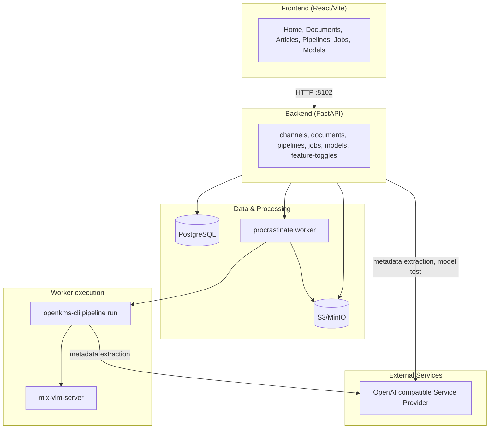
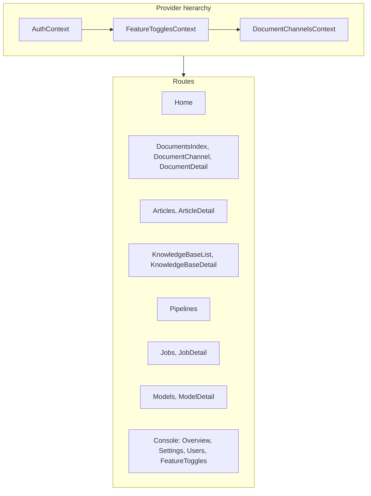
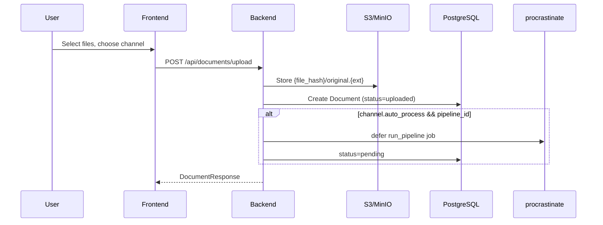
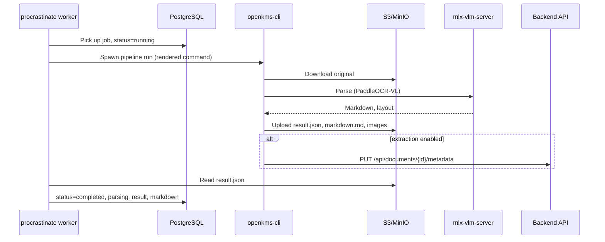
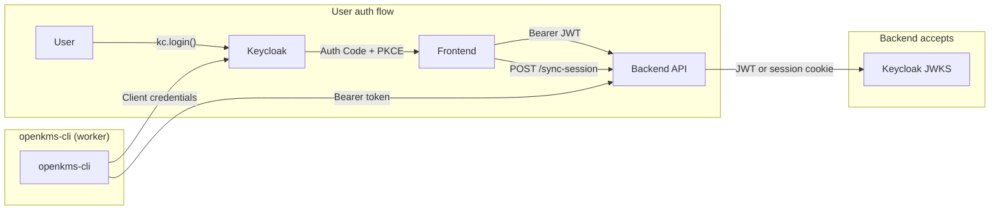

# openKMS Architecture

## High-Level Diagram



| Layer | Components |
|-------|------------|
| **PostgreSQL** | documents, doc_channels, pipelines, api_providers, api_models, feature_toggles, procrastinate_jobs |
| **S3/MinIO** | File storage under `{file_hash}/original.{ext}` |
| **Worker** | Picks up jobs, spawns openkms-cli subprocess, updates document status |
| **OpenAI compatible Service Provider** | OpenAI, Anthropic, etc.; metadata extraction and model playground (configured via api_models) |

## Frontend Structure



```
frontend/src/
├── main.tsx                 # Entry
├── App.tsx                  # Routes, providers (Auth → FeatureToggles → DocumentChannels)
├── config/index.ts          # API URL
├── components/Layout/       # MainLayout, Sidebar, Header
├── contexts/                # DocumentChannelsContext, FeatureTogglesContext, AuthContext
├── data/                    # channelsApi, documentsApi, pipelinesApi, jobsApi, modelsApi, providersApi, featureTogglesApi, channelUtils
└── pages/
    ├── Home.tsx
    ├── DocumentsIndex.tsx   # /documents – overview
    ├── DocumentChannel.tsx  # /documents/channels/:channelId
    ├── DocumentChannels.tsx # /documents/channels – manage
    ├── DocumentChannelSettings.tsx
    ├── DocumentDetail.tsx
    ├── Articles.tsx, ArticleDetail.tsx
    ├── KnowledgeBaseList.tsx, KnowledgeBaseDetail.tsx
    ├── Pipelines.tsx, Jobs.tsx, JobDetail.tsx, Models.tsx, ModelDetail.tsx
    └── console/             # ConsoleLayout, Overview, Settings, Users, FeatureToggles
```

## Backend Structure

```
backend/
├── app/
│   ├── main.py                  # FastAPI app, CORS, routers, procrastinate lifespan
│   ├── config.py                # Settings (env: OPENKMS_*)
│   ├── database.py              # Async engine, get_db, init_db
│   ├── api/
│   │   ├── auth.py              # OAuth2 Keycloak login/logout, require_auth, require_admin
│   │   ├── channels.py         # GET/POST/PUT /api/channels/documents
│   │   ├── documents.py        # POST upload (store only), GET, DELETE, PUT metadata, PUT markdown, POST restore-markdown, POST extract-metadata
│   │   ├── feature_toggles.py  # GET/PUT /api/feature-toggles (PUT admin-only)
│   │   ├── pipelines.py        # CRUD /api/pipelines, template-variables
│   │   ├── models.py           # CRUD /api/models, GET config-by-name (service client), POST test
│   │   ├── providers.py        # CRUD /api/providers (service providers: OpenAI, Anthropic, etc.)
│   │   └── jobs.py             # GET/POST/DELETE /api/jobs, POST retry
│   ├── models/
│   │   ├── document.py          # Document model (+ status, metadata JSONB)
│   │   ├── document_channel.py  # DocumentChannel (+ pipeline_id, auto_process, extraction_model_id, extraction_schema)
│   │   ├── pipeline.py         # Pipeline model (name, command, default_args, model_id)
│   │   ├── api_provider.py      # ApiProvider (name, base_url, api_key)
│   │   ├── api_model.py        # ApiModel (provider_id FK, name, category, model_name; inherits base_url/api_key from provider)
│   │   └── feature_toggle.py  # FeatureToggle (key-value flags)
│   ├── schemas/
│   │   ├── document.py
│   │   ├── channel.py           # ChannelNode, ChannelCreate, ChannelUpdate
│   │   ├── pipeline.py         # PipelineCreate/Update/Response (+ model_id)
│   │   ├── api_model.py        # ApiModelCreate/Update/Response (+ provider_id)
│   │   ├── api_provider.py     # ApiProviderCreate/Update/Response
│   │   └── job.py              # JobCreate/Response
│   ├── jobs/
│   │   ├── __init__.py          # procrastinate App (PsycopgConnector)
│   │   └── tasks.py            # run_pipeline task (subprocess openkms-cli)
│   └── services/
│       ├── model_testing.py         # Model playground: build URL/headers/payload, parse response by category
│       ├── metadata_extraction.py   # pydantic-ai Agent + StructuredDict for metadata extraction (abstract, author, tags, etc.)
│       └── storage.py               # S3/MinIO client (upload, delete)
├── pyproject.toml               # Dependencies (uv.lock for reproducible installs)
└── worker.py                    # procrastinate worker entry point
```

## openkms-cli

Standalone CLI for document parsing, designed for backend integration. Developers can add CLI tools for pipeline steps.

```
openkms-cli/
├── pyproject.toml           # typer>=0.9.0, optional [parse], [pipeline], [metadata]
├── openkms_cli/
│   ├── __init__.py
│   ├── __main__.py          # python -m openkms_cli
│   ├── app.py               # Typer app, registers subcommands
│   ├── auth.py              # Keycloak client credentials (get_access_token)
│   ├── extract.py           # Metadata extraction via pydantic-ai (optional [metadata])
│   ├── parse_cli.py         # parse run command
│   ├── parser.py            # PaddleOCR-VL wrapper (optional [parse])
│   └── pipeline_cli.py      # pipeline download, upload, run, optional extract (optional [pipeline])
└── README.md
```

- **Purpose**: Decouple parsing from backend; run via subprocess in worker/job context
- **Commands**: `parse run`, `pipeline run`
- **Pipeline run**: Download from S3 → parse → upload to S3. When channel has extraction_model_id and extraction_schema, worker passes `--extract-metadata --extraction-model-name <model_name>`; CLI fetches model config via `GET /api/models/config-by-name`, extracts via pydantic-ai, PUTs to backend
- **Output**: result.json, markdown.md, layout_det_*, block_*, markdown_out/* (compatible with openKMS backend)
- **Extensible**: Add new Typer subapps in app.py for additional CLI tools

## Data Flow

### Document Upload (Decoupled)



1. Frontend opens upload modal on channel page; user selects files; `POST /api/documents/upload` (multipart: file + channel_id)
2. Backend stores original file to S3/MinIO under `{file_hash}/original.{ext}`; creates Document with `status=uploaded` (no parsing at upload time)
3. If channel has `auto_process=true` and a linked pipeline, a procrastinate job is deferred automatically (`status=pending`)
4. Response: DocumentResponse with status

### Document Processing (Job Queue)



1. Jobs can be created: manually via `POST /api/jobs`, or automatically on upload (if channel has auto_process)
2. The job references a Pipeline configuration (command template with `{variable}` placeholders, default_args, optional linked model)
3. procrastinate worker picks up the job, renders the command template (substituting `{input}`, `{s3_prefix}`, `{vlm_url}`, `{model_name}`, etc.; model-linked values override defaults), sets `Document.status=running`
4. If document's channel has extraction_model_id and extraction_schema, worker appends `--extract-metadata --document-id ... --api-url ... --extraction-schema-file ... --extraction-model-base-url ... --extraction-model-name ...` and passes `EXTRACTION_MODEL_API_KEY` in env
5. Worker spawns the rendered command (e.g. `openkms-cli pipeline run --pipeline-name paddleocr-doc-parse --input s3://bucket/{file_hash}/original.{ext} --s3-prefix {file_hash}`)
6. CLI gets Keycloak token (client credentials), parses document via PaddleOCR-VL, uploads results to S3; if extraction enabled, extracts metadata via pydantic-ai and PUTs to `PUT /api/documents/{id}/metadata`
7. Worker reads result.json from S3, updates Document (parsing_result, markdown, `status=completed`)
8. On failure: `status=failed`; user can retry via `POST /api/jobs/{id}/retry`

### Document Detail

1. Frontend fetches `GET /api/documents/{id}` – document includes parsing_result, markdown, and status
2. Document files (images, markdown assets): frontend requests `GET /api/documents/{id}/files/{file_hash}/{path}`; backend redirects (302) to presigned S3 URL via frontend proxy
3. If document status is `uploaded` or `failed`, a "Process" button appears to trigger processing
4. If document status is `pending` or `failed`, a "Reset" button appears to reset status to `uploaded` (only if no active jobs exist)
5. Metadata section: extract metadata via pydantic-ai Agent + StructuredDict (channel's extraction_model_id + extraction_schema); `POST /api/documents/{id}/extract-metadata`; manual edit via `PUT /api/documents/{id}/metadata` (editable fields per schema)
6. Document info: Name editable via Edit button; `PUT /api/documents/{id}` with `{ name }`
7. Markdown edit: Edit/View toggle in markdown panel; edit mode shows textarea with Save (`PUT /api/documents/{id}/markdown`) and Restore (`POST /api/documents/{id}/restore-markdown`) from S3 `{file_hash}/markdown.md`; only for real documents (not examples)

### Channel Tree

1. Frontend `DocumentChannelsContext` fetches `GET /api/channels/documents`
2. Backend returns nested `ChannelNode[]` (id, name, description, children)
3. Sidebar and Documents pages use `channelUtils` (flattenChannels, getDocumentChannelName, etc.)

### Document List by Channel

- Frontend fetches `GET /api/documents?channel_id=` for the current channel
- Backend returns documents in channel and descendants

## Authentication (Keycloak)



- **Backend**: Requires auth for `/api/*` (channels, documents). Accepts either session cookie (from backend OAuth flow) or `Authorization: Bearer <JWT>`. JWT validated via Keycloak JWKS.
- **Frontend**: Keycloak JS adapter (Authorization Code + PKCE); sends Bearer token in API requests; calls `POST /sync-session` after login to sync JWT to backend session (for img requests that use cookies).
- **Login**: Uses `kc.login()` (SSO if user already has Keycloak session).
- **Logout**: Uses `kc.logout()` – redirects to Keycloak logout, then back to frontend. Requires frontend origin in Keycloak "Valid Post Logout Redirect URIs".
- `GET /login` – redirects to Keycloak (backend OAuth, optional)
- `GET /login/oauth2/code/keycloak` – OAuth callback; stores tokens in session
- `POST /sync-session` – accepts Bearer JWT; stores in session (for frontend Keycloak JS flow)
- `POST /clear-session` – clears backend session only (called before Keycloak logout)
- `GET /logout` – clears session; redirects to Keycloak logout (legacy)
- **Route protection**: All pages except home require auth; unauthenticated users see "Authentication Required" with Sign in button.
- **Console**: Only users with realm role `admin` can access (Header link, Sidebar, routes). Non-admins redirected to home.

## Configuration

| Layer | Config |
|-------|--------|
| Backend | `.env` / `OPENKMS_*` – database, VLM, PaddleOCR, extraction_model_id, OPENKMS_BACKEND_URL (for CLI metadata extraction) |
| Backend | `KEYCLOAK_*` – auth server, realm, client id/secret, redirect URI, frontend URL, KEYCLOAK_SERVICE_CLIENT_ID (openkms-cli) |
| Backend | `AWS_*` – S3/MinIO for file storage (optional) |
| Frontend | `config/index.ts` – `apiUrl`, `keycloak` (url, realm, clientId). In dev, `apiUrl` defaults to '' (uses proxy). |
| Vite dev | Proxy `/api`, `/sync-session`, `/clear-session` → backend; `/buckets/openkms` → MinIO |
| Alembic | `alembic.ini` – uses `settings.database_url_sync` |
| Cursor | `.cursor/rules/` – project rules (e.g. docs-before-commit) |
