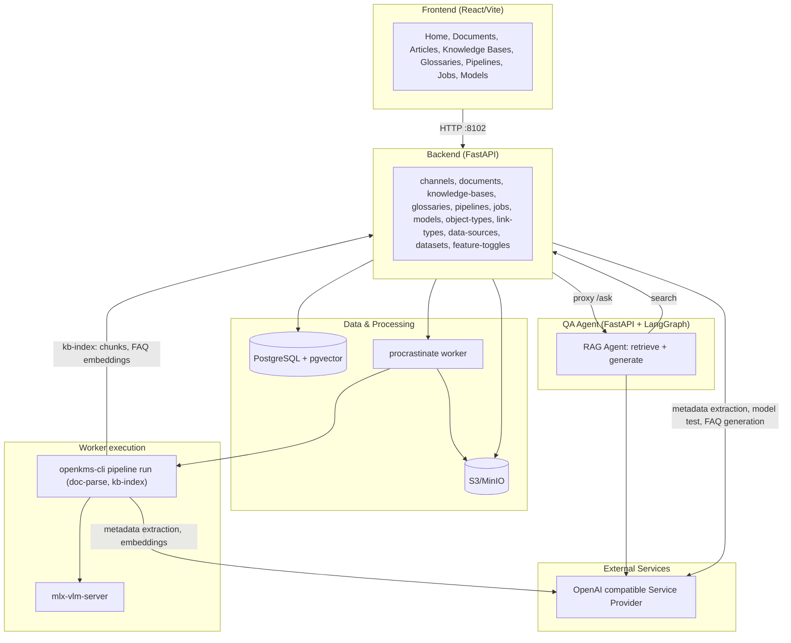
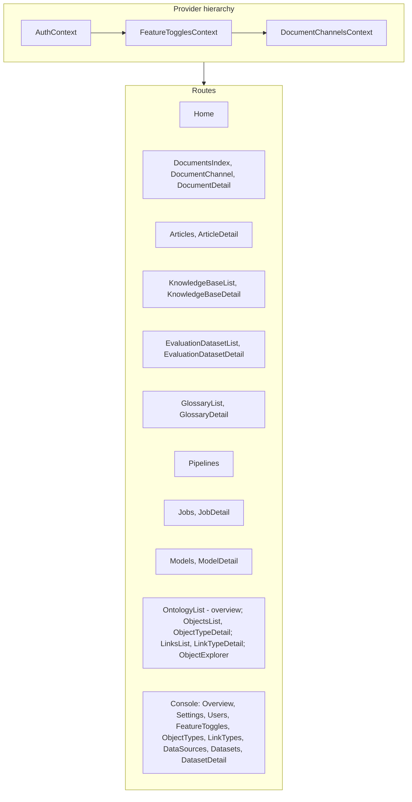
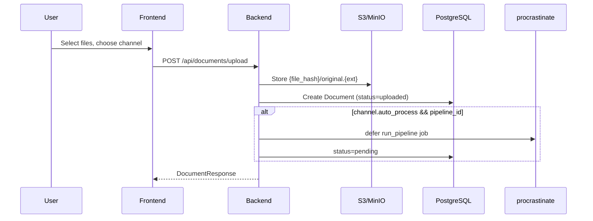
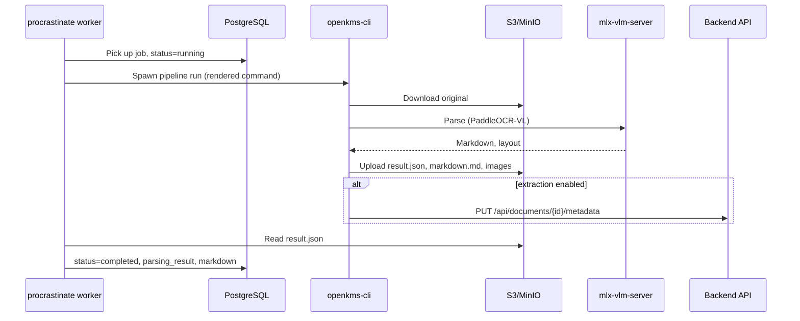
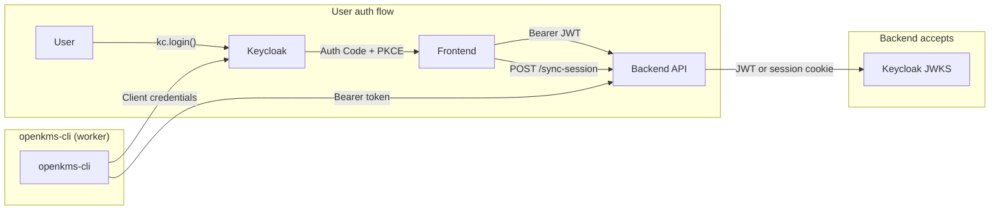

# openKMS Architecture

## High-Level Diagram



| Layer | Components |
|-------|------------|
| **PostgreSQL + pgvector** | documents, doc_channels, pipelines, api_providers, api_models, feature_toggles, object_types, object_instances, link_types, link_instances, data_sources, datasets, knowledge_bases, kb_documents, faqs, chunks, evaluation_datasets, evaluation_dataset_items, glossaries, glossary_terms, procrastinate_jobs |
| **S3/MinIO** | File storage under `{file_hash}/original.{ext}` |
| **Worker** | Picks up jobs, spawns openkms-cli subprocess, updates document status / indexes knowledge bases |
| **OpenAI compatible Service Provider** | OpenAI, Anthropic, etc.; metadata extraction, FAQ generation, embeddings, and model playground (configured via api_models) |
| **QA Agent** | Separate FastAPI + LangGraph service; retrieves via backend search API (no DB access), generates answers via LLM; configurable per knowledge base |

## Frontend Structure



```
frontend/src/
├── main.tsx                 # Entry
├── App.tsx                  # Routes, providers (Auth → FeatureToggles → DocumentChannels), ErrorBoundary, Suspense + lazy routes
├── config/index.ts          # API URL
├── components/Layout/       # MainLayout, Sidebar, Header
├── components/ErrorBoundary.tsx   # Catches uncaught errors, fallback UI with retry
├── components/ErrorBanner.tsx    # Page-level error banner (toast for transient errors)
├── contexts/                # DocumentChannelsContext, FeatureTogglesContext, AuthContext
├── data/                    # channelsApi, documentsApi, knowledgeBasesApi, evaluationDatasetsApi, glossariesApi, pipelinesApi, jobsApi, modelsApi, providersApi, ontologyApi, dataSourcesApi, datasetsApi, featureTogglesApi, channelUtils
└── pages/
    ├── Home.tsx
    ├── DocumentsIndex.tsx   # /documents – overview
    ├── DocumentChannel.tsx  # /documents/channels/:channelId
    ├── DocumentChannels.tsx # /documents/channels – manage
    ├── DocumentChannelSettings.tsx
    ├── DocumentDetail.tsx
    ├── Articles.tsx, ArticleDetail.tsx
    ├── KnowledgeBaseList.tsx, KnowledgeBaseDetail.tsx
    ├── EvaluationDatasetList.tsx, EvaluationDatasetDetail.tsx
    ├── GlossaryList.tsx, GlossaryDetail.tsx
    ├── Pipelines.tsx, Jobs.tsx, JobDetail.tsx, Models.tsx, ModelDetail.tsx
    ├── OntologyList.tsx, ObjectsList.tsx, ObjectTypeDetail.tsx, LinksList.tsx, LinkTypeDetail.tsx, ObjectExplorer.tsx
    └── console/             # ConsoleLayout, Overview, Settings, Users, FeatureToggles, ObjectTypes, LinkTypes, DataSources, Datasets, ConsoleDatasetDetail
```

## Backend Structure

```
backend/
├── app/
│   ├── main.py                  # FastAPI app, CORS, routers, procrastinate lifespan; rejects default secret in production
│   ├── config.py                # Settings (env: OPENKMS_*); vlm_url primary for VLM
│   ├── constants.py             # DocumentStatus enum (uploaded, pending, running, completed, failed)
│   ├── database.py              # Async engine, get_db, init_db
│   ├── api/
│   │   ├── auth.py              # OAuth2 Keycloak login/logout, require_auth, require_admin
│   │   ├── channels.py         # GET/POST/PUT /api/document-channels
│   │   ├── documents.py        # POST upload (store only), GET (channel_id, search, offset, limit), DELETE, PUT (name, channel_id), PUT metadata, PUT markdown, POST restore-markdown, POST extract-metadata, GET page-index, GET section (by line range)
│   │   ├── object_types.py     # CRUD /api/object-types; is_master_data, display_property; is_master_data filter for label config; instances from Neo4j when available
│   │   ├── link_types.py       # CRUD /api/link-types; instances from Neo4j when available; count_from_neo4j param for Links page
│   │   ├── ontology_explore.py # POST /api/ontology/explore; execute read-only Cypher against Neo4j (Object Explorer)
│   │   ├── data_sources.py     # CRUD /api/data-sources (admin), POST /{id}/test, POST /{id}/neo4j-delete-all; credentials encrypted
│   │   ├── datasets.py         # CRUD /api/datasets (admin), GET /from-source/{id} lists PG tables, GET /{id}/rows and /{id}/metadata
│   │   ├── feature_toggles.py  # GET/PUT /api/feature-toggles (PUT admin-only); hasNeo4jDataSource for sidebar visibility
│   │   ├── knowledge_bases.py  # CRUD /api/knowledge-bases, documents, FAQs, chunks, search, ask proxy
│   │   ├── evaluation_datasets.py  # CRUD /api/evaluation-datasets, items, items/import (CSV), run (search + LLM judge)
│   │   ├── glossaries.py       # CRUD /api/glossaries, terms, export, import
│   │   ├── pipelines.py       # CRUD /api/pipelines, template-variables
│   │   ├── models.py           # CRUD /api/models, GET config-by-name (service client), POST test
│   │   ├── providers.py        # CRUD /api/providers (service providers: OpenAI, Anthropic, etc.)
│   │   └── jobs.py             # GET/POST/DELETE /api/jobs, POST retry
│   ├── models/
│   │   ├── document.py          # Document model (+ status, metadata JSONB)
│   │   ├── document_channel.py  # DocumentChannel (+ pipeline_id, auto_process, extraction_model_id, extraction_schema, label_config, object_type_extraction_max_instances)
│   │   ├── pipeline.py         # Pipeline model (name, command, default_args, model_id)
│   │   ├── api_provider.py      # ApiProvider (name, base_url, api_key)
│   │   ├── api_model.py        # ApiModel (provider_id FK, name, category, model_name; inherits base_url/api_key from provider)
│   │   ├── feature_toggle.py  # FeatureToggle (key-value flags)
│   │   ├── object_type.py     # ObjectType (name, description, properties JSONB, dataset_id FK, key_property, is_master_data, display_property)
│   │   ├── object_instance.py # ObjectInstance (object_type_id FK, data JSONB)
│   │   ├── link_type.py       # LinkType (source_object_type_id, target_object_type_id)
│   │   ├── link_instance.py   # LinkInstance (link_type_id, source_object_id, target_object_id)
│   │   ├── data_source.py     # DataSource (kind, host, port, database, username_encrypted, password_encrypted)
│   │   ├── dataset.py         # Dataset (data_source_id FK, schema_name, table_name)
│   │   ├── knowledge_base.py  # KnowledgeBase (name, description, embedding_model_id, judge_model_id, agent_url, chunk_config, faq_prompt, metadata_keys)
│   │   ├── kb_document.py     # KBDocument join table (knowledge_base_id, document_id)
│   │   ├── faq.py             # FAQ (knowledge_base_id, question, answer, embedding via pgvector)
│   │   ├── chunk.py           # Chunk (knowledge_base_id, document_id, content, embedding via pgvector)
│   │   ├── glossary.py        # Glossary (name, description)
│   │   └── glossary_term.py   # GlossaryTerm (glossary_id, primary_en, primary_cn, definition, synonyms_en, synonyms_cn)
│   ├── schemas/
│   │   ├── document.py
│   │   ├── channel.py           # ChannelNode, ChannelCreate, ChannelUpdate, LabelConfigItem (label_config)
│   │   ├── pipeline.py         # PipelineCreate/Update/Response (+ model_id)
│   │   ├── api_model.py        # ApiModelCreate/Update/Response (+ provider_id)
│   │   ├── api_provider.py     # ApiProviderCreate/Update/Response
│   │   ├── job.py              # JobCreate/Response
│   │   ├── knowledge_base.py  # KB/FAQ/Chunk/Search/Ask schemas
│   │   ├── glossary.py        # Glossary/Term Create/Update/Response, Export/Import schemas
│   │   ├── ontology.py        # ObjectType/LinkType/ObjectInstance/LinkInstance schemas
│   │   └── data_source.py     # DataSourceCreate/Response; dataset.py for Dataset schemas
│   ├── jobs/
│   │   ├── __init__.py          # procrastinate App (PsycopgConnector)
│   │   └── tasks.py            # run_pipeline task, run_kb_index task (subprocess openkms-cli)
│   └── services/
│       ├── credential_encryption.py # Fernet encrypt/decrypt for DataSource credentials
│       ├── model_testing.py         # Model playground: build URL/headers/payload, parse response by category
│       ├── metadata_extraction.py   # pydantic-ai Agent + StructuredDict for metadata extraction (abstract, author, tags, object_type, list[object_type])
│       ├── faq_generation.py             # LLM-based FAQ pair generation from document markdown
│       ├── glossary_term_suggestion.py   # LLM suggests translation, definition, synonyms for glossary terms
│       ├── kb_search.py                  # Semantic search over chunks and FAQs (used by search route and evaluation)
│       ├── search_judge.py               # LLM judge for search retrieval evaluation (pass, score, reasoning)
│       └── storage.py                    # S3/MinIO client (upload, delete)
├── scripts/
│   ├── ensure_pgvector.py       # Pre-start: check/create pgvector extension; auto-install in Docker if missing
│   └── seed_mock_insurance_data.py  # Create mock diseases, insurance_products, disease_insurance_product tables in schema 'mock'
├── pyproject.toml               # Dependencies (uv.lock for reproducible installs)
└── worker.py                    # procrastinate worker entry point
```

## openkms-cli

Standalone CLI for document parsing, designed for backend integration. Developers can add CLI tools for pipeline steps.

```
openkms-cli/
├── pyproject.toml           # typer>=0.9.0, optional [parse], [pipeline], [metadata], [kb]
├── openkms_cli/
│   ├── __init__.py
│   ├── __main__.py          # python -m openkms_cli
│   ├── app.py               # Typer app, registers subcommands
│   ├── auth.py              # Keycloak client credentials (get_access_token)
│   ├── extract.py           # Metadata extraction via pydantic-ai (optional [metadata])
│   ├── parse_cli.py         # parse run command
│   ├── parser.py            # PaddleOCR-VL wrapper (optional [parse])
│   ├── pipeline_cli.py      # pipeline list, pipeline run (doc-parse, kb-index); optional [pipeline], [kb]
│   └── kb_indexer.py        # Chunking, embedding, pgvector bulk insert (optional [kb])
└── README.md
```

- **Purpose**: Decouple parsing from backend; run via subprocess in worker/job context
- **Commands**: `parse run`, `pipeline list`, `pipeline run`
- **Pipeline run**: Download from S3 → parse → upload to S3. When channel has extraction_model_id and extraction_schema, worker passes `--extract-metadata --extraction-model-name <model_name>`; CLI fetches model config via `GET /api/models/config-by-name`, extracts via pydantic-ai, PUTs to backend
- **Output**: result.json, markdown.md, layout_det_*, block_*, markdown_out/* (compatible with openKMS backend)
- **KB indexing**: `openkms-cli pipeline run --pipeline-name kb-index --knowledge-base-id <id>` – fetches KB config and documents from backend API, splits documents into chunks (fixed_size, markdown_header, paragraph), propagates document metadata to chunks/FAQs per `metadata_keys`, generates embeddings via OpenAI-compatible API, writes chunks via `POST /chunks/batch` and FAQ embeddings via `PUT /faqs/batch-embeddings` (no direct DB access)
- **Extensible**: Add new Typer subapps in app.py for additional CLI tools

## QA Agent Service

```
qa-agent/
├── pyproject.toml           # FastAPI, LangGraph, langchain-openai, httpx
├── qa_agent/
│   ├── __init__.py
│   ├── main.py              # FastAPI app with /ask endpoint
│   ├── config.py            # Settings (backend URL, LLM)
│   ├── agent.py             # LangGraph agent: retrieve → generate (with tools) → tools
│   ├── retriever.py         # Calls backend search API (no DB access)
│   ├── ontology_client.py   # GET object-types, link-types; POST ontology/explore (Cypher)
│   ├── tools.py             # get_ontology_schema_tool, run_cypher_tool
│   └── schemas.py           # AskRequest/AskResponse
├── .env.example
└── README.md
```

- **Purpose**: Separate RAG + ontology service for Q&A against knowledge bases; configurable per KB via `agent_url`
- **Architecture**: LangGraph state graph: `retrieve` (KB search) → `generate` (LLM with tools) ⇄ `tools` (ontology). RAG via `POST /api/knowledge-bases/{id}/search`; ontology via `GET /api/object-types`, `GET /api/link-types`, `POST /api/ontology/explore` (Cypher). Does not access the database directly.
- **Ontology skills**: For coverage questions (e.g. "Which insurance products cover heart attack?"), the agent calls `get_ontology_schema_tool` to learn node labels and relationship types, then `run_cypher_tool` to query Neo4j.
- **Integration**: Backend proxies `POST /api/knowledge-bases/{kb_id}/ask` to `{kb.agent_url}/ask`, passing the user's access token so the agent can call the backend APIs
- **Port**: 8103 by default

## Data Flow

### Document Upload (Decoupled)



1. Frontend opens upload modal on channel page; user selects files; `POST /api/documents/upload` (multipart: file + channel_id)
2. Backend stores original file to S3/MinIO under `{file_hash}/original.{ext}`; creates Document with `status=uploaded` (no parsing at upload time)
3. If channel has `auto_process=true` and a linked pipeline, a procrastinate job is deferred automatically (`status=pending`)
4. Response: DocumentResponse with status

### Document Processing (Job Queue)



1. Jobs can be created: manually via `POST /api/jobs`, or automatically on upload (if channel has auto_process)
2. The job references a Pipeline configuration (command template with `{variable}` placeholders, default_args, optional linked model)
3. procrastinate worker picks up the job, renders the command template (substituting `{input}`, `{s3_prefix}`, `{vlm_url}`, `{model_name}`, etc.; model-linked values override defaults), sets `Document.status=running`
4. If document's channel has extraction_model_id and extraction_schema, worker appends `--extract-metadata --document-id ... --api-url ... --extraction-schema-file ... --extraction-model-base-url ... --extraction-model-name ...` and passes `EXTRACTION_MODEL_API_KEY` in env
5. Worker spawns the rendered command (e.g. `openkms-cli pipeline run --pipeline-name paddleocr-doc-parse --input s3://bucket/{file_hash}/original.{ext} --s3-prefix {file_hash}`)
6. CLI gets Keycloak token (client credentials), parses document via PaddleOCR-VL, uploads results to S3; if extraction enabled, extracts metadata via pydantic-ai and PUTs to `PUT /api/documents/{id}/metadata`
7. Worker reads result.json from S3, updates Document (parsing_result, markdown, `status=completed`)
8. On failure: `status=failed`; user can retry via `POST /api/jobs/{id}/retry`

### Document Detail

1. Frontend fetches `GET /api/documents/{id}` – document includes parsing_result, markdown, and status
2. Document files (images, markdown assets): frontend requests `GET /api/documents/{id}/files/{file_hash}/{path}`; backend redirects (302) to presigned S3 URL via frontend proxy
3. If document status is `uploaded` or `failed`, a "Process" button appears to trigger processing
4. If document status is `pending` or `failed`, a "Reset" button appears to reset status to `uploaded` (only if no active jobs exist)
5. Metadata section: single unified METADATA section (extracted + manual labels); extract via pydantic-ai Agent + StructuredDict (channel's extraction_model_id + extraction_schema, supports object_type and list[object_type]); `POST /api/documents/{id}/extract-metadata`; manual edit via `PUT /api/documents/{id}/metadata` (editable fields per extraction_schema and label_config)
6. Document info: Name editable via Edit button; `PUT /api/documents/{id}` with `{ name }`
7. Markdown edit: Edit/View toggle in markdown panel; edit mode shows textarea with Save (`PUT /api/documents/{id}/markdown`) and Restore (`POST /api/documents/{id}/restore-markdown`) from S3 `{file_hash}/markdown.md`; only for real documents (not examples)

### Channel Tree

1. Frontend `DocumentChannelsContext` fetches `GET /api/document-channels`
2. Backend returns nested `ChannelNode[]` (id, name, description, children)
3. Sidebar and Documents pages use `channelUtils` (flattenChannels, getDocumentChannelName, etc.)

### Document List by Channel

- Frontend fetches `GET /api/documents?channel_id=` for the current channel; `channel_id` optional (all documents)
- Optional `search` param filters by document name; `limit` defaults to 200
- Backend returns documents in channel and descendants (or all if no channel)

## Authentication (Keycloak)



- **Backend**: Requires auth for `/api/*` (channels, documents). Accepts either session cookie (from backend OAuth flow) or `Authorization: Bearer <JWT>`. JWT validated via Keycloak JWKS.
- **Frontend**: Keycloak JS adapter (Authorization Code + PKCE); sends Bearer token in API requests; calls `POST /sync-session` after login to sync JWT to backend session (for img requests that use cookies).
- **Login**: Uses `kc.login()` (SSO if user already has Keycloak session).
- **Logout**: Uses `kc.logout()` – redirects to Keycloak logout, then back to frontend. Requires frontend origin in Keycloak "Valid Post Logout Redirect URIs".
- `GET /login` – redirects to Keycloak (backend OAuth, optional)
- `GET /login/oauth2/code/keycloak` – OAuth callback; stores tokens in session
- `POST /sync-session` – accepts Bearer JWT; stores in session (for frontend Keycloak JS flow)
- `POST /clear-session` – clears backend session only (called before Keycloak logout)
- `GET /logout` – clears session; redirects to Keycloak logout (legacy)
- **Route protection**: All pages except home require auth; unauthenticated users see "Authentication Required" with Sign in button.
- **Console**: Only users with realm role `admin` can access (Header link, Sidebar, routes). Non-admins redirected to home.

## Configuration

| Layer | Config |
|-------|--------|
| Backend | `.env` / `OPENKMS_*` – database, VLM, PaddleOCR, extraction_model_id, OPENKMS_BACKEND_URL (for CLI metadata extraction) |
| Backend | `KEYCLOAK_*` – auth server, realm, client id/secret, redirect URI, frontend URL, KEYCLOAK_SERVICE_CLIENT_ID (openkms-cli) |
| Backend | `AWS_*` – S3/MinIO for file storage (optional) |
| Frontend | `config/index.ts` – `apiUrl`, `keycloak` (url, realm, clientId). In dev, `apiUrl` defaults to '' (uses proxy). |
| Vite dev | Proxy `/api`, `/sync-session`, `/clear-session` → backend; `/buckets/openkms` → MinIO |
| Alembic | `alembic.ini` – uses `settings.database_url_sync` |
| Cursor | `.cursor/rules/` – project rules (e.g. docs-before-commit, alembic-migrations) |
