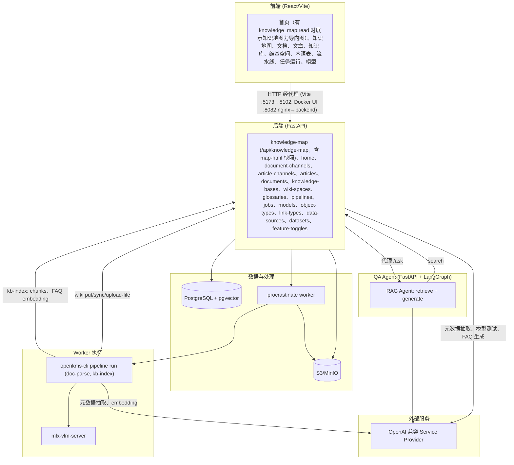
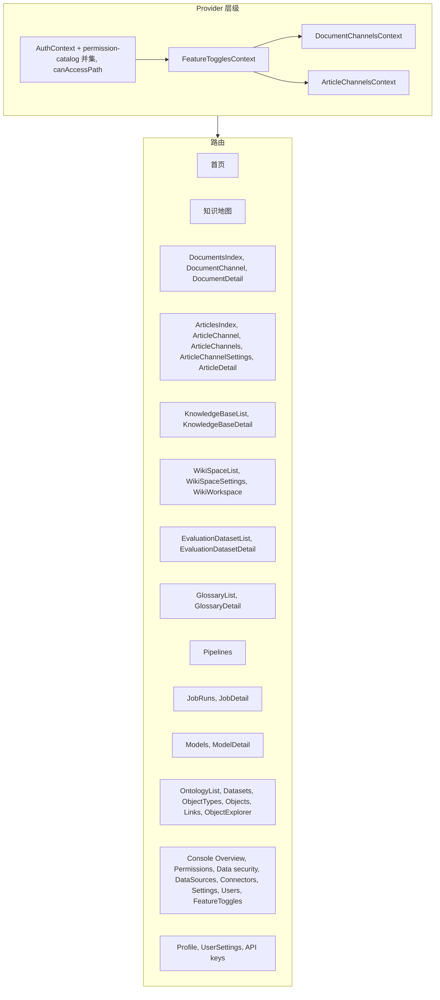
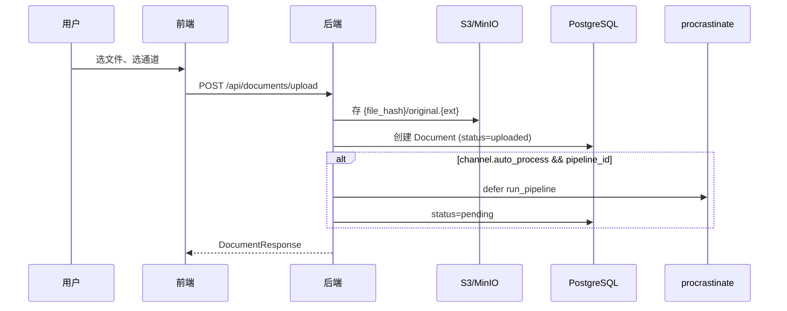
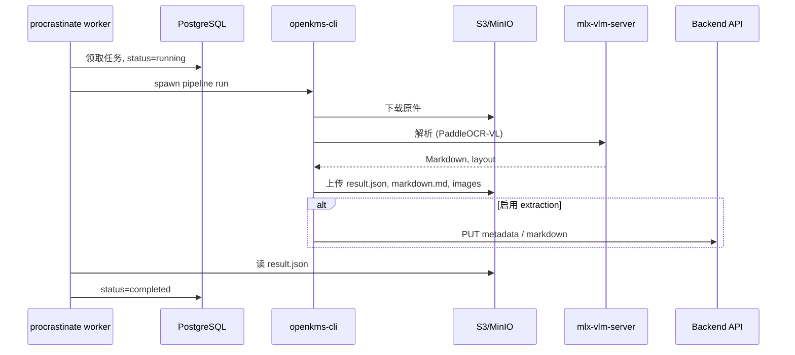
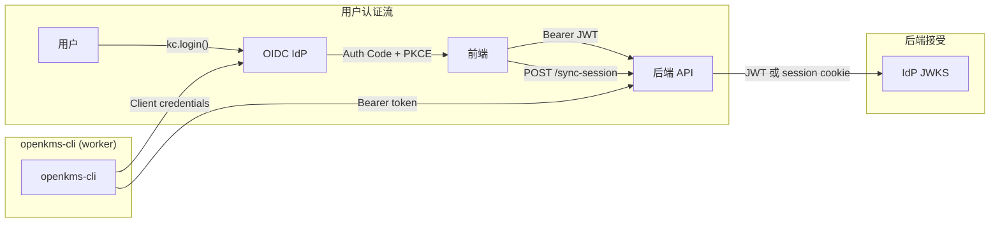

# openKMS 架构

**`docker/docker-compose.yml`** 运行完整栈（Postgres/pgvector、MinIO、本体图存储用 **Neo4j**、backend、**scheduler**（中央 cron）、带 `openkms-cli` 解析的 procrastinate **worker**、nginx 前端 **http://localhost:8082**）。**worker** 镜像为 **`platform: linux/amd64`**（Apple Silicon 经模拟运行 Paddle wheel），并安装 **`libgl1`**（OpenCV/PaddleX）及 **LibreOffice（writer + impress）**（**DOCX/PPTX**）与 **mupdf-tools**（`mutool`，**EPUB** → PDF 再解析）。**Postgres**、**MinIO**、**backend** 不发布到主机；服务经 Docker DNS（`postgres`、`minio`、`backend:8102`）互访，浏览器经 **8082** 由 nginx 代理 **`/api`**、**`/internal-api`**、认证路由与 **`/buckets/...`**。镜像：**`docker/Dockerfile`**（`backend`、`worker`）、**`docker/Dockerfile.frontend`**。仓库根目录：**`docker compose -f docker/docker-compose.yml`** 用于 **`build`**、**`up -d --build`**、**`down`**（**`docker/README.md`**）。

## 高层架构图



| 层 | 作用 |
|----|------|
| **PostgreSQL + pgvector** | 系统记录 — 元数据、权限与向量 embedding。领域：**认证与 ACL**（用户、角色、组、资源 ACL）、**通道与内容**（文档、文章、版本、关系）、**知识**（知识库、分块、FAQ、维基、术语表）、**本体**（对象/链接类型与实例、数据集）、**运维**（流水线、任务、模型、评测、知识地图）、**系统**（设置、功能开关）。完整表清单：[data-models.md](features/data-models.md)。 |
| **S3/MinIO** | 大文件 — 文档原件（`{file_hash}/…`）、文章包、维基 vault 镜像与临时文件、维基链接图缓存 JSON。浏览器经 API presigned 重定向访问。 |
| **Worker** | procrastinate worker 执行延迟任务（文档解析、知识库索引等），拉起 **openkms-cli**；在 PostgreSQL 中更新状态。 |
| **LLM 提供商** | 外部 OpenAI 兼容 API，配置为 **api_providers** / **api_models** — 元数据抽取、FAQ 生成、embedding、模型 playground。 |
| **QA Agent** | 按知识库配置的独立 FastAPI + LangGraph 服务；仅经后端 API 检索（不直连数据库）。 |
| **Wiki Copilot** | **主** API 进程内 LangGraph 代理（`/api/agent/*`），供维基 UI 使用 — 页面搜索、关联文档、可选 upsert。与 QA Agent 不同。详见 [wiki_agent_prototype.md](./wiki_agent_prototype.md)。 |

## 前端结构



本体论相关 SPA 源码位于 `frontend/src/pages/ontology/`。Console 管理页位于 `frontend/src/pages/console/`。

### 目录布局（`frontend/src/`）

| 区域 | 作用 |
|------|------|
| **`App.tsx`** | 路由表、Provider 嵌套（见上图）、`ErrorBoundary`、懒加载页面 |
| **`pages/`** | 每个路由一个页面，按领域分子目录（`documents/`、`articles/`、`wiki/`、`ontology/`、`console/` 等）。与上图对应即可，不必在此罗列每个文件名 |
| **`components/`** | 跨路由复用的 UI（布局壳、markdown、图、错误边界）。仅单页使用的组件放在对应 `pages/` 旁 |
| **`data/`** | 按 API 领域划分的 HTTP 客户端；统一经 `apiClient.ts` 的 **`authAwareFetch`** |
| **`contexts/`** | 跨页 React 状态（认证、功能开关、通道列表） |
| **`config/`** | API 根路径与供 UI 门控用的 `PERM_*` 镜像 |
| **`styles/`** | 全局设计系统 — 细则见 [`frontend/src/styles/README.md`](../frontend/src/styles/README.md) |
| **`i18n/`** | 语言包与 namespace（见下文） |
| **`graph/`** | 2D/3D 或 wiki/首页共用同一图模型时的类型与构建逻辑 |

```
frontend/src/
├── App.tsx, main.tsx, index.scss
├── pages/
│   ├── documents/, articles/, wiki/, knowledge-bases/, knowledge-map/
│   ├── evaluation/, glossaries/, ontology/, console/
│   ├── agents/, pipelines/, jobs/, models/, auth/, connectors/
│   └── Home.tsx, Profile.tsx, UserSettings.tsx, GlobalSearch.tsx
├── components/
│   ├── Layout/                 # 外壳：侧栏、顶栏、路由门控
│   ├── markdown/, wiki/, agents/, knowledge-bases/, jobs/, ui/
│   └── KnowledgeMapForceGraph*.tsx, ErrorBoundary, …
├── data/                       # 按后端领域划分的 *Api.ts（+ apiClient.ts）
├── contexts/                   # Auth、FeatureToggles、DocumentChannels、ArticleChannels
├── config/                     # API 地址、PERM_* 镜像
├── styles/
│   ├── design-system/          # token、mixin、全局 — 见 styles/README.md
│   └── account-page.scss
├── i18n/locales/{en,zh-CN}/    # 按界面划分的 namespace
├── graph/                      # 知识地图共用图模型
└── utils/                      # permissionPatterns 等工具
```

### 约定

- **新功能页** — 在 `pages/<领域>/` 增加 `Feature.tsx` 与同目录 `Feature.scss`；在 `App.tsx` 注册懒加载路由；在 `data/` 新增或扩展 HTTP 模块。
- **样式** — SCSS 中 `@use` 设计系统 token/mixin；间距与字号用 `var(--space-*)`、`var(--text-*)`；设置页宽度用 `ds.$km-layout-max`；Profile / 个人设置复用 `account-page.scss`（`account-*` 类）。
- **导航与权限** — 侧栏用 `canAccessPath` 与功能开关；以后端权限为准。
- **命名** — `*List` / `*Detail` / `*Settings` 表示浏览 → 详情 → 配置；文档与文章采用相同的通道模式（索引 → 通道树 → 通道内列表 → 设置）。
- **去哪查** — 路由看 `App.tsx`；API 看 `data/*Api.ts`；外壳看 `components/Layout/`；token 与间距看 `styles/README.md`。

### 国际化（SPA）

SPA 使用 **i18next** + **react-i18next**（[`frontend/src/i18n/`](https://github.com/yingrui/openKMS/tree/main/frontend/src/i18n)）：locale **`en`** 与 **`zh-CN`**，按表面划分 namespace（如 **`layout`**、**`knowledgeBase`**、**`wikiSpace`**），在 **`frontend/src/i18n/config.ts`** 注册。登录后语言经 **`PATCH /api/auth/me`** 写入 **`user_preferences`**（JWT `sub`），**`GET /api/auth/me`** 时恢复；**`localStorage`**（`openkms_locale`）缓存当前 locale 供 **`Accept-Language`**（[`getAuthHeaders`](https://github.com/yingrui/openKMS/blob/main/frontend/src/data/apiClient.ts)）与 profile 加载前首屏。核心 shell 字符串使用翻译键。

## 后端结构

### 目录布局（`backend/`）

| 层级 | 作用 |
|------|------|
| **`app/main.py`** | FastAPI 应用、路由注册、lifespan |
| **`app/api/`** | HTTP 路由 — 按领域分模块（或 `admin/` 包）；与前端 `data/*Api.ts` 对应 |
| **`app/models/`** | SQLAlchemy ORM — 按表簇分模块 |
| **`app/schemas/`** | API 请求/响应的 Pydantic 类型 |
| **`app/services/`** | 业务逻辑、LLM、S3、权限与守卫 — 路由保持精简 |
| **`app/jobs/`** | procrastinate 应用与延迟任务（`run_pipeline`、`run_kb_index` 等） |
| **`app/i18n/`** | 多语言 API 错误目录 + `Accept-Language` |
| **`app/middleware/`** | 可选的严格权限模式校验 |
| **`scheduler.py` / `worker.py`** | 定时调度（单实例）与任务 worker（可扩展）— 见下文 |
| **`scripts/`** | 启动辅助（`ensure_pgvector.py` 等） |

```
backend/
├── app/
│   ├── main.py, config.py, database.py
│   ├── api/
│   │   ├── auth.py, channels.py, documents.py, articles.py, …
│   │   ├── admin/              # 控制台：用户组、安全角色、健康检查
│   │   └── internal/           # 仅 worker / openkms-cli
│   ├── models/                 # document、wiki、knowledge_base、evaluation 等
│   ├── schemas/                # 与 api 领域配对
│   ├── services/
│   │   ├── agent/, evaluation/, connector_sync/, connector_search/, …
│   │   └── *.py                # kb_search、wiki_vault_import、permission_*、守卫、storage
│   ├── jobs/tasks.py
│   ├── i18n/
│   └── middleware/
├── scripts/
├── scheduler.py
└── worker.py
```

### 约定

- **新 HTTP 功能** — 增加 `api/<领域>.py` 路由、`schemas/<领域>.py`、新表则改 `models/`（Alembic 迁移），逻辑放在 `services/`；在 `main.py` 注册路由。
- **权限** — 路由上 `require_permission`；通道/文档/文章用 `context_guard` / `resource_acl_service` 做资源 ACL；目录在 `services/permission_*`。
- **长任务** — API 中 defer 到 `jobs/tasks.py`；worker 按需拉起 openkms-cli 子进程。
- **仅内部** — CLI 默认值与凭据在 `api/internal/`（不对浏览器暴露）。
- **去哪查** — 路由列表 → `app/api/`；表结构 → `app/models/`；副作用 → `app/services/`；异步任务 → `app/jobs/tasks.py`。

**后台进程：** **API**（`uvicorn`）提供 HTTP 并维护进程心跳注册表。**Scheduler**（`scheduler.py`，单副本）每分钟读取 `scheduled_triggers` 并 defer 任务。**Worker**（`worker.py`，可扩展）只执行 procrastinate 任务，不扫 cron。

**公开（无认证）API 布局：** 只读无 session 端点（除 auth bootstrap）使用 **`/api/public/<resource>`**（如 **`GET /api/public/system`**）。启用严格模式时须列入 **`strict_permission_patterns._UNAUTH_EXACT`**。

## openkms-cli

独立 CLI，供文档解析与后端集成；开发者为流水线步骤添加子命令。

```
openkms-cli/
├── pyproject.toml           # typer；可选 [parse], [pipeline], [metadata], [kb], [dev]
├── tests/
├── schemas/                 # document_parse_result.schema.json
├── openkms_cli/
│   ├── app.py, settings.py, auth.py, backend_defaults.py
│   ├── baidu_parser.py, parse_result.py, extract.py, parse_cli.py, parser.py
│   ├── office_convert.py    # LibreOffice + mutool → PDF
│   ├── pipeline_cli.py, kb_indexer.py
└── README.md
```

- **目的**：解析与后端解耦；worker/任务上下文经 subprocess 运行
- **测试**：在 **`openkms-cli/`** 运行 `pip install -e ".[dev]" && pytest tests/`
- **配置**：`settings.py` 显式映射环境变量；加载 `openkms-cli/.env` 与 cwd `.env`；CLI  flag 优先
- **命令**：`parse run`、`pipeline list`、`pipeline run`
- **Pipeline run**：S3 下载 →（可选 Office/EPUB 转 PDF）→ 解析 → 上传 S3；通道有 extraction 时 worker 传 `--extract-metadata`；解析成功后抽取失败仅记日志不失败任务
- **输出**：result.json、markdown.md、layout 等（与 openKMS backend 兼容）
- **KB 索引**：`kb-index` 流水线；wiki 可按 space 重索引
- **扩展**：在 `app.py` 注册新 Typer 子应用

## openkms-skill（OpenCode / 外部 Agent）

可选目录 **`openkms-skill/`**（不在 Docker 栈）打包 Python CLI + **`SKILL.md`**，供 [OpenCode](https://opencode.ai/docs/skills) 类 Agent 调用与 SPA 相同的 **`/api/...`**，使用应用内创建的**个人 API 密钥**（**Settings** → **API keys**，`/settings`）。安装：**`openkms-skill/install.sh`** → **`~/.config/opencode/skills/openkms/`**（重装保留 **`config.yml`**）。

完整说明：**[OpenCode 技能（`openkms-skill`）](features/opencode-openkms-skill.md)**。与 **`openkms-cli`**（worker 子进程、internal + public API 环境认证）不同。

## QA Agent 服务

```
qa-agent/
├── pyproject.toml
├── qa_agent/
│   ├── main.py              # /ask、/ask/stream (NDJSON)
│   ├── config.py, agent.py, retriever.py, ontology_client.py, tools.py, schemas.py
├── .env.example
└── README.md
```

- **目的**：独立 RAG + 本体服务，供知识库问答；经 KB 的 `agent_url` 配置
- **架构**：LangGraph：`retrieve` → `generate` ⇄ `tools`（本体）。RAG 经 `POST /api/knowledge-bases/{id}/search`；本体经 object-types、link-types、ontology/explore（Cypher）。不直连数据库。
- **本体技能**：覆盖类问题先 `get_ontology_schema_tool` 再 `run_cypher_tool` 查 Neo4j。
- **集成**：后端代理 `POST …/ask` 与 **`…/ask/stream`** 到 qa-agent，转发用户 token；持久化线程经 **`agent-conversations/.../messages`** 存 PostgreSQL 并转发 NDJSON。SPA 全页 Q&A 与 Wiki Copilot 共用 **`delta` / `tool_*` / `done`** 形状。
- **端口**：默认 8103

## 数据流

### 文档上传（解耦）



1. 前端在通道页打开上传；`POST /api/documents/upload`（multipart：file + channel_id）
2. 后端存 S3 `{file_hash}/original.{ext}`；创建 `status=uploaded` 的 Document（上传时不解析）
3. 通道 `auto_process=true` 且有关联 pipeline 时自动 defer 任务（`status=pending`）
4. 返回 DocumentResponse

### 文档处理（任务队列）



1. 任务来源：`POST /api/jobs` 或上传时自动（auto_process）
2. 任务引用 Pipeline（命令模板、`{variable}`、`default_args`、可选 model）
3. Worker 渲染命令、设 `status=running`
4. 有 extraction 时 worker 追加 `--extract-metadata` 等参数
5. Worker spawn 命令（如 `openkms-cli pipeline run --pipeline-name paddleocr-doc-parse …`）
6. CLI 认证（OIDC client credentials 或 local Basic）→ 解析 → 上传 S3；经 **`PUT /internal-api/documents/{id}/markdown`**、**metadata** 同步（internal 服务客户端；无通道写 ACL）
7. Worker 读 result.json，更新 Document（`status=completed`）
8. 失败：`status=failed`；可 `POST /api/jobs/{id}/retry`

### 文档详情

1. `GET /api/documents/{id}` — 含 parsing_result、markdown、status
2. 文件经 `GET /api/documents/{id}/files/...` → presigned 302
3. `uploaded`/`failed` 显示「Process」；`pending`/`failed` 且无活跃任务可「Reset」
4. 元数据：统一 METADATA；`POST extract-metadata`；`PUT metadata` 手工编辑
5. 名称 `PUT /api/documents/{id}`；markdown 编辑/保存/从 S3 恢复
6. 版本：显式快照 `POST .../versions`；列表、预览、恢复

### 通道树

1. `DocumentChannelsContext` → `GET /api/document-channels`
2. 嵌套 `ChannelNode[]`
3. Sidebar 与文档页用 `channelUtils`

### 按通道文档列表

- `GET /api/documents?channel_id=`；可选 `search`；`limit` 默认 200
- 返回通道及子孙（或无 channel 时全部）

## 认证（`OPENKMS_AUTH_MODE`）

两种模式（默认 **`oidc`**）。部署须保持 **backend** `OPENKMS_AUTH_MODE` 与 **frontend** 一致：SPA 调用 **`GET /api/auth/public-config`**（无 auth）取 **`auth_mode`**、**`allow_signup`**。**openkms-cli** 与 **qa-agent** 仅用 **internal service** auth 访问 **`/internal-api/models/...`**（`sub=local-cli` 的 Basic，或 **`azp`** 在 **`OPENKMS_INTERNAL_SERVICE_CLIENT_IDS`** 的 OIDC client credentials）；人类 SPA token 拒绝。**`/internal-api`** 不在可选严格 permission 中间件内（仅查 **`/api/...`**）。SPA 可 **`GET /api/public/system`** 取 **`system_name`**。应用据 API 在 **OIDC（Authorization Code + PKCE，`oidc-client-ts`）** 与本地表单间切换；`VITE_AUTH_MODE` 仅 API 失败时回退，且与 backend 不一致时横幅提示。

### OIDC 模式



- **后端**：解析 issuer、discovery、JWKS 校验 JWT；可选 session cookie（`POST /sync-session`）
- **前端**：**`oidc-client-ts`**；redirect **`/auth/callback`**、**`/auth/silent-renew`**
- `GET /login`、OAuth callback、`GET /logout` 等

### Local 模式

- **后端**：`users` 表、bcrypt、HS256 JWT（`OPENKMS_SECRET_KEY`）
- **端点**：register、login、me、logout、sync-session
- **CLI**：`OPENKMS_CLI_BASIC_*` → Basic（仅可信网络）
- **前端**：`/login`、`/signup`；`allow_signup` 控制注册
- OIDC 路由在 local 模式重定向到 `/login?notice=local_auth`

### 共用

- **API 上无效 JWT**：**`authAwareFetch`** 对 session 类 **401** 先静默重试（OIDC `signinSilent` + sync-session；local 查 me）；仍失败则清 session、toast、跳转登录；返回合成 **401**（`SESSION_EXPIRED_API_DETAIL`）
- **路由保护**：**`/`** 对访客公开；其余 **MainLayout** 页需认证
- **Console**：OIDC `admin` 或 local `is_admin` / `user_security_roles`
- `POST /clear-session` 清 cookie

## 配置

| 层 | 配置 |
|----|------|
| Backend | `.env` / `OPENKMS_*` — 数据库、**`OPENKMS_VLM_URL`**（mlx-vlm；非 embedding 网关）、Paddle 默认、**OPENKMS_PIPELINE_TIMEOUT_SECONDS** 等。**不用：** `OPENKMS_VLM_API_KEY`、`OPENKMS_EMBEDDING_MODEL_*`（CLI/KB 模型） |
| Backend | `OPENKMS_DEBUG`、**`OPENKMS_SQL_ECHO`**、**`OPENKMS_PERMISSION_CATALOG_CACHE_SECONDS`** |
| Backend | `OPENKMS_AUTH_MODE`、`OPENKMS_ALLOW_SIGNUP`、`OPENKMS_CLI_BASIC_*`、`OPENKMS_LOCAL_JWT_EXP_HOURS` |
| Backend | `OPENKMS_OIDC_*`、`OPENKMS_FRONTEND_URL`、`AWS_*`（S3/MinIO） |
| Frontend | `config/index.ts` — `apiUrl`、`authMode` 回退、`oidc`（`VITE_OIDC_*`）；运行时来自 public-config |
| Vite dev | 代理 **`/api`**、**`/internal-api`**、session 路由 → **8102**；**`/buckets/openkms`** → MinIO **9000** |
| Alembic | `alembic.ini` — `settings.database_url_sync` |
| Cursor | `.cursor/rules/` — 项目规则 |
