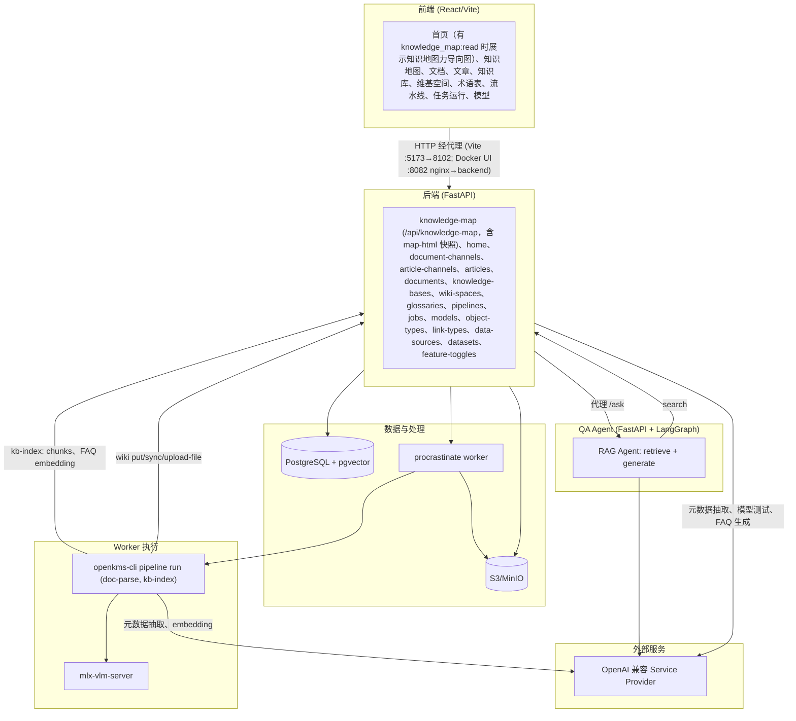
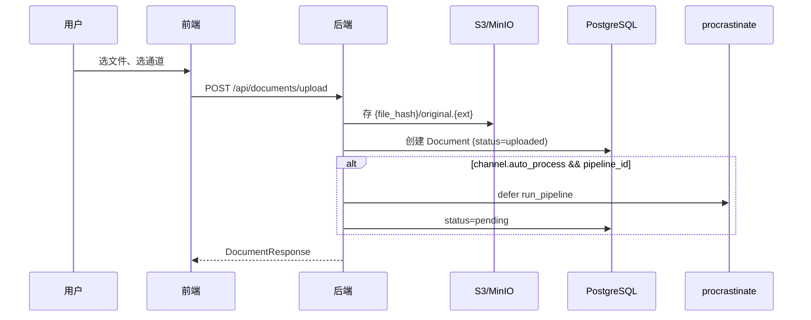
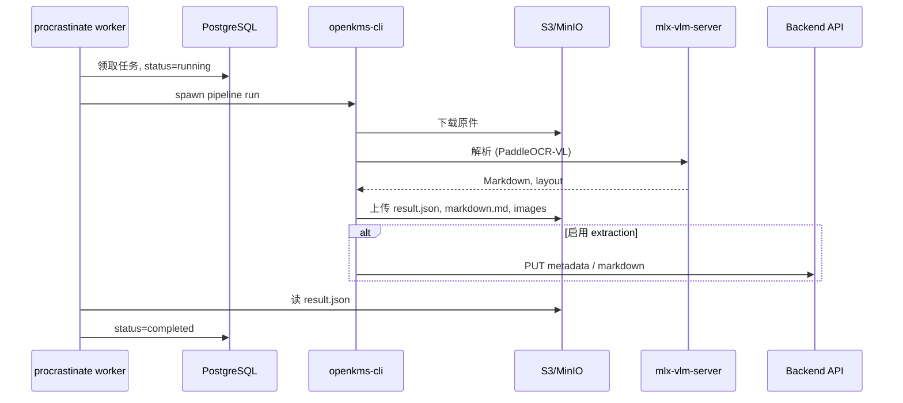
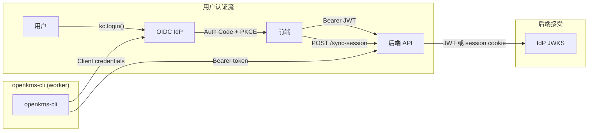

# openKMS 架构

**`docker/docker-compose.yml`** 运行完整栈（Postgres/pgvector、MinIO、本体图存储用 **Neo4j**、backend、**scheduler**（中央 cron）、带 `openkms-cli` 解析的 procrastinate **worker**、nginx 前端 **http://localhost:8082**）。**worker** 镜像为 **`platform: linux/amd64`**（Apple Silicon 经模拟运行 Paddle wheel），并安装 **`libgl1`**（OpenCV/PaddleX）及 **LibreOffice（writer + impress）**（**DOCX/PPTX**）与 **mupdf-tools**（`mutool`，**EPUB** → PDF 再解析）。**Postgres**、**MinIO**、**backend** 不发布到主机；服务经 Docker DNS（`postgres`、`minio`、`backend:8102`）互访，浏览器经 **8082** 由 nginx 代理 **`/api`**、**`/internal-api`**、认证路由与 **`/buckets/...`**。镜像：**`docker/Dockerfile`**（`backend`、`worker`）、**`docker/Dockerfile.frontend`**。仓库根目录：**`docker compose -f docker/docker-compose.yml`** 用于 **`build`**、**`up -d --build`**、**`down`**（**`docker/README.md`**）。

## 高层架构图



| 层 | 组件 |
|----|------|
| **PostgreSQL + pgvector** | users（本地认证）、**user_api_keys**（哈希个人 API token；Bearer `okms.{id}.{secret}` 以所有者身份认证）、**security_permissions**（权限键目录：label、route/API 模式）、**security_roles**、**security_role_permissions**、**user_security_roles**（本地用户 ↔ 角色）、**access_groups**、**access_group_members**（主体 ↔ 组）、**resource_acl_entries**（按资源共享：对用户/组/authenticated 的 r/w/m；容器继承）、**system_settings**（单行：`system_name`、`default_timezone`、`api_base_url_note`）、**knowledge_map_nodes**（知识地图术语自引用树）、**knowledge_map_resource_links**（文档通道、文章通道 id 或 wiki space → 节点；知识地图 UI 按术语管理）、**knowledge_map_html_artifact**（单例缓存 LLM HTML 概览 + 语义 `content_hash`）、**article_channels**（树；无解析流水线）、**articles**（markdown 工作副本 + `series_id`、生命周期日期、`origin_article_id`、`last_synced_at`；metadata JSONB）、**article_versions**、**article_attachments**、documents（**series_id**、**effective_from** / **effective_to**、**lifecycle_status**；**document_relationships** 有向边：supersedes、amends、implements、see_also）、document_versions、doc_channels、pipelines、api_providers、api_models、feature_toggles、object_types、object_instances、link_types、link_instances、data_sources、datasets、knowledge_bases、kb_documents、faqs、chunks、**wiki_spaces**、**wiki_pages**、**wiki_files**、evaluation_datasets、evaluation_dataset_items、evaluation_runs、evaluation_run_items、glossaries、glossary_terms、procrastinate_jobs |
| **S3/MinIO** | 文件存储 `{file_hash}/original.{ext}`；**文章包** `articles/{article_id}/content.md`、`articles/{article_id}/images/…`、`articles/{article_id}/attachments/…`、可选 `origin.html`（经认证 `GET /api/articles/{id}/files/{path}` → presigned 重定向）；维基 **vault 镜像** `wiki/{space_id}/vault/{relative-path}`（vault 导入与 multipart 上传、可规范化路径）；启用存储时 markdown 页亦写入 `…/vault/{wiki_path}.md`；**Graph View** 缓存 JSON `wiki/{space_id}/link-graph.json`（当 `max(wiki_pages.updated_at)` 新于对象 `LastModified` 时失效）；不可规范化名的临时上传用 `wiki/{space_id}/files/{file_id}/…` |
| **Worker** | 领取任务、spawn openkms-cli 子进程、更新文档状态 / 索引知识库 |
| **OpenAI 兼容 Service Provider** | OpenAI、Anthropic 等；元数据抽取、FAQ 生成、embedding、模型 playground（经 api_models 配置） |
| **QA Agent** | 独立 FastAPI + LangGraph；经后端 search API 检索（无 DB 直连），LLM 生成答案；按知识库配置 |
| **维基内嵌 Agent（MVP）** | 维基 UI 的 **Wiki Copilot**：**主** FastAPI 进程内 LangGraph：`POST/GET/DELETE/PATCH` **`/api/agent/conversations`**（列表按 `wiki_space_id` 过滤）、消息路由、维基工具（`list_wiki_pages`、**`search_wiki_pages`**、`get_wiki_page`、`list_linked_channel_documents`；JWT 有 `wikis:write` 时 **`upsert_wiki_page`**）；**流式**消息用 LangGraph `astream_events`（v2），NDJSON 除 token `delta` 外含 **`tool_start` / `tool_end` / `tool_error`**。系统提示含 vendored [wiki-skills](https://github.com/kfchou/wiki-skills) `SKILL.md`（`third-party/wiki-skills`，git subtree）及 openKMS 映射；**wiki_space_documents** + linked-doc API。**与 qa-agent 不同**。[wiki_agent_prototype.md](./wiki_agent_prototype.md) |

## 前端结构

```mermaid
flowchart TB
  subgraph Providers["Provider 层级"]
    Auth[AuthContext + permission-catalog 并集 / canAccessPath]
    FT[FeatureTogglesContext]
    DC[DocumentChannelsContext]
    AC[ArticleChannelsContext]
    Auth --> FT
    FT --> DC
    FT --> AC
  end

  subgraph Pages["路由"]
    Home[首页]
    KnowledgeMapPage[知识地图]
    Docs[DocumentsIndex, DocumentChannel, DocumentDetail]
    Articles[ArticlesIndex, ArticleChannel, ArticleChannels, ArticleChannelSettings, ArticleDetail]
    KB[KnowledgeBaseList, KnowledgeBaseDetail]
    Wiki[WikiSpaceList, WikiSpaceSettings, WikiWorkspace]
    Eval[EvaluationDatasetList, EvaluationDatasetDetail]
    Glossaries[GlossaryList, GlossaryDetail]
    Pipelines[Pipelines]
    JobRuns[JobRuns, JobDetail]
    Models[Models, ModelDetail]
    Ontology[OntologyList; Datasets, DatasetDetail, ObjectTypesPage, LinkTypesPage; ObjectsList, ObjectTypeDetail; LinksList, LinkTypeDetail; ObjectExplorer] — SPA 源码 **`frontend/src/pages/ontology/`**
    Console[Console: Overview, Permission management, Data security, DataSources, Connectors, Settings, Users, FeatureToggles]
    UserSettings[Profile, UserSettings /settings API keys]
  end

  Providers --> Pages
```

```
frontend/src/
├── main.tsx                 # 入口 (`index.scss` → 设计系统变量、全局、工具类)
├── index.scss               # `@use` design-system: `css-variables`, `global`, `utilities`
├── styles/README.md         # 设计系统索引（token、约定、间距节奏）
├── styles/design-system/    # SCSS + CSS 变量: `_css-variables`（色板、间距 **`--gap-compact`** / **`--padding-compact-*`**、字体、动效、z-index、状态 pill、KB 图 **`--color-ontology-*`**、打印 **`--print-*`**）、`_tokens`（含 **`$km-layout-max`**）、`_mixins`、`_global`、可选 `_index`、`knowledge-map/`
├── styles/account-page.scss # Profile / 设置 共用卡片、表单、列表布局（`account-*` 类）
├── App.tsx                  # 路由、Provider（Auth → FeatureToggles → DocumentChannels → ArticleChannels）、ErrorBoundary、Suspense + lazy 路由
├── utils/permissionPatterns.ts  # 与后端对齐的前端 glob；catalog 模式并集供 SPA 门控
├── config/index.ts          # API URL；config/permissions.ts（PERM_* 镜像供 UI 门控）
├── components/Layout/       # MainLayout（路由门控；`/` 上 **`app-content--home`** padding）、Sidebar（canAccessPath + toggles 门控导航；**术语表**与**本体**为同级顶栏；本体子路由缩进；窄屏可折叠图标模式 + localStorage）、Header
├── components/KnowledgeMapForceGraph.tsx (+ `.scss`)  # 首页 hub：无已发布 HTML 时用 **`react-force-graph-2d`**；有快照则 **`iframe`** 展示。术语 → `/knowledge-map?node=…`；资源 → 通道/wiki/文章路由
├── components/KnowledgeMapForceGraph3D.tsx  # 可选 3D：**`react-force-graph-3d`**（仅 `/knowledge-map` **Explore (3D)** tab lazy）；共享 `src/graph/knowledgeMapGraphModel.ts`
├── graph/knowledgeMapGraphModel.ts  # `walkTree` + `KMNode` / `KMLink` 供 2D/3D 共用
├── components/ErrorBoundary.tsx   # 未捕获错误、重试 UI
├── components/ErrorBanner.tsx    # 页级错误横幅（瞬态错误用 toast）
├── components/markdown/     # `richMarkdown.tsx`：GFM + KaTeX + `rehype-raw` + **Mermaid**；Wiki/Document 预览、Agent 消息体
├── contexts/                # DocumentChannelsContext, ArticleChannelsContext, FeatureTogglesContext, AuthContext
├── data/                    # apiClient（getAuthHeaders、authAwareFetch + session-expired hook）、systemApi、channelsApi、…、**userApiKeysApi**
└── pages/
    ├── Home.tsx
    ├── Profile.tsx            # /profile — `GET /api/auth/me`
    ├── UserSettings.tsx       # /settings — 个人 API 密钥
    ├── DocumentsIndex.tsx   # /documents
    ├── DocumentChannel.tsx  # /documents/channels/:channelId
    ├── DocumentChannels.tsx # /documents/channels
    ├── DocumentChannelSettings.tsx
    ├── DocumentDetail.tsx
    ├── ArticlesIndex.tsx     # /articles
    ├── ArticleChannel.tsx   # /articles/channels/:channelId
    ├── ArticleChannels.tsx  # /articles/channels
    ├── ArticleChannelSettings.tsx
    ├── ArticleDetail.tsx   # /articles/view/:id — 共用 **DocumentDetail.scss**（信息卡、**Relationships**、markdown 编辑）
    ├── KnowledgeBaseList.tsx, KnowledgeBaseDetail.tsx
    ├── WikiSpaceList.tsx, WikiSpaceSettings.tsx, WikiSpaceGraph.tsx, **WikiWorkspace.tsx** + **WikiPagePanel.tsx**（多 tab + 图 tab；可选 **WikiSpaceAgentPanel** Copilot）、WikiPageEditor.tsx（re-export）
    ├── EvaluationDatasetList.tsx, EvaluationDatasetDetail.tsx
    ├── KnowledgeMap.tsx, GlossaryList.tsx, GlossaryDetail.tsx
    ├── Pipelines.tsx, JobRuns.tsx, JobDetail.tsx, Models.tsx, ModelDetail.tsx
    ├── ontology/            # 本体相关页面；ontology-admin.scss
    └── console/             # ConsoleLayout 及各 Console 页（datasets/schema UI 在 /ontology/*）
```

### 国际化（SPA）

SPA 使用 **i18next** + **react-i18next**（[`frontend/src/i18n/`](https://github.com/yingrui/openKMS/tree/main/frontend/src/i18n)）：locale **`en`** 与 **`zh-CN`**，按表面划分 namespace（如 **`layout`**、**`knowledgeBase`**、**`wikiSpace`**），在 **`frontend/src/i18n/config.ts`** 注册。登录后语言经 **`PATCH /api/auth/me`** 写入 **`user_preferences`**（JWT `sub`），**`GET /api/auth/me`** 时恢复；**`localStorage`**（`openkms_locale`）缓存当前 locale 供 **`Accept-Language`**（[`getAuthHeaders`](https://github.com/yingrui/openKMS/blob/main/frontend/src/data/apiClient.ts)）与 profile 加载前首屏。核心 shell 字符串使用翻译键。

## 后端结构

```
backend/
├── app/
│   ├── i18n/                  # API 错误目录 (`catalog.py`) + `Accept-Language` 解析 + 结构化 HTTP 错误 (`errors.py`)
│   ├── middleware/
│   │   └── strict_permission_patterns.py  # 可选 OPENKMS_ENFORCE_PERMISSION_PATTERNS_STRICT
│   ├── config.py                # Settings (env: OPENKMS_*); vlm_url 为 VLM 主配置
│   ├── oidc_discovery.py        # 缓存 GET {issuer}/.well-known/openid-configuration
│   ├── constants.py             # DocumentStatus 枚举
│   ├── database.py              # 异步 engine, get_db（启动不 DDL；pgvector 经 dev.sh / Alembic）
│   ├── api/
│   │   ├── auth.py              # OIDC 或本地 HS256 JWT；/api/auth/*（me、permission-catalog、**api-keys**、sync-session）
│   │   ├── admin/               # health-status, groups, security_roles, security_permissions, permission_reference
│   │   ├── channels.py         # GET/POST/PUT /api/document-channels
│   │   ├── documents.py        # 上传、列表、元数据/markdown/版本、extract-metadata、page-index、section 等
│   │   ├── object_types.py, link_types.py, ontology_explore.py
│   │   ├── data_sources.py, datasets.py, feature_toggles.py, system_settings.py
│   │   ├── knowledge_bases.py  # CRUD、documents、FAQs、chunks、search、ask 代理
│   │   ├── wiki_spaces.py      # spaces、pages、documents 链接、files、graph、semantic-index、vault 导入
│   │   ├── agent.py            # /api/agent：Wiki Copilot 对话与消息
│   │   ├── evaluations.py, glossaries.py, home_hub.py, knowledge_map.py
│   │   ├── pipelines.py, models.py, internal/, providers.py, users_admin.py, jobs.py
│   ├── models/                  # 各 SQLAlchemy 模型（document、article、KB、wiki、evaluation、glossary、knowledge_map 等）
│   ├── schemas/                 # Pydantic schema
│   ├── jobs/                    # procrastinate App；run_pipeline、run_kb_index 等
│   └── services/                # 加密、元数据/FAQ/术语建议、KB 搜索、wiki 导入与图谱、权限与 ACL、embedded agent 等
├── scripts/
│   ├── ensure_pgvector.py
│   └── seed_mock_insurance_data.py
├── pyproject.toml
└── worker.py
```

**公开（无认证）API 布局：** 只读无 session 端点（除 auth bootstrap）使用 **`/api/public/<resource>`**（如 **`GET /api/public/system`**）。启用严格模式时须列入 **`strict_permission_patterns._UNAUTH_EXACT`**。

## openkms-cli

独立 CLI，供文档解析与后端集成；开发者为流水线步骤添加子命令。

```
openkms-cli/
├── pyproject.toml           # typer；可选 [parse], [pipeline], [metadata], [kb], [dev]
├── tests/
├── schemas/                 # document_parse_result.schema.json
├── openkms_cli/
│   ├── app.py, settings.py, auth.py, backend_defaults.py
│   ├── baidu_parser.py, parse_result.py, extract.py, parse_cli.py, parser.py
│   ├── office_convert.py    # LibreOffice + mutool → PDF
│   ├── pipeline_cli.py, kb_indexer.py
└── README.md
```

- **目的**：解析与后端解耦；worker/任务上下文经 subprocess 运行
- **测试**：在 **`openkms-cli/`** 运行 `pip install -e ".[dev]" && pytest tests/`
- **配置**：`settings.py` 显式映射环境变量；加载 `openkms-cli/.env` 与 cwd `.env`；CLI  flag 优先
- **命令**：`parse run`、`pipeline list`、`pipeline run`
- **Pipeline run**：S3 下载 →（可选 Office/EPUB 转 PDF）→ 解析 → 上传 S3；通道有 extraction 时 worker 传 `--extract-metadata`；解析成功后抽取失败仅记日志不失败任务
- **输出**：result.json、markdown.md、layout 等（与 openKMS backend 兼容）
- **KB 索引**：`kb-index` 流水线；wiki 可按 space 重索引
- **扩展**：在 `app.py` 注册新 Typer 子应用

## openkms-skill（OpenCode / 外部 Agent）

可选目录 **`openkms-skill/`**（不在 Docker 栈）打包 Python CLI + **`SKILL.md`**，供 [OpenCode](https://opencode.ai/docs/skills) 类 Agent 调用与 SPA 相同的 **`/api/...`**，使用应用内创建的**个人 API 密钥**（**Settings** → **API keys**，`/settings`）。安装：**`openkms-skill/install.sh`** → **`~/.config/opencode/skills/openkms/`**（重装保留 **`config.yml`**）。

完整说明：**[OpenCode 技能（`openkms-skill`）](features/opencode-openkms-skill.md)**。与 **`openkms-cli`**（worker 子进程、internal + public API 环境认证）不同。

## QA Agent 服务

```
qa-agent/
├── pyproject.toml
├── qa_agent/
│   ├── main.py              # /ask、/ask/stream (NDJSON)
│   ├── config.py, agent.py, retriever.py, ontology_client.py, tools.py, schemas.py
├── .env.example
└── README.md
```

- **目的**：独立 RAG + 本体服务，供知识库问答；经 KB 的 `agent_url` 配置
- **架构**：LangGraph：`retrieve` → `generate` ⇄ `tools`（本体）。RAG 经 `POST /api/knowledge-bases/{id}/search`；本体经 object-types、link-types、ontology/explore（Cypher）。不直连数据库。
- **本体技能**：覆盖类问题先 `get_ontology_schema_tool` 再 `run_cypher_tool` 查 Neo4j。
- **集成**：后端代理 `POST …/ask` 与 **`…/ask/stream`** 到 qa-agent，转发用户 token；持久化线程经 **`agent-conversations/.../messages`** 存 PostgreSQL 并转发 NDJSON。SPA 全页 Q&A 与 Wiki Copilot 共用 **`delta` / `tool_*` / `done`** 形状。
- **端口**：默认 8103

## 数据流

### 文档上传（解耦）



1. 前端在通道页打开上传；`POST /api/documents/upload`（multipart：file + channel_id）
2. 后端存 S3 `{file_hash}/original.{ext}`；创建 `status=uploaded` 的 Document（上传时不解析）
3. 通道 `auto_process=true` 且有关联 pipeline 时自动 defer 任务（`status=pending`）
4. 返回 DocumentResponse

### 文档处理（任务队列）



1. 任务来源：`POST /api/jobs` 或上传时自动（auto_process）
2. 任务引用 Pipeline（命令模板、`{variable}`、`default_args`、可选 model）
3. Worker 渲染命令、设 `status=running`
4. 有 extraction 时 worker 追加 `--extract-metadata` 等参数
5. Worker spawn 命令（如 `openkms-cli pipeline run --pipeline-name paddleocr-doc-parse …`）
6. CLI 认证（OIDC client credentials 或 local Basic）→ 解析 → 上传 S3；经 **`PUT /internal-api/documents/{id}/markdown`**、**metadata** 同步（internal 服务客户端；无通道写 ACL）
7. Worker 读 result.json，更新 Document（`status=completed`）
8. 失败：`status=failed`；可 `POST /api/jobs/{id}/retry`

### 文档详情

1. `GET /api/documents/{id}` — 含 parsing_result、markdown、status
2. 文件经 `GET /api/documents/{id}/files/...` → presigned 302
3. `uploaded`/`failed` 显示「Process」；`pending`/`failed` 且无活跃任务可「Reset」
4. 元数据：统一 METADATA；`POST extract-metadata`；`PUT metadata` 手工编辑
5. 名称 `PUT /api/documents/{id}`；markdown 编辑/保存/从 S3 恢复
6. 版本：显式快照 `POST .../versions`；列表、预览、恢复

### 通道树

1. `DocumentChannelsContext` → `GET /api/document-channels`
2. 嵌套 `ChannelNode[]`
3. Sidebar 与文档页用 `channelUtils`

### 按通道文档列表

- `GET /api/documents?channel_id=`；可选 `search`；`limit` 默认 200
- 返回通道及子孙（或无 channel 时全部）

## 认证（`OPENKMS_AUTH_MODE`）

两种模式（默认 **`oidc`**）。部署须保持 **backend** `OPENKMS_AUTH_MODE` 与 **frontend** 一致：SPA 调用 **`GET /api/auth/public-config`**（无 auth）取 **`auth_mode`**、**`allow_signup`**。**openkms-cli** 与 **qa-agent** 仅用 **internal service** auth 访问 **`/internal-api/models/...`**（`sub=local-cli` 的 Basic，或 **`azp`** 在 **`OPENKMS_INTERNAL_SERVICE_CLIENT_IDS`** 的 OIDC client credentials）；人类 SPA token 拒绝。**`/internal-api`** 不在可选严格 permission 中间件内（仅查 **`/api/...`**）。SPA 可 **`GET /api/public/system`** 取 **`system_name`**。应用据 API 在 **OIDC（Authorization Code + PKCE，`oidc-client-ts`）** 与本地表单间切换；`VITE_AUTH_MODE` 仅 API 失败时回退，且与 backend 不一致时横幅提示。

### OIDC 模式



- **后端**：解析 issuer、discovery、JWKS 校验 JWT；可选 session cookie（`POST /sync-session`）
- **前端**：**`oidc-client-ts`**；redirect **`/auth/callback`**、**`/auth/silent-renew`**
- `GET /login`、OAuth callback、`GET /logout` 等

### Local 模式

- **后端**：`users` 表、bcrypt、HS256 JWT（`OPENKMS_SECRET_KEY`）
- **端点**：register、login、me、logout、sync-session
- **CLI**：`OPENKMS_CLI_BASIC_*` → Basic（仅可信网络）
- **前端**：`/login`、`/signup`；`allow_signup` 控制注册
- OIDC 路由在 local 模式重定向到 `/login?notice=local_auth`

### 共用

- **API 上无效 JWT**：**`authAwareFetch`** 对 session 类 **401** 先静默重试（OIDC `signinSilent` + sync-session；local 查 me）；仍失败则清 session、toast、跳转登录；返回合成 **401**（`SESSION_EXPIRED_API_DETAIL`）
- **路由保护**：**`/`** 对访客公开；其余 **MainLayout** 页需认证
- **Console**：OIDC `admin` 或 local `is_admin` / `user_security_roles`
- `POST /clear-session` 清 cookie

## 配置

| 层 | 配置 |
|----|------|
| Backend | `.env` / `OPENKMS_*` — 数据库、**`OPENKMS_VLM_URL`**（mlx-vlm；非 embedding 网关）、Paddle 默认、**OPENKMS_PIPELINE_TIMEOUT_SECONDS** 等。**不用：** `OPENKMS_VLM_API_KEY`、`OPENKMS_EMBEDDING_MODEL_*`（CLI/KB 模型） |
| Backend | `OPENKMS_DEBUG`、**`OPENKMS_SQL_ECHO`**、**`OPENKMS_PERMISSION_CATALOG_CACHE_SECONDS`** |
| Backend | `OPENKMS_AUTH_MODE`、`OPENKMS_ALLOW_SIGNUP`、`OPENKMS_CLI_BASIC_*`、`OPENKMS_LOCAL_JWT_EXP_HOURS` |
| Backend | `OPENKMS_OIDC_*`、`OPENKMS_FRONTEND_URL`、`AWS_*`（S3/MinIO） |
| Frontend | `config/index.ts` — `apiUrl`、`authMode` 回退、`oidc`（`VITE_OIDC_*`）；运行时来自 public-config |
| Vite dev | 代理 **`/api`**、**`/internal-api`**、session 路由 → **8102**；**`/buckets/openkms`** → MinIO **9000** |
| Alembic | `alembic.ini` — `settings.database_url_sync` |
| Cursor | `.cursor/rules/` — 项目规则 |
