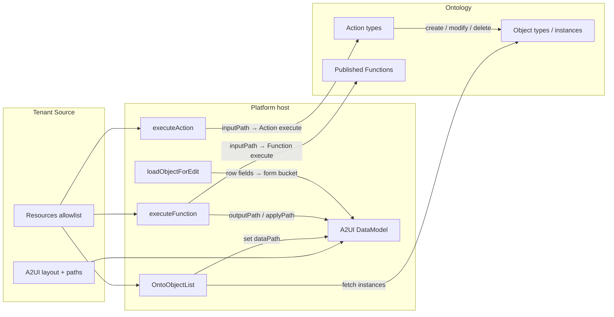

# App Builder & Apps

**App Builder** is the openKMS **platform** authoring surface for ontology-backed apps. An **App** is a product identity + **resource allowlist** + a set of **artifacts** (each one an A2UI surface). **A2UI** is the first-class lane (`app_kind` from `template_id`: `a2ui`); a **`module`** lane is reserved for hosted custom frontends (not implemented yet).

**Apps** is the published gallery and Run host.

**New app** asks only for a display **name**. Authors set **Resources / Loaders** in Settings, compose layout in **Design → Source** (or via [openkms-skill](openkms-skill.md) `apps` commands), then Preview and Publish. Builder does **not** create ontology assets. There is no in-app designer chat — external agents use the same draft/publish APIs.

**Related:** [Ontology Functions](ontology-functions.md) · [Ontology](ontology.md) · [Understanding the ontology](../tutorials/understanding-ontology.md) · [openkms-skill](openkms-skill.md) · [Knowledge Map](knowledge-map.md) (Overview A2UI designer — separate product)

## Suite Apps

| App | Route | Layout | Role |
|-----|-------|--------|------|
| **App Builder** | `/app-builder` | Ontology-style left rail; full-bleed Design | Author: name shell → Settings + Source → publish |
| **Apps** | `/apps` | No ontology rail | End user: published gallery + Run |

| Route | Role |
|-------|------|
| `/app-builder` | Draft + published apps; **New app** |
| `/app-builder/new` | Name only → create stub draft → Design |
| `/app-builder/:appId/design` | Artifacts \| Preview / Source / Data model \| authoring checklist \| publish |
| `/app-builder/:appId/settings` | General \| Resources \| Loaders \| versions + rollback |
| `/apps` | Published gallery only |
| `/apps/:appId` | Run **published** a2ui app (404 if draft) |

Permissions reuse `ontology:read` / `ontology:write`.

## Authoring journey (Design)

The Design right rail shows a checklist; each step has **Go**:

| Step | What you do | Where |
|------|-------------|--------|
| 1 Resources | Allowlist Object Types / Actions / Functions | **Settings → Resources** |
| 2 Loaders | `OntoObjectList` → `dataPath` (+ optional filter / row fields) | **Settings → Loaders** |
| 3 Layout | Compose `List` / `Modal` / buttons; optional `updateDataModel` seeds | **Source** (or skill `apps patch`) |
| 4 Preview | Inspect the live surface + DataModel snapshot | **Preview** / **Data model** |
| 5 Publish | Publish draft to Apps | Right rail Publish |

- **Loaders** write ontology instances into DataModel paths at runtime (configured in Settings).
- **`updateDataModel` in Source** (if present) also seeds the same DataModel — there is no separate “form defaults” product surface; edit Source.
- **Data model** tab shows only the live Preview DataModel snapshot (`get('/')`).
- Paths are surface runtime keys, not openKMS HTTP APIs.

## Resources (capability boundary)

Settings (or skill `apps patch --bindings-json`) stores allowlisted api names; server resolves ids and `bindings_hash`. Example:

```json
{
  "objectTypes": ["WorkItem"],
  "actions": ["createWorkItem", "updateWorkItem"],
  "functions": ["suggestWorkItemPriority"]
}
```

UI wiring lives in the **A2UI Source** (component props), not in a board-shaped bindings table. Old board-shaped binding keys are rejected at save time.

**Publish** requires non-empty, resolvable resources and valid A2UI Source (no removed components). Stale hash → gallery **Stale** badge and Run banner.

**Durable writes** go through **Action execute** only. Functions are read/compute (and may fill form fields via `applyPath`); they do not persist object edits by themselves.

## How an App talks to the ontology

An App never embeds ontology schema or domain widgets. At runtime the **platform host** bridges A2UI DataModel ↔ ontology APIs; the **tenant Source** only names which resources and which host events to use.



### Layers

| Layer | Owns | Does not own |
|-------|------|----------------|
| **Resources** | Which OT / Action / Function api names this app may touch | Layout, copy, filters |
| **Source (A2UI)** | Components, DataModel paths, which Button fires which host event | HTTP calls, Action apply, Function runtime |
| **Platform host** | `OntoObjectList` fetch, `executeAction` / `executeFunction` / `loadObjectForEdit`, validation, publish gates | Domain UX (e.g. “Kanban columns”) |
| **Ontology** | Types, instances, Actions, published Functions | App chrome |

### DataModel (runtime glue)

- The surface **DataModel** is a path tree (`/`, `/todoItems`, `/editWorkItem/priority`, …). It is **not** an openKMS HTTP route table.
- **Seed:** Source `updateDataModel` and/or user typing in `TextField`s bound to paths.
- **Load:** `OntoObjectList` writes instance arrays at `dataPath`.
- **Inspect:** Design → **Data model** shows the live Preview snapshot (`get('/')`).
- **List row bindings** inside a row template must use **relative** paths (`title`, `id`) — absolute `/title` resolves from the DataModel root and stays empty.

### Read — `OntoObjectList` (custom catalog component)

Platform **custom** A2UI component (openKMS extension of the basic catalog in `catalog.tsx` — not an upstream primitive, not a backend React widget). Props typically: `objectType` (must be in Resources), `dataPath`, optional `filterProperty` / `filterValue`, title/row field hints.

1. Host resolves the object type and lists instances (optional property filters).
2. Writes the array into DataModel at `dataPath`.
3. Display is composed separately: basic `List` + row template (Card / Text / Button) bound to that path.

Settings → **Loaders** edits these loader nodes in the default artifact Source; pair each loader with a `List` on the same path.

### Write — `executeAction`

Basic `Button` → `action.event.name = executeAction`.

| Context | Role |
|---------|------|
| `actionApiName` | Must be in Resources.actions |
| `inputPath` | Form bucket in DataModel (e.g. `/createWorkItem`) |
| `objectId` (optional) | Modify/delete target; often `{ "path": "/editWorkItem/objectId" }` |

Host: read DataModel at `inputPath` → coerce with Action input shape → Action execute (create / modify / delete apply) → refresh loaders → typically clear the form bucket and close the nearest Modal.

There is **no** `OntoActionForm` / `OntoActionButton`. Input fields are basic `TextField`s; writable shape comes from the Action (built-in fields / Function `input_schema`).

**Create pattern:** Modal (trigger Button + content Column of TextFields + Submit) → `executeAction` with `inputPath`.

**Edit pattern:** row Button → `loadObjectForEdit` (seed form + open Modal) → Save → `executeAction` (`updateWorkItem` + `objectId`).

### Compute — `executeFunction`

Basic `Button` → `action.event.name = executeFunction`.

| Context | Role |
|---------|------|
| `functionApiName` | Must be in Resources.functions (published Function) |
| `inputPath` | Optional input object from DataModel |
| `objectId` | Optional; host also sets `object_id` / `work_item_id` on the Function input |
| `outputPath` | Optional; write full Function `output` for Text bindings (e.g. hint) |
| `applyPath` + `applyKey` | Optional; copy one output field into a form path (e.g. suggested `priority` → `/editWorkItem/priority`) |

Functions are **decision helpers** (score, suggest, closure). Persisting the suggestion still needs a later `executeAction` Save.

There is **no** `OntoFunctionButton`.

### Seed edit form — `loadObjectForEdit`

Row Button context: `inputPath` plus field paths from the list row (`objectId` / `id`, `title`, `status`, …). Host writes the payload into the form bucket and opens the shared edit Modal (hidden trigger marker).

### End-to-end example (Kanban-style WorkItem)

1. Resources: `WorkItem`, `createWorkItem`, `updateWorkItem`, `suggestWorkItemPriority`.
2. One filtered `OntoObjectList` per column status + `List` row templates.
3. New: Modal → TextFields on `/createWorkItem/*` → `executeAction` / `createWorkItem`.
4. Edit: `loadObjectForEdit` → `/editWorkItem` → optional **Suggest priority** (`executeFunction` + `applyPath`) → Save (`executeAction` / `updateWorkItem`).

That board is **tenant Source composition**, not a platform Kanban widget.

### Frontend implementation map

| Concern | Where |
|---------|--------|
| **Custom catalog component `OntoObjectList`** | `frontend/src/pages/app-builder/a2ui/catalog.tsx` — registered on `appBuilderCatalog` via `createComponentImplementation` (extends A2UI **basic** catalog; **not** an upstream A2UI primitive). Loader UI is `OntoObjectListLoader` in the same file. |
| Host event name constants (`executeAction`, `executeFunction`, `loadObjectForEdit`, edit-modal marker) | `catalog.tsx` (`EXECUTE_*_EVENT`, `LOAD_OBJECT_FOR_EDIT_EVENT`, `EDIT_MODAL_OPEN_MARKER`) |
| Host handlers + surface wiring | `frontend/src/pages/app-builder/a2ui/AppA2uiSurface.tsx` — `handleExecuteAction`, `handleExecuteFunction`, `handleLoadObjectForEdit`; `surf.onAction.subscribe(…)` dispatches by event name |
| Ontology HTTP used by host / loader | `frontend/src/data/ontologyApi.ts` (instances), `ontologyActionsApi.ts` (Action execute), `ontologyFunctionsApi.ts` (Function execute) |
| Loader bindings inspect / Settings editors | `a2ui/dataModelInspect.ts`, `a2ui/DataModelLoadEditor.tsx`, `a2ui/ResourcesEditor.tsx` |
| Client-side Source validation | `a2ui/validate.ts` (mirrors backend `app_builder/a2ui.py` rules) |
| Shared A2UI chrome styles | `frontend/src/styles/design-system/_a2ui-platform.scss` |

Preview (Design) and Run (Apps) both mount `AppA2uiSurface` with the same catalog + host — only the message list (draft vs published) differs.

## Platform vs published app


| Platform (openKMS code) | Published app (tenant A2UI Source in DB) |
|---------------------------|------------------------------------------|
| Catalog + host hooks (`executeAction`, `executeFunction`, `loadObjectForEdit`, `OntoObjectList` loader) | Layout, copy, filters, which Action opens which Modal |
| Shared A2UI styling (`_a2ui-platform.scss`) | Resource allowlist + draft artifacts (`app_components`) + published version snapshot |
| Validation, publish gates | Domain UX (e.g. column boards composed from filtered lists) |

The platform must **not** ship domain UI (no Kanban widget, no app-named buttons, no board-shaped binding keys, no synthesizers that emit a named product layout). Kanban-style boards are **tenant content** composed in Source — see [Understanding the ontology](../tutorials/understanding-ontology.md).

**Validation:** invalid Source or removed catalog components **fail** at save/publish and surface in Design — the server does **not** silently replace draft JSON on load. Use **Reset layout** (`POST …/synthesize`) to return to a generic stub, then re-compose in Source.

**Removed catalog components** (reject at validation): `OntoKanbanBoard`, `OntoActionForm`, `OntoActionButton`, `OntoFunctionButton`, `OntoObjectLink`. Use basic `Modal` + `TextField` + `Button` host events (`executeAction` / `executeFunction` / `loadObjectForEdit`) instead.

## Artifacts

An App renders a set of **artifacts**; each artifact is one A2UI **surface** (`surfaceId`), shown as a tab in Run (single active). Authors edit artifact `messages` in Design → Source (or via skill). Agents outside the SPA compose the same draft through App Builder HTTP APIs.

## A2UI catalog (a2ui lane)

Catalog id: `https://openkms.local/a2ui/catalogs/ontology-app/v1.json`.

Platform catalog extension + host events are summarized in [How an App talks to the ontology](#how-an-app-talks-to-the-ontology). Short reference:

| Piece | Role |
|-------|------|
| **`OntoObjectList` (custom)** | openKMS catalog extension in `catalog.tsx` — loader only; instances → `dataPath` |
| `executeAction` / `executeFunction` / `loadObjectForEdit` | Host events handled in `AppA2uiSurface.tsx` on basic `Button` |
| Basic `Column` / `Row` / `Text` / `Card` / `Button` / `Modal` / `TextField` / `List` | Upstream A2UI basic catalog (layout) |

There is no `OntoActionButton` / `OntoFunctionButton` / `OntoObjectLink` / `OntoActionForm` / `OntoKanbanBoard`.

Create stores a **stub** until the author composes a layout in Source.

**List pattern (Source):** `OntoObjectList` + `List` with `children: { componentId, path }` row template; **relative** field paths inside the row. Shared edit Modal + `loadObjectForEdit` + `executeAction`.

**Settings → Resources / Loaders:** allowlist + loader nodes on the default artifact. Pair each loader with a `List` on the same path in Source.

**Design → Data model / Source:** live snapshot vs hand-edited `messages` (including `updateDataModel` seeds). Same draft artifact.

Multi-column boards are **composed** in Source from filtered lists + Modals. Invalid Source fails validation; **Reset layout** (`POST …/synthesize`) then re-compose.

## App kinds

| Kind | Status |
|------|--------|
| `a2ui` | Supported — platform primitives + tenant Source |
| `module` | Reserved — hosted custom module (future) |

## Backend code

| Layer | Path |
|-------|------|
| HTTP | `backend/app/api/app_builder.py` |
| Services | `backend/app/services/app_builder/` — `a2ui.py`, `service.py` |
| Model / schemas | `backend/app/models/app_builder.py`, `backend/app/schemas/app_builder.py` |

Frontend (interaction runtime — see [Frontend implementation map](#frontend-implementation-map)):

| Path | Role |
|------|------|
| `frontend/src/pages/app-builder/a2ui/catalog.tsx` | **Custom** `OntoObjectList` + host event constants + `appBuilderCatalog` |
| `frontend/src/pages/app-builder/a2ui/AppA2uiSurface.tsx` | Preview/Run surface; `executeAction` / `executeFunction` / `loadObjectForEdit` handlers |
| `frontend/src/pages/app-builder/` | Design / Settings UI |
| `frontend/src/data/appBuilderApi.ts` | App Builder HTTP client |
| `frontend/src/components/app-builder/` | Nav rail, routing |
| `frontend/src/pages/apps/` | Gallery + Run shells |

## API

`/api/app-builder/apps` (`ontology:read` / `ontology:write`):

| Method | Path | Description |
|--------|------|-------------|
| GET | `/api/app-builder/apps` | List (`?status=published`) |
| POST | `/api/app-builder/apps` | Create (name + api_name; resources optional) |
| GET | `/api/app-builder/apps/{id}` | Published run (404 if draft) |
| GET | `/api/app-builder/apps/{id}/design` | Draft for Builder |
| PATCH | `/api/app-builder/apps/{id}` | Update metadata / resources / draft |
| DELETE | `/api/app-builder/apps/{id}` | Delete app |
| POST | `/api/app-builder/apps/{id}/synthesize` | Reset draft to stub layout |
| POST | `/api/app-builder/apps/{id}/publish` | Publish draft (requires resolved resources + valid components; snapshot → new version) |
| POST | `/api/app-builder/apps/{id}/unpublish` | Clear published |
| GET | `/api/app-builder/apps/{id}/versions` | List published versions |
| POST | `/api/app-builder/apps/{id}/versions/{version_id}/rollback` | Rollback published to a version |

## Data model

Tables:

- `ontology_apps`: `id`, `name`, `api_name` (unique), `description`, `template_id` (app kind: `a2ui` \| `module`), `bindings` JSONB (resources), `published_version_id`, `bindings_hash`, `status` (`draft` \| `published`), `created_by`, timestamps. API returns `app_kind` (from `template_id`) and `published_version`.
- `app_components`: `id`, `app_id` (FK → `ontology_apps`), `name`, `position`, `is_default`, `a2ui_messages` JSONB — the **draft artifacts**, each one an A2UI surface.
- `app_published_versions`: `id`, `app_id` (FK → `ontology_apps`), `version`, `components` JSONB snapshot, `bindings` JSONB snapshot, `created_by`, `created_at` — immutable publish snapshots for rollback.

## Out of scope (this release)

- Creating OT / FoO / Actions inside Builder
- In-app designer chat (compose via Source or openkms-skill)
- Module host / loading custom app bundles
- Per-app App Rail icons; Run-by-`api_name` URLs
- Drag-and-drop status boards as a platform widget
