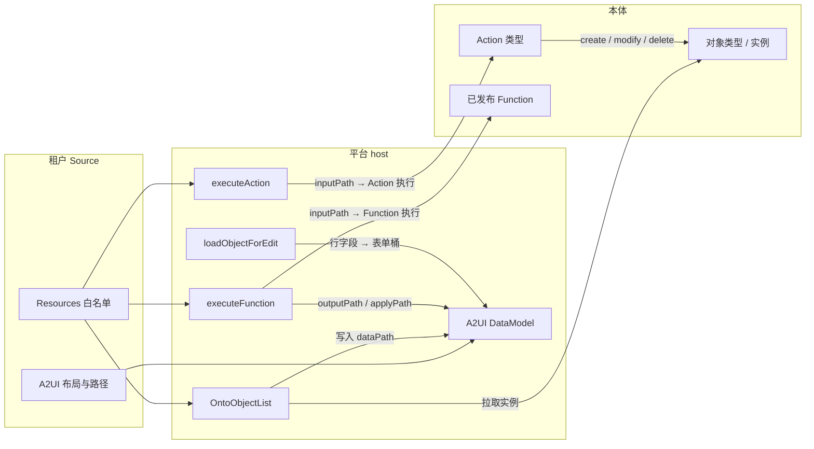

# 应用构建器与应用（App Builder & Apps）

**应用构建器（App Builder）** 是 openKMS **平台**侧、面向本体应用的编创界面。一个 **App** = 产品身份 + **资源白名单（Resources）** + 一组 **制品（artifact）**（每个制品是一个 A2UI surface）。**A2UI** 是当前一等通道（`app_kind` 来自 `template_id`: `a2ui`）；**`module`** 通道预留给托管自定义前端（尚未实现）。

**应用（Apps）** 是已发布应用的画廊与运行宿主。

**新建应用** 只要求显示 **名称**。作者在设置中配置 **Resources / Loaders**，在 **设计 → Source** 组装布局（或通过 [openkms-skill](openkms-skill.md) 的 `apps` 命令），再预览并发布。构建器 **不会** 创建本体资产。应用内 **没有** 设计器聊天——外部 Agent 走同一套草稿 / 发布 API。

英文源：[App Builder & Apps](app-builder.md)

**相关：** [Ontology Functions](ontology-functions.md) · [本体](ontology.md) · [认识本体](../tutorials/understanding-ontology.md) · [openkms-skill](openkms-skill.md) · [知识地图](knowledge-map.md)（Overview A2UI 设计器为另一产品）

## Suite Apps

| 应用 | 路由 | 布局 | 职责 |
|------|------|------|------|
| **应用构建器** | `/app-builder` | 本体式左侧轨；设计页全出血 | 作者：起名 → 设置 + Source → 发布 |
| **应用** | `/apps` | 无本体轨 | 终端用户：已发布画廊 + 运行 |

| 路由 | 职责 |
|------|------|
| `/app-builder` | 草稿 + 已发布列表；**新建应用** |
| `/app-builder/new` | 仅名称 → 创建 stub 草稿 → 设计 |
| `/app-builder/:appId/design` | 制品 \| 预览 / Source / 数据模型 \| 作者清单 \| 发布 |
| `/app-builder/:appId/settings` | 常规 \| 资源 \| 加载器 \| 版本 + 回滚 |
| `/apps` | 仅已发布画廊 |
| `/apps/:appId` | 运行 **已发布** a2ui 应用（草稿 404） |

权限复用 `ontology:read` / `ontology:write`。

## 作者路径（设计）

设计页右侧清单；每步有 **前往**：

| 步骤 | 做什么 | 在哪 |
|------|--------|------|
| 1 资源 | 白名单对象类型 / Action / Function | **设置 → 资源** |
| 2 加载器 | `OntoObjectList` → `dataPath`（可加过滤 / 行字段） | **设置 → 加载器** |
| 3 布局 | 组装 `List` / `Modal` / 按钮；可选 Source 里的 `updateDataModel` | **Source**（或 skill `apps patch`） |
| 4 预览 | 看实时 surface + DataModel 快照 | **预览** / **数据模型** |
| 5 发布 | 把草稿发布到「应用」 | 右侧发布 |

- **加载器** 在运行时把本体实例写入 DataModel 路径（在设置中配置）。
- Source 中的 **`updateDataModel`**（若有）也会种子同一棵 DataModel——没有单独的「表单默认值」产品面，改 Source。
- **数据模型** 页只显示与预览共用的实时快照（`get('/')`）。
- 路径是 surface 运行时键，不是 openKMS HTTP API。

## 资源（能力边界）

设置（或 skill `apps patch --bindings-json`）保存允许的 api name；服务端解析 id 并写 `bindings_hash`。示例：

```json
{
  "objectTypes": ["WorkItem"],
  "actions": ["createWorkItem", "updateWorkItem"],
  "functions": ["suggestWorkItemPriority"]
}
```

界面接线在 **A2UI Source**（组件属性）里，不在「看板形」bindings 表里。旧看板形 binding 键在保存时拒绝。

**发布** 要求资源非空且可解析，以及合法 A2UI Source（无已移除组件）。哈希过期 → 画廊 **Stale** 标记与运行横幅。

**持久写回只走 Action execute。** Function 是读 / 计算（可用 `applyPath` 填表单字段），本身不持久化对象编辑。

## App 与本体如何交互 {#app-ontology-interaction}

App **不**内嵌本体 schema，也 **不**内置领域 widget。运行时由 **平台 host** 桥接 A2UI DataModel ↔ 本体 API；**租户 Source** 只声明可用资源与要触发的 host 事件。



### 分层

| 层 | 负责 | 不负责 |
|----|------|--------|
| **Resources** | 本 App 可触达的 OT / Action / Function api name | 布局、文案、过滤 |
| **Source（A2UI）** | 组件、DataModel 路径、哪个 Button 触发哪个 host 事件 | HTTP、Action apply、Function 运行时 |
| **平台 host** | `OntoObjectList` 拉取、`executeAction` / `executeFunction` / `loadObjectForEdit`、校验、发布门禁 | 领域 UX（如「看板列」） |
| **本体** | 类型、实例、Action、已发布 Function | App 外壳 |

### DataModel（运行时胶水）

- surface 的 **DataModel** 是路径树（`/`、`/todoItems`、`/editWorkItem/priority` …），**不是** openKMS HTTP 路由表。
- **种子：** Source 的 `updateDataModel` 和/或用户在绑定路径的 `TextField` 中输入。
- **加载：** `OntoObjectList` 把实例数组写入 `dataPath`。
- **检视：** 设计 → **数据模型** 显示预览的实时快照（`get('/')`）。
- 行模板内字段绑定必须用 **相对** 路径（`title`、`id`）——绝对路径 `/title` 从 DataModel 根解析，标题会空。

### 读 — `OntoObjectList`（自定义 catalog 组件）

平台 **自定义** A2UI 组件（在 `catalog.tsx` 中扩展 basic catalog；不是上游原语，也不是后端 React 部件）。常见属性：`objectType`（须在 Resources 中）、`dataPath`、可选 `filterProperty` / `filterValue`、标题 / 行字段提示。

1. Host 解析对象类型并列出实例（可选属性过滤）。
2. 将数组写入 DataModel 的 `dataPath`。
3. 展示另组：基础 `List` + 行模板（Card / Text / Button）绑同一 path。

设置 → **加载器** 编辑默认制品 Source 中的这些 loader；每个 loader 需配一个同 path 的 `List`。

### 写 — `executeAction`

基础 `Button` → `action.event.name = executeAction`。

| Context | 作用 |
|---------|------|
| `actionApiName` | 须在 Resources.actions |
| `inputPath` | DataModel 中的表单桶（如 `/createWorkItem`） |
| `objectId`（可选） | 修改 / 删除目标；常见 `{ "path": "/editWorkItem/objectId" }` |

Host：读 `inputPath` → 按 Action 输入形 coerce → Action 执行（create / modify / delete apply）→ 刷新加载器 → 通常清空表单桶并关闭最近 Modal。

**没有** `OntoActionForm` / `OntoActionButton`。输入是基础 `TextField`；可写字段形状来自 Action（内置字段 / Function `input_schema`）。

**创建：** Modal（触发 Button + 内容 Column 的 TextField + 提交）→ `executeAction` + `inputPath`。

**编辑：** 行 Button → `loadObjectForEdit`（填表单 + 开 Modal）→ 保存 → `executeAction`（`updateWorkItem` + `objectId`）。

### 计算 — `executeFunction`

基础 `Button` → `action.event.name = executeFunction`。

| Context | 作用 |
|---------|------|
| `functionApiName` | 须在 Resources.functions（已发布 Function） |
| `inputPath` | 可选，从 DataModel 取输入对象 |
| `objectId` | 可选；host 还会写入 Function 输入的 `object_id` / `work_item_id` |
| `outputPath` | 可选；写入完整 Function `output` 供 Text 绑定（如 hint） |
| `applyPath` + `applyKey` | 可选；把某一输出字段拷到表单路径（如建议的 `priority` → `/editWorkItem/priority`） |

Function 是 **决策助手**（打分、建议、闭包）。要持久化建议仍需随后的 `executeAction` 保存。

**没有** `OntoFunctionButton`。

### 填充编辑表单 — `loadObjectForEdit`

行 Button 的 context：`inputPath` 加上来自行的字段路径（`objectId` / `id`、`title`、`status` …）。Host 写入表单桶并打开共享编辑 Modal（隐藏触发标记）。

### 端到端示例（看板式 WorkItem）

1. Resources：`WorkItem`、`createWorkItem`、`updateWorkItem`、`suggestWorkItemPriority`。
2. 每个 status 列一个过滤的 `OntoObjectList` + `List` 行模板。
3. 新建：Modal → `/createWorkItem/*` 上的 TextField → `executeAction` / `createWorkItem`。
4. 编辑：`loadObjectForEdit` → `/editWorkItem` → 可选 **Suggest priority**（`executeFunction` + `applyPath`）→ 保存（`executeAction` / `updateWorkItem`）。

该「看板」是 **租户 Source 组合**，不是平台看板 widget。

### 前端实现对照 {#frontend-implementation-map}

| 关注点 | 位置 |
|--------|------|
| **自定义 catalog 组件 `OntoObjectList`** | `frontend/src/pages/app-builder/a2ui/catalog.tsx` — 用 `createComponentImplementation` 注册到 `appBuilderCatalog`（扩展 A2UI **basic** catalog；**不是**上游原语）。加载逻辑为同文件内的 `OntoObjectListLoader`。 |
| Host 事件名常量（`executeAction`、`executeFunction`、`loadObjectForEdit`、编辑 Modal 标记） | `catalog.tsx`（`EXECUTE_*_EVENT`、`LOAD_OBJECT_FOR_EDIT_EVENT`、`EDIT_MODAL_OPEN_MARKER`） |
| Host 处理与 surface 接线 | `frontend/src/pages/app-builder/a2ui/AppA2uiSurface.tsx` — `handleExecuteAction`、`handleExecuteFunction`、`handleLoadObjectForEdit`；`surf.onAction.subscribe(…)` 按事件名分发 |
| Host / 加载器调用的本体 HTTP | `frontend/src/data/ontologyApi.ts`（实例）、`ontologyActionsApi.ts`（Action 执行）、`ontologyFunctionsApi.ts`（Function 执行） |
| Loader 绑定检视 / 设置编辑器 | `a2ui/dataModelInspect.ts`、`a2ui/DataModelLoadEditor.tsx`、`a2ui/ResourcesEditor.tsx` |
| 客户端 Source 校验 | `a2ui/validate.ts`（对齐后端 `app_builder/a2ui.py`） |
| 共用 A2UI 样式 | `frontend/src/styles/design-system/_a2ui-platform.scss` |

设计预览与 Apps 运行都挂载同一套 `AppA2uiSurface` + catalog + host——差别只在 messages（草稿 vs 已发布）。

## 平台 vs 已发布应用

| 平台（openKMS 代码） | 已发布应用（租户 A2UI Source，存库） |
|----------------------|--------------------------------------|
| Catalog + host 钩子（`executeAction`、`executeFunction`、`loadObjectForEdit`、`OntoObjectList` 加载器） | 布局、文案、过滤、哪个 Action 开哪个 Modal |
| 共用 A2UI 样式（`_a2ui-platform.scss`） | 资源白名单 + 草稿制品（`app_components`）+ 发布版快照 |
| 校验、发布门禁 | 领域 UX（如多列板 = 多个过滤 List） |

平台 **不得** 交付领域 UI（无看板 widget、无应用名按钮、无看板形 binding、无按域名自动合成布局）。看板式界面是 Source 中的租户内容——见 [认识本体](../tutorials/understanding-ontology.md)。

**校验：** 非法 Source 或已移除组件在保存 / 发布时 **失败** 并在设计页可见——服务端 **不会** 在加载时静默替换草稿 JSON。用 **重置布局**（`POST …/synthesize`）回到通用 stub，再在 Source 中重搭。

**已移除 catalog 组件**（校验拒绝）：`OntoKanbanBoard`、`OntoActionForm`、`OntoActionButton`、`OntoFunctionButton`、`OntoObjectLink`。改用基础 `Modal` + `TextField` + `Button` host 事件。

## 制品

一个 App 渲染一组 **制品**；每个制品是一个 A2UI **surface**（`surfaceId`），在运行页以 tab 展示（单活动）。作者在设计 → Source（或 skill）编辑制品 `messages`。SPA 外的 Agent 通过同一套 App Builder HTTP API 改草稿。

## A2UI catalog（a2ui 通道）

Catalog id：`https://openkms.local/a2ui/catalogs/ontology-app/v1.json`。

平台扩展与 host 事件见上文 [App 与本体如何交互](#app-ontology-interaction)。速查：

| 部件 | 作用 |
|------|------|
| **`OntoObjectList`（自定义）** | openKMS 在 `catalog.tsx` 中的 catalog 扩展 — 仅加载器；实例 → `dataPath` |
| `executeAction` / `executeFunction` / `loadObjectForEdit` | 在 `AppA2uiSurface.tsx` 中处理的 host 事件（基础 `Button`） |
| 基础 `Column` / `Row` / `Text` / `Card` / `Button` / `Modal` / `TextField` / `List` | 上游 A2UI basic catalog（布局） |

没有 `OntoActionButton` / `OntoFunctionButton` / `OntoObjectLink` / `OntoActionForm` / `OntoKanbanBoard`。

创建时是 **stub**，直到作者在 Source 中组装布局。

**List 模式（Source）：** `OntoObjectList` + `List` 行模板；行内用 **相对** 字段路径。共享编辑 Modal + `loadObjectForEdit` + `executeAction`。

**设置 → 资源 / 加载器：** 白名单 + 默认制品上的 loader。每个 loader 在 Source 配同 path 的 `List`。

**设计 → 数据模型 / Source：** 实时快照 vs 手改 `messages`（含 `updateDataModel`）。同一份草稿制品。

多列板在 Source 用过滤 List + Modal **组合**。非法 Source 校验失败；**重置布局** 后再重搭。

## 应用种类

| 种类 | 状态 |
|------|------|
| `a2ui` | 已支持 — 平台积木 + 租户 Source |
| `module` | 预留 — 托管自定义模块（未来） |

## 后端代码

| 层 | 路径 |
|----|------|
| HTTP | `backend/app/api/app_builder.py` |
| 服务 | `backend/app/services/app_builder/` — `a2ui.py`、`service.py` |
| 模型 / schema | `backend/app/models/app_builder.py`、`backend/app/schemas/app_builder.py` |

前端（交互运行时 — 见 [前端实现对照](#frontend-implementation-map)）：

| 路径 | 作用 |
|------|------|
| `frontend/src/pages/app-builder/a2ui/catalog.tsx` | **自定义** `OntoObjectList` + host 事件常量 + `appBuilderCatalog` |
| `frontend/src/pages/app-builder/a2ui/AppA2uiSurface.tsx` | 预览 / 运行 surface；`executeAction` / `executeFunction` / `loadObjectForEdit` |
| `frontend/src/pages/app-builder/` | 设计 / 设置 UI |
| `frontend/src/data/appBuilderApi.ts` | App Builder HTTP 客户端 |
| `frontend/src/components/app-builder/` | 导航轨、路由 |
| `frontend/src/pages/apps/` | 画廊 + 运行壳 |

## API

`/api/app-builder/apps`（`ontology:read` / `ontology:write`）：

| 方法 | 路径 | 说明 |
|------|------|------|
| GET | `/api/app-builder/apps` | 列表（`?status=published`） |
| POST | `/api/app-builder/apps` | 创建（名称 + api_name；资源可选） |
| GET | `/api/app-builder/apps/{id}` | 已发布运行文档（草稿 404） |
| GET | `/api/app-builder/apps/{id}/design` | 构建器草稿 |
| PATCH | `/api/app-builder/apps/{id}` | 更新元数据 / 资源 / 草稿 |
| DELETE | `/api/app-builder/apps/{id}` | 删除 |
| POST | `/api/app-builder/apps/{id}/synthesize` | 重置草稿为 stub |
| POST | `/api/app-builder/apps/{id}/publish` | 发布草稿 |
| POST | `/api/app-builder/apps/{id}/unpublish` | 取消发布 |
| GET | `/api/app-builder/apps/{id}/versions` | 已发布版本列表 |
| POST | `/api/app-builder/apps/{id}/versions/{version_id}/rollback` | 回滚到某发布版 |

## 数据模型

表：

- `ontology_apps`：身份、`bindings`（资源）、`published_version_id`、`bindings_hash`、`status` 等。API 返回 `app_kind` 与 `published_version`。
- `app_components`：草稿制品（每条 A2UI surface 的 `a2ui_messages`）。
- `app_published_versions`：不可变发布快照，用于回滚。

## 本版不做

- 在构建器内创建 OT / FoO / Action
- 应用内设计器聊天（用 Source 或 openkms-skill）
- Module host / 加载自定义包
- 每应用 App Rail 图标；按 `api_name` 运行 URL
- 拖拽看板作为平台 widget
