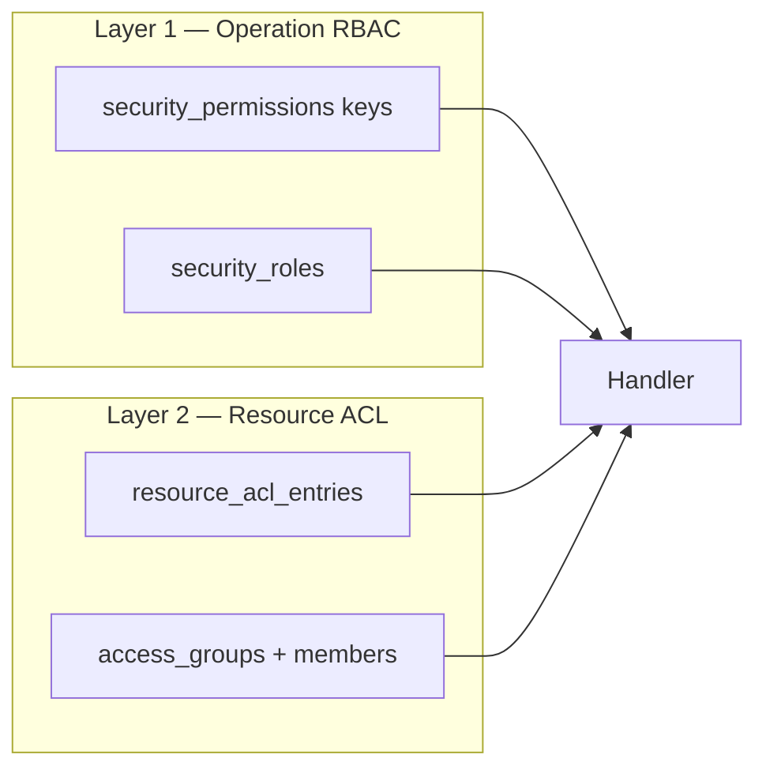

# Data security

How openKMS separates **who may use a feature** (operation permissions) from **which items they may see or change** (resource ACL). Read this page before changing auth, sharing UI, list filters, or agent/CLI data access.

**Related:** [Console & authentication](console-and-auth.md) (Console UX, OIDC/local login), [Security](../security.md) (auth modes, tokens, production checklist), [Data models — Data security](data-models.md#data-security-access-groups-resource-acl) (table schemas), [API reference — resource ACL](api-reference.md).

---

## For AI agents — quick facts

| Question | Answer |
|---|---|
| Two layers? | **Operation RBAC** (`security_permissions` keys) **and** **resource ACL** (`resource_acl_entries`). Both must pass. |
| Default when no ACL? | **Open** — any authenticated user with the right operation key can access the resource. |
| When is data restricted? | Any ACL row exists on the resource **or an ancestor container** in its chain. |
| What is **Others**? | `grantee_type=authenticated` — permissions for everyone signed in who is **not** owner and **not** in a listed group. `permissions=0` = explicit deny. |
| Permission bits | `r`=read (1), `w`=write (2), `m`=manage (4). Manage implies read/write in checks. |
| Resolver code | `backend/app/services/resource_acl_service.py` |
| Sharing API | `GET`/`PUT /api/resource-acl/{resource_type}/{resource_id}` — see [API reference](api-reference.md) |
| JWT admin + data | Admin **does not** bypass read/write ACL. Admin **does** bypass **manage** (can configure sharing without a grant). |
| Service CLI | `sub=local-cli` skips resource ACL (internal automation). |
| Legacy | Group junction scopes and **data resources** → migrated to ACL; old PUT endpoints return **410**. |
| Not ACL-scoped | Object Explorer arbitrary Cypher (`POST /api/ontology/explore`) — gate with operation permissions only. |

When you add a new **list** or **get** handler for a securable type, wire `check_resource_access` / `instance_visible` / the appropriate `scoped_*_predicate` from `resource_acl_service.py`. When you add a new securable type, extend `SECURABLE_RESOURCE_TYPES` in `resource_acl_constants.py`, register the model in Alembic if needed, and document the type here and in `data-models.md`.

---

## Mental model

```text
Request
  → authenticate (JWT / session / API key)
  → Layer 1: operation permission (e.g. documents:read)
  → Layer 2: resource ACL (e.g. read on document_channel dc_…)
  → handler
```

Layer 1 is **coarse** (feature-wide). Layer 2 is **fine-grained** (per channel, KB, wiki space, etc.).



---

## Layer 1 — Operation permissions (RBAC)

**Purpose:** Gate features and Console tools — not individual channels or documents.

| Storage | Role |
|---|---|
| `security_permissions` | Catalog of keys (`documents:read`, `console:groups`, `all`, …) with optional route/API patterns |
| `security_roles` + `security_role_permissions` | Named roles → keys |
| `user_security_roles` | Local users → roles |
| OIDC JWT `realm_access.roles` | Matched to `security_roles.name` |

**Enforcement:**

- Backend: `require_permission` / `require_any_permission` on wired routes.
- SPA: union of `frontend_route_patterns` from `GET /api/auth/permission-catalog`.
- Optional: `OPENKMS_ENFORCE_PERMISSION_PATTERNS_STRICT` — every `/api/*` must match catalog patterns.

**Bypass:** JWT realm role `admin`, permission key `all`, service subject `local-cli`.

Canonical key list: [Console & authentication — Permission catalog](console-and-auth.md#permission-catalog-canonical-keys).

---

## Layer 2 — Resource ACL (data plane)

**Purpose:** Control which **instances** a user may read, write, or share — document channels, documents, wiki spaces, knowledge bases, etc.

### Tables

| Table | Purpose |
|---|---|
| `resource_acl_entries` | Grants: `(resource_type, resource_id, grantee_type, grantee_id)` → permission bitmask |
| `access_groups` | Named groups referenced by `grantee_type=group` |
| `access_group_members` | `subject` ↔ `group_id` (local user id, OIDC `sub`, or aliases — see below) |

Full column definitions: [Data models — Data security](data-models.md#data-security-access-groups-resource-acl).

### Securable resource types

Defined in `backend/app/services/resource_acl_constants.py`:

| `resource_type` | Typical container chain |
|---|---|
| `document_channel` | Parent channels up to root |
| `document` | Own row + document's channel chain |
| `article_channel` | Parent article channels |
| `article` | Own row + article's channel chain |
| `wiki_space` | — |
| `wiki_page` | Parent wiki space |
| `knowledge_base`, `evaluation`, `dataset`, `object_type`, `link_type` | Standalone instances |

### Permission bits and grantees

| Bit | Value | Meaning |
|---|---|---|
| Read | 1 | List, view, download |
| Write | 2 | Upload, edit content, move |
| Manage | 4 | Change sharing settings (`m` satisfies `r` and `w` in checks) |

| `grantee_type` | `grantee_id` | UI label |
|---|---|---|
| `user` | JWT `sub` or local user id | **Owner** (or explicit user grant) |
| `group` | `access_groups.id` | Named group row |
| `authenticated` | `NULL` | **Others** — all signed-in users not owner / not in listed groups |

### Default-open vs restricted

- **No ACL rows** anywhere in the resource's inheritance chain → **open** to all authenticated users (who pass Layer 1).
- **Any ACL row** in the chain → access is **computed**; empty **Others** (`permissions=0`) explicitly denies users who are not owner and not in a listed group.

Sharing takes effect **immediately** when ACL rows exist — no dependency on `OPENKMS_ENFORCE_RESOURCE_ACL` (that flag is reserved for future system-wide defaults).

---

## Inheritance and evaluation

Implemented in `resource_acl_service.py`.

### Context chain

Built by `resource_context_chain()` — **nearest resource first**, then ancestors:

- **Document** → channel → parent channel → … → root
- **Article** → article channel chain
- **Wiki page** → wiki space
- **Channel** → parent channel chain (for nested folders)

### Effective permissions

`effective_permissions(subject, resource_type, resource_id)`:

1. **Group membership** — `user_group_ids()` loads groups for the subject, matching `access_group_members.subject` against **aliases**: JWT `sub`, `preferred_username`, `email`, `name`, and (local mode) resolved user id/username. This lets OIDC users match members stored as `"bob"` when JWT `sub` is a UUID.
2. **Others (authenticated)** — `_authenticated_bits_from_chain()` returns the **nearest** explicit Others grant on the chain; child overrides parent. `0` means deny for non-owner/non-group users at that level.
3. **User and group grants** — union all matching rows on any node in the chain (except Others rows, handled in step 2).
4. **Check** — `check_resource_access(..., required)` uses `perm_satisfies(have, need)`.

### Owner bootstrap

- On create, `bootstrap_owner_acl()` adds a **user** grant with `rwm` for the creator when applicable.
- Document channels store `document_channels.created_by`; sharing GET/PUT uses it as default owner when no owner grant exists.
- PUT preserves the owner row when omitted from the payload.

---

## Special callers

| Caller | Operation RBAC | Resource ACL read/write | Resource ACL manage |
|---|---|---|---|
| Normal user | Catalog keys | Computed from ACL | Needs `m` grant |
| JWT `admin` | Bypass | **Computed** — needs explicit grant | **Bypass** (break-glass for sharing config) |
| `local-cli` | Bypass | Skipped | Skipped |
| Personal API key | Same as owner account | Same as owner account | Same as owner account |

**Implication for testing:** A user with `is_admin=true` or realm role `admin` still **cannot see** restricted channels unless they are owner, in a granted group, or **Others** allows read. They **can** still open sharing settings (manage bypass) if they know the resource id.

---

## Enforcement (where ACL is applied)

| Surface | Mechanism |
|---|---|
| Document channel tree | `GET /api/document-channels` — filter to `readable_document_channel_ids` |
| Single document channel | `GET /api/document-channels/{id}` — 404 if not readable |
| Document lists | `scoped_document_predicate`; `GET /api/documents?channel_id=` — 404 without channel read |
| Document get / upload / move | `document_passes_scoped_predicate`, `channel_allowed_for_document_upload` |
| Article channels & articles | `scoped_article_predicate`, `article_passes_scoped_predicate` |
| Wiki spaces, KBs, evals, datasets, ontology types | `readable_resource_ids`, `instance_visible` |
| Global search | Scoped via same helpers in `global_search.py` |
| Sharing API | GET requires read; PUT requires manage (admin bypass on manage only) |
| SPA document channel page | Channel must appear in filtered sidebar tree; else "Channel not found" |

Legacy `data_resource_policy.py` delegates visibility to resource ACL; deprecated data-resource admin APIs return **410**.

---

## Operator and user UI

### Console — access groups

- **Routes:** `/console/data-security/groups`, `/console/data-security/groups/:id/members`
- **Permission:** `console:groups`
- **Actions:** Create/rename groups; `PUT /api/admin/groups/{id}/members` with `subjects` (local user ids or OIDC subs). Works in local and OIDC modes.

### Console — admin audit perspectives

- **Issues route:** `/console/data-security/issues` (permission `console:groups`)
  - `GET /api/admin/resource-acl/issues`: summary counts (`issue_count`, `by_issue`).
  - `GET /api/admin/resource-acl/issues?issue={code}&limit=&offset=`: paginated rows per issue type (default `limit=5`, max `100`). Issue codes:
    - **Others manage / write** — org-wide Manage or Write on **Others**
    - **Missing / broken owner** — no owner grant, owner with no permissions, owner without Manage, or owner user missing (local auth)
    - **Unknown / empty group** — group grant references a deleted access group, or a group with no members
    - **Implicit Others** — resource has ACL rows but no explicit **Others** row while a parent container grants **Others** (may inherit broader access)
    - **Review recommended: Others read** — group-based sharing plus org-wide read on **Others**
  - Does **not** flag resources with no ACL (default-open is intentional) or **Others read-only** without group grants.
  - Inline **Fix sharing** uses admin ACL API; no data read required.
  - `GET/PUT /api/admin/resource-acl/{type}/{id}`: Console audit read/write for any restricted resource.
  - `GET /api/admin/data-resources/migration-report`: read-only report of legacy data-resource rows (deprecated; no longer enforced).
- **Group detail route:** `/console/data-security/groups/:id/members`
  - `GET /api/admin/groups/{id}/shared-resources`: read-only list of ACL grants where the group is referenced, including permissions and optional sharing link paths.

### Per-resource sharing

- **API:** `GET`/`PUT /api/resource-acl/{resource_type}/{resource_id}`; `GET …/owner-candidates` (manage + local auth lists users for owner picker).
- **SPA:** **Sharing** tab on document channel settings (`ResourceSharePanel` — owner, groups, Others checkboxes). More surfaces may follow the same component.

User-visible copy uses **Owner**, **Groups**, and **Others** — not internal grantee type names.

---

## Example: restricted document channel

Channel **Test** has ACL:

- Owner: user `bob` — `rwm`
- Group **QA** — `rwm`
- **Others** — unchecked (`permissions=0`)

User **alice** (not bob, not in QA):

- With `documents:read` → **cannot** see Test in sidebar; direct URL → not found; `GET /api/documents?channel_id=Test` → 404.
- User **bob** or QA member → full access per grant bits.

Parent channel **Papers** with **no ACL** remains visible to alice; **Test** as a child is evaluated on its own — parent visibility does not imply child visibility.

---

## Migration from legacy group scopes

Alembic revision **`x6y7z8a9b0c1`**:

- Creates `resource_acl_entries`.
- Copies rows from legacy junction tables (`access_group_channels`, etc.) into ACL entries.
- Replaces `access_group_users` with `access_group_members`.

Revision **`y7z8a9b0c1d2`** seeds default **Others** grants on existing document channels where appropriate.

Revision **`z8a9b0c1d2e4`** adds `document_channels.created_by`.

Old **data resource** APIs and group **scope** PUT handlers return **410** with a message to use resource ACL. For backward compatibility, `GET /api/admin/data-resources` and `GET /api/admin/data-resources/{id}` still return rows, but rows are not enforced by visibility logic.

---

## Configuration

| Variable | Effect |
|---|---|
| `OPENKMS_ENFORCE_RESOURCE_ACL` | Reserved for future system-wide ACL defaults (alias: `OPENKMS_ENFORCE_GROUP_DATA_SCOPES`). Per-resource sharing applies when ACL entries exist **regardless** of this flag. |
| `OPENKMS_ENFORCE_PERMISSION_PATTERNS_STRICT` | Layer 1 only — strict API pattern matching |

See [Security](../security.md) for auth modes and token behaviour.

---

## Known gaps and review notes

| Topic | Status |
|---|---|
| Share UI on all securable types | Document channels first; API supports all types in `SECURABLE_RESOURCE_TYPES` |
| `OPENKMS_ENFORCE_RESOURCE_ACL=true` default-closed | Not implemented — flag reserved |
| Admin read-all break-glass | Not implemented — admin needs grants to read data |
| Object Explorer Cypher | Not rewritten for ACL — restrict via `ontology:read` / deployment policy |
| OIDC owner picker | `owner-candidates` empty in OIDC mode — use subject id |
| List filter performance | Per-channel Python evaluation; may need SQL batching at large scale |

---

## Code map

| Path | Responsibility |
|---|---|
| `backend/app/services/resource_acl_constants.py` | Types, bits, grantee enums |
| `backend/app/services/resource_acl_service.py` | Resolve permissions, list filters, predicates |
| `backend/app/api/resource_acl.py` | Sharing HTTP API |
| `backend/app/models/resource_acl.py` | `ResourceAclEntry` model |
| `backend/app/services/data_scope.py` | Re-exports + channel tree expansion |
| `backend/app/services/data_resource_policy.py` | Legacy compatibility; visibility delegates to ACL |
| `frontend/src/components/ResourceSharePanel.tsx` | Sharing UI |
| `frontend/src/data/resourceAclApi.ts` | Sharing API client |
| `backend/tests/test_resource_acl.py` | Permission helper unit tests |
