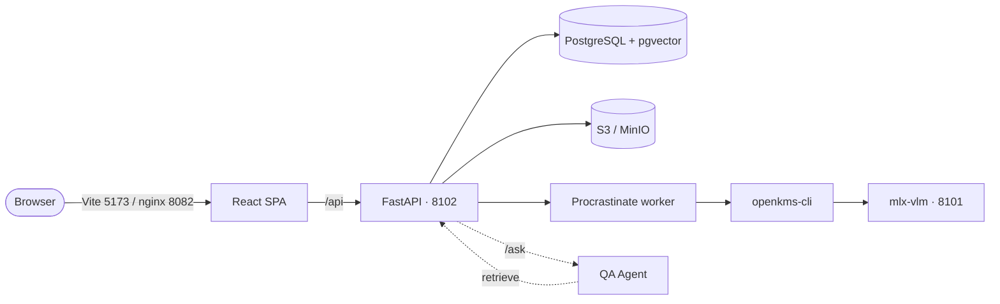

# openKMS

**Open Knowledge Management System** — one governed knowledge network for people and agents.

Teams **retrieve**, **contribute**, and **govern** the same corpus—so answers stay sourced and permission-aware, not trapped in private chat or stale files.

[Repository on GitHub :material-github:](https://github.com/yingrui/openKMS){ .md-button .md-button--primary }
[Quickstart](quickstart.md){ .md-button }

---

## Why openKMS?

Most organizations already have files, wikis, and AI chat. The gap is **one place** where:

- **Frontline staff** can find answers **with sources** they dare use in real work.
- **Experts** can contribute without a separate publishing project.
- **The organization** can govern who sees what, what is still valid, and what must be reviewed.
- **Agents** can discover, retrieve, answer, and **cite** in-bounds content—not only a model with no corpus.

openKMS treats those as **one network**, not separate “KM for humans” and “RAG for bots.” If governance exists but nobody uses the system—or if search works but answers cannot be trusted for compliance—both sides fail.

North star: [Goals](goals.md) — *Frontline confidence · Expert contribution · Organizational governance · Agent readiness*.

## What you build in openKMS

Content lives in **channel trees** (like folder hierarchies). Typical surfaces:

| Surface | Role |
|---------|------|
| **Documents** | Upload PDFs and office files; parse to editable Markdown (PaddleOCR-VL via a separate VLM server); versions and policy **lifecycle**. |
| **Articles** | Markdown CMS with channels, attachments, and relationships (`supersedes`, `amends`, `see_also`, …). |
| **Wiki spaces** | Path-based notes, vault import, page graph, **Wiki Copilot**. |
| **Knowledge bases** | Hybrid search and **Q&A with provenance** (chunks, sources, optional QA Agent service). |
| **Knowledge map & ontology** | Terms linked to channels/spaces; optional structured data and graph explore. |

**Under the hood:** [operation permissions + resource ACL](features/data-security.md) (admin does not imply read-all data), [evaluations](features/evaluation.md) for retrieval and wiki coverage, and [development plan](development_plan.md) for what is shipped vs next.

## Where to start

| If you want to… | Read |
|---|---|
| Understand **why** openKMS exists (vision & business problems) | [Goals & vision](goals.md) |
| Try it locally with Docker or on the host | [Quickstart](quickstart.md) |
| Understand the system | [Architecture](architecture.md) · [Functionalities](functionalities.md) |
| Find a specific feature or API | [Functionalities](functionalities.md) → `features/*.md` |
| HTTP or schema reference | [API reference](features/api-reference.md) · [Data models](features/data-models.md) |
| Knowledge artifact types | [Knowledge types](features/knowledge-types.md) |
| Sharing and resource ACL | [Data security](features/data-security.md) |
| Use openKMS from OpenCode / an external agent | [OpenCode skill (`openkms-skill`)](features/opencode-openkms-skill.md) |
| Set up a dev environment | [Developer setup](developer/setup.md) |
| Deploy with Docker | [Operations · Docker](operations/docker.md) |
| Review security design (principles) | [Security](security.md) · [Data security](features/data-security.md) · [Console & auth](features/console-and-auth.md) |
| See what's planned next | [Roadmap · Development plan](development_plan.md) |
| Compare openKMS to other stacks or read KM frameworks | [Research](#research) (below) |
| Edit the docs (human or AI agent) | [Doc conventions for AI agents](agents.md) |

## Research {#research}

Notes for architecture and product decisions (not shipped feature specs):

| Topic | Document |
|--------|----------|
| RAG engine vs openKMS | [RAGFlow vs openKMS](research/ragflow_vs_openkms.md) |
| Confluence AI (Rovo) vs openKMS | [Confluence AI vs openKMS](research/confluence_ai_vs_openkms.md) |
| LLM wiki (llm_wiki) vs wiki spaces | [LLM wiki vs openKMS](research/llm_wiki_comparison.md) |
| Measuring KM outcomes (OKF dimension) | [Operational Knowledge Fitness](research/km_dimension_operational_fitness.md) |
| Evaluating articles & wiki text | [Text content evaluation](research/text_content_evaluation.md) |

## At a glance

| Service | Default port |
|---|---|
| Backend (FastAPI) | **8102** |
| Frontend (Vite dev) | **5173** |
| Frontend (Docker, nginx) | **8082** |
| VLM server (mlx-vlm) | **8101** |

## Project layout

| Path | What's inside |
|---|---|
| `backend/` | FastAPI service, async SQLAlchemy, Alembic migrations |
| `frontend/` | React 19 + Vite SPA |
| `openkms-cli/` | Document parsing / pipeline CLI used by the worker |
| `openkms-skill/` | Optional SKILL + CLI for agents (Bearer personal API key; not in Docker) |
| `vlm-server/` | mlx-vlm HTTP server (PaddleOCR-VL backend) |
| `docker/` | Dockerfiles and `docker-compose.yml` |
| `docs/` | This site |
