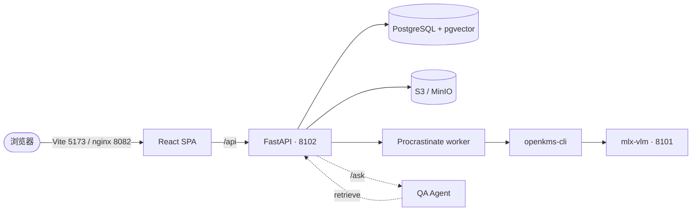

# openKMS

**开放知识管理系统（Open Knowledge Management System）** — 面向人与 Agent 的统一治理知识网络。

团队在同一语料上**检索**、**贡献**与**治理**——答案有出处、受权限约束，而不是困在私聊或过期文件里。

[GitHub 仓库 :material-github:](https://github.com/yingrui/openKMS){ .md-button .md-button--primary }
[快速开始](quickstart.md){ .md-button }

---

## 为什么选择 openKMS？

多数组织已有文件、维基和 AI 聊天。缺口在于**一个统一入口**：

- **一线员工**能找到**有出处、敢用于实际工作**的答案。
- **专家**无需单独开一轮「出版项目」即可贡献知识。
- **组织**能治理「谁可见什么、什么仍有效、什么必须复审」。
- **Agent**能发现、检索、作答并**引用**权限范围内的内容——而不只是无语料的模型。

openKMS 把这些视为**同一张网络**，而非割裂的「给人用的 KM」与「给 bot 用的 RAG」。若治理存在但无人使用——或搜索可用但答案不能用于合规——两侧都会失败。

北极星：[目标与愿景](goals.md) — *让一线敢用、专家愿写、组织可管、Agent 可用*。

## 在 openKMS 里构建什么

内容存放在**通道树**（类似文件夹层级）中。典型表面包括：

| 表面 | 作用 |
|------|------|
| **文档（Documents）** | 上传 PDF 与 Office 文件；解析为可编辑 Markdown（PaddleOCR-VL，经独立 VLM 服务）；版本与策略**生命周期**。 |
| **文章（Articles）** | Markdown CMS，含通道、附件与关系（`supersedes`、`amends`、`see_also` 等）。 |
| **维基空间（Wiki spaces）** | 基于路径的笔记、vault 导入、页面图谱、**Wiki Copilot**。 |
| **知识库（Knowledge bases）** | 混合检索与**带来源的问答**（分块、来源、可选 QA Agent 服务）。 |
| **知识地图与本体** | 术语关联通道/空间；可选结构化数据与图谱浏览。 |

**底层能力：** [操作权限 + 资源 ACL](features/data-security.md)（管理员不意味着可读全部数据）、面向检索与维基覆盖的[评测](features/evaluation.md)，以及说明已交付与后续计划的[开发计划](development_plan.md)。

## 从哪里开始

| 如果你想… | 阅读 |
|-----------|------|
| 理解 openKMS **为何存在**（愿景与业务问题） | [目标与愿景](goals.md) |
| 用 Docker 或本机快速试用 | [快速开始](quickstart.md) |
| 理解系统整体 | [架构](architecture.md) · [功能索引](functionalities.md) |
| 查找具体功能或 API | [功能索引](functionalities.md) → `features/*.md` |
| HTTP 或 schema 参考 | [API 参考](features/api-reference.md) · [数据模型](features/data-models.md) |
| 知识制品类型 | [知识类型](features/knowledge-types.md) |
| 共享与资源 ACL | [数据安全](features/data-security.md) |
| 从 OpenCode / 外部 Agent 使用 openKMS | [OpenCode 技能（`openkms-skill`）](features/opencode-openkms-skill.md) |
| 搭建开发环境 | [开发者环境搭建](developer/setup.md) |
| 用 Docker 部署 | [运维 · Docker](operations/docker.md) |
| 审阅安全设计（原则） | [安全](security.md) · [数据安全](features/data-security.md) · [控制台与认证](features/console-and-auth.md) |
| 查看后续计划 | [路线图 · 开发计划](development_plan.md) |
| 与其他技术栈对比或阅读 KM 框架 | [研究](#research)（见下） |
| 编辑文档（人或 AI Agent） | [AI 代理文档规范](agents.md) |

## 研究 {#research}

面向架构与产品决策的笔记（非已交付功能规格）：

| 主题 | 文档 |
|------|------|
| RAG 引擎 vs openKMS | [RAGFlow 与 openKMS](research/ragflow_vs_openkms.md) |
| Confluence AI（Rovo）vs openKMS | [Confluence AI 与 openKMS](research/confluence_ai_vs_openkms.md) |
| LLM wiki（llm_wiki）vs 维基空间 | [LLM wiki 与 openKMS](research/llm_wiki_comparison.md) |
| 衡量 KM 成效（OKF 维度） | [运营知识健康度](research/km_dimension_operational_fitness.md) |
| 评测文章与维基文本 | [文本内容评测](research/text_content_evaluation.md) |

## 一览

| 服务 | 默认端口 |
|------|----------|
| 后端（FastAPI） | **8102** |
| 前端（Vite 开发） | **5173** |
| 前端（Docker，nginx） | **8082** |
| VLM 服务（mlx-vlm） | **8101** |

## 项目结构

| 路径 | 内容 |
|------|------|
| `backend/` | FastAPI 服务、async SQLAlchemy、Alembic 迁移 |
| `frontend/` | React 19 + Vite SPA |
| `openkms-cli/` | 文档解析 / 流水线 CLI（worker 调用） |
| `openkms-skill/` | 可选 SKILL + CLI（Agent 用 Bearer 个人 API Key；不在 Docker 内） |
| `vlm-server/` | mlx-vlm HTTP 服务（PaddleOCR-VL 后端） |
| `docker/` | Dockerfile 与 `docker-compose.yml` |
| `docs/` | 本站文档 |
