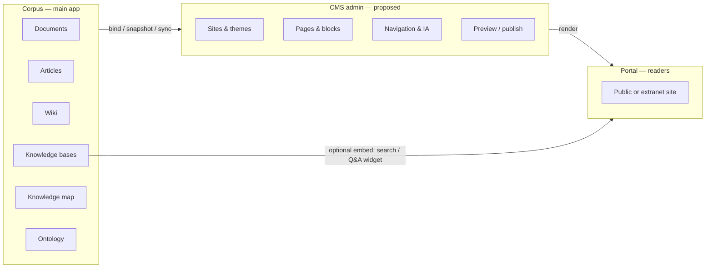
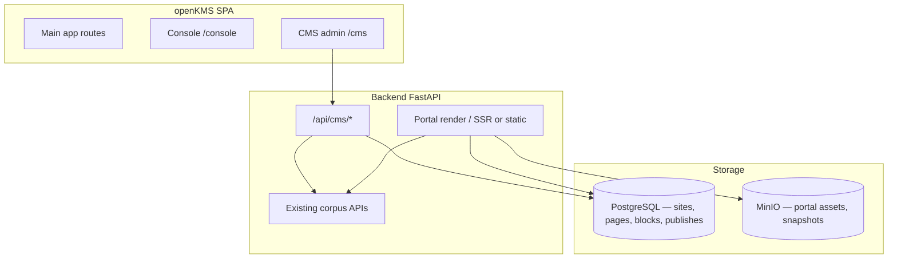

# CMS / Portal module for openKMS

Research note on a **separate CMS admin surface** (PageAdmin-style) to build an **outward-facing portal or website** that expresses curated knowledge from openKMS—not another channel for authoring the corpus itself. Written before implementation (2026-06).

**Related:** [Goals (vision)](../goals.md) · [Development plan](../development_plan.md) · [Architecture](../architecture.md) · [Articles](../features/articles.md) · [Knowledge map](../features/knowledge-map.md) · [Console & authentication](../features/console-and-auth.md) · [Operational Knowledge Fitness](km_dimension_operational_fitness.md)

**External reference:** [PageAdmin CMS — visual forms & business systems](https://cloud.tencent.com/developer/article/2623401) (Tencent Cloud developer article, 2026-01)

---

## Executive summary

| | **Today in openKMS** | **Proposed CMS / Portal** |
|---|----------------------|---------------------------|
| **Primary user** | Experts, knowledge admins, agents maintaining the corpus | **Publishers** and **site editors** packaging knowledge for audiences |
| **Primary output** | Governed artifacts (documents, articles, wiki, KB chunks) | **Pages, navigation, and experiences** on a portal or public site |
| **Mental model** | “Where knowledge lives and is kept correct” | “How we **present** what we know to customers, partners, or internal readers” |
| **Entry** | Main app sidebar (Documents, Articles, Wiki, …) | **Header link** → `/cms/*` admin shell, analogous to **Console** |

openKMS already excels at **ingest, structure, permission, lifecycle, and RAG**. A CMS module would close the gap on **delivery**: turning that corpus into a purposeful **website or portal** without asking every visitor to navigate channel trees, KB consoles, or signed-in operator UIs.

PageAdmin is a useful **feature vocabulary** (visual forms, workflows, data views, dashboards), but openKMS should **not** try to become a generic low-code ERP. The distinctive bet is a **knowledge-grounded portal**: pages and blocks that **bind to** articles, wiki pages, glossary terms, knowledge-map nodes, KB answers, and ontology objects—with provenance and permission boundaries preserved at publish time.

**Recommendation:** Treat CMS as a **new product lane** with its own route shell and permission family (`cms:*`), ship an **MVP portal builder** first (sites, pages, themes, knowledge bindings, preview/publish), and defer full PageAdmin parity (custom form tables, workflow engine, BI) until portal value is proven.

---

## The problem this solves

[Goals](../goals.md) lists a user action **Deliver** — training or external messaging with citations. Today that path is thin:

- **Articles** support markdown authoring, lifecycle, and print—but they are organized for **operators**, not for a cohesive **site**.
- **Knowledge map HTML** is a single generated overview on Home—not a multi-page portal with IA, menus, or audience-specific views.
- **KB Q&A** is a **service** for apps and agents, not a browsable marketing or help center.
- **Home static landing** (`HomeStaticLanding`) is deployment marketing copy, not org-specific knowledge expression.

Organizations using openKMS as their knowledge backbone still need:

1. A **reader-facing** destination (help center, product docs site, compliance portal, research showcase).
2. **Editorial control** over layout, navigation, and what is “on the homepage” without redeploying the SPA.
3. **Separation of concerns**—corpus maintenance (main app) vs site packaging (CMS)—so publishers are not lost inside document channels and ontology screens.

The CMS idea aligns with **Operational Knowledge Fitness** ([OKF](km_dimension_operational_fitness.md)): moving from “knowledge exists” to “knowledge is **used** operationally,” including **external and onboarding audiences** who will never open `/articles/channels`.

---

## What PageAdmin represents (and what to borrow)

The [PageAdmin article](https://cloud.tencent.com/developer/article/2623401) describes a full **visual business platform**:

| PageAdmin capability | Relevance to openKMS portal |
|----------------------|----------------------------|
| Drag-and-drop **form designer** (26+ field types) | **Low near-term priority** unless the portal must capture structured submissions (feedback, requests). openKMS already has ontology/datasets for structured data. |
| **Workflow engine** (approval nodes, conditions, timeouts) | **Medium** for publish approval (“legal review before go-live”)—could reuse lifecycle patterns from documents/articles rather than a generic BPMN clone. |
| **Data views** (filters, saved views, row actions) | **High** for CMS **content lists** (pages, menus, scheduled publishes) and for **bound knowledge** browsers (e.g. “all current policies tagged X”). |
| **CRUD + import/export + triggers** | **Partial**—portal metadata yes; arbitrary business tables only if we explicitly scope “portal apps.” |
| **BI dashboards** | **Later**—openKMS has evaluations and hub stats; portal analytics (page views, search exits) is a separate product. |
| **Unified identity / SSO** | **Already shipped** via Console auth; portal needs **public vs authenticated** page modes and optional SSO for extranet. |

**Takeaway:** PageAdmin is a **superset**. For openKMS, the CMS should be a **portal and composition layer** first; adopt PageAdmin **patterns** (visual admin, views, workflows) only where they support **knowledge expression and publish governance**.

---

## How this differs from existing openKMS surfaces

| Surface | Role | Why it is not the portal |
|---------|------|---------------------------|
| **Articles** | Markdown CMS for **knowledge artifacts** | Channel tree and lifecycle serve RAG and governance, not site IA or landing experiences. |
| **Wiki spaces** | Collaborative notes, Copilot, vault | Path-based workspace for authors; not a branded external site builder. |
| **Knowledge map** | Term hierarchy + one **map HTML** artifact | Great for orientation graph; not multi-site, multi-audience publishing. |
| **Console** | Platform **operations** (permissions, storage, toggles) | Correct **UX pattern** for separation; wrong domain (operators vs publishers). |
| **Home hub** | Signed-in **work dashboard** | Mixes comments, work items, and optional map HTML—not a substitute for `docs.example.com`. |

**Principle:** Corpus features optimize **truth and maintenance**; CMS optimizes **audience, narrative, and layout**. Overlap is intentional via **bindings**, not by merging route trees.

---

## Product shape: entrance and shells

Mirror the **Console** pattern documented in [Console & authentication](../features/console-and-auth.md):

| Element | Console (today) | CMS (proposed) |
|---------|-----------------|----------------|
| Header control | **Console** / **Exit Console** | **CMS** / **Exit CMS** |
| Route prefix | `/console/*` | `/cms/*` |
| Sidebar | Console-only nav (health, permissions, …) | Site list, pages, media, themes, publish queue, settings |
| Permissions | `console:*` family | `cms:read`, `cms:write`, `cms:publish`, … |
| Feature toggle | Per-area toggles in Console | `cms` toggle (default off in early releases) |
| Audience | Operators | **Publishers** (may overlap with knowledge admins, but role can be narrower) |

Main app routes (`/documents`, `/articles`, `/wiki`, …) stay unchanged. Publishers jump to CMS when composing a site; experts stay in the main app when fixing source content.

**Public portal delivery** (readers) should **not** require the full openKMS SPA shell:

- **Option A — Subpath:** `https://openkms.example.com/portal/{site_slug}/…` served by backend or a lightweight static renderer.
- **Option B — Subdomain:** `https://help.example.com` with CNAME to openKMS portal router.
- **Option C — Export:** Static site generation to object storage / CDN (good for air-gapped or marketing-only sites).

Option A fits the current Docker/nginx layout with minimal new moving parts; B and C are natural phase-2 scale paths.

---

## Core concepts (proposed domain model)

### 1. Site

A **site** is a bounded portal: name, slug, default locale, theme, domain/path config, and publish state (draft / published). One openKMS deployment may host **multiple sites** (e.g. internal handbook vs public product docs).

### 2. Page

A **page** belongs to a site: URL path, title, SEO metadata, layout template, and an ordered list of **blocks**. Pages can be draft or published; published versions are **immutable snapshots** (or versioned like articles) so rollback is safe.

### 3. Block (composition unit)

Blocks are the visual/building layer—not raw markdown files in a channel:

| Block type (MVP candidates) | Behavior |
|----------------------------|----------|
| **Rich text** | WYSIWYG or markdown with design-system styling |
| **Hero / CTA** | Marketing-style headers linking into the site |
| **Knowledge bind — article** | Pull title/summary/body (or excerpt) from an article by id; optional “sync on publish” |
| **Knowledge bind — wiki** | Embed or transclude a wiki page path |
| **Knowledge bind — glossary** | Term list or definition card from a glossary |
| **Knowledge bind — map node** | Card or subtree from knowledge map |
| **KB search / Q&A embed** | Scoped widget to a KB (public-safe subset) |
| **Navigation / menu** | Auto or manual |
| **Media** | Image carousel, video—reuse MinIO assets with portal ACL |

Bindings should store **reference + render options** (excerpt length, show effective dates, show “source in openKMS” link for staff). On publish, choose:

- **Live bind** — re-fetch on each request (always current; needs permission check at render time).
- **Snapshot bind** — freeze content at publish (stable for compliance; stale risk).

This directly supports [Goals — deliver with citations](../goals.md) and OKF **verifiability**.

### 4. Theme & design system

Reuse [design-system](../design-system.md) tokens so portal pages feel related to the main product without sharing the operator chrome. Themes: colors, typography, header/footer partials.

### 5. Navigation & IA

Site-level menu editor (tree of pages + external links). Optional auto-generation from knowledge-map subtree (“browse by domain”).

### 6. Publish pipeline

Preview (authenticated) → optional **approval** (phase 2) → publish → invalidate CDN/cache. Audit log: who published what, which source article versions were snapshotted.

---

## Knowledge expression: what “express what we learnt” means

The portal is not a second wiki. It is the **curated story** atop the corpus:

| Expression pattern | Example |
|--------------------|---------|
| **Onboarding path** | “New hire week 1” site section bound to map node + 5 wiki pages + 2 policies |
| **Product help center** | KB search widget + article binds for release notes |
| **Compliance desk** | Only articles with `is_current_for_rag` and `lifecycle_status=effective` |
| **Research portal** | Ontology-driven directory (taxa, specimens) + narrative pages |
| **Executive summary** | Single landing with LLM-assisted **overview block** (like map HTML designer, but site-scoped) |

**AI assist (in-app, not delivery):** A **Portal Copilot** in `/cms` could draft page copy and block layouts from knowledge-map + search—analogous to Knowledge Map HTML Designer and Wiki Copilot, but output is **page JSON / blocks**, not operator-only iframe HTML on Home.

---

## Security and permissions

openKMS’s two-layer model ([Data security](../features/data-security.md)) must extend to CMS:

| Layer | CMS implication |
|-------|-----------------|
| **Operation RBAC** | `cms:read` (draft preview), `cms:write` (edit), `cms:publish` (go live), optional `cms:sites:admin` |
| **Resource ACL** | Per-site and per-page sharing (which groups can edit or preview) |
| **Public render** | Unauthenticated readers see **only** published portal content; bindings must **not** leak unpublished articles or ACL-protected wiki paths |
| **Live bind** | Renderer enforces same ACL as source APIs—or CMS refuses live bind for restricted sources |

**Fail closed:** If a bound article is withdrawn or loses effective status, published snapshot pages should show a defined stale state (banner + last verified date), not a 500 or empty hole.

---

## Architecture sketch

**Frontend:**

- `frontend/src/pages/cms/` — admin UI (lazy-loaded like `console/`).
- `Header.tsx` — `canAccessCms` + CMS link (parallel to `canAccessConsole`).
- `Sidebar.tsx` — `sidebar-nav--cms` variant when `pathname.startsWith('/cms')`.

**Backend:**

- New module `backend/app/api/cms/` (or `portal/`) — sites, pages, blocks, publish.
- Render path: either dedicated FastAPI routes serving HTML for `/portal/...`, or JSON for a small public React bundle.

**Reuse:**

- Article/wiki/glossary **read APIs** and hydration patterns from knowledge-map HTML (`hydrate_placeholder_links`, sanitize with `nh3`).
- Permission catalog pattern from `permission_catalog.py`.
- Versioning semantics from articles/documents where snapshots matter.

---

## Phased roadmap (suggested)

### Phase 0 — Research & design (now)

- This document; align with [Development plan](../development_plan.md) as a **new strategic row** when approved.
- UX wireframes: CMS shell, site dashboard, page editor, public preview.
- Decision: subpath vs subdomain vs static export for v1.

### Phase 1 — MVP portal (highest value / lowest scope)

- Single site (multi-site schema ok but UI can limit to one).
- Page + block editor (rich text, hero, article bind, menu).
- Draft / preview / publish; public render at `/portal/...`.
- Header CMS link + `cms:*` permissions + feature toggle.
- Snapshot bind only (simpler security story).

**Success metric:** A team publishes a **help center landing + 10 pages** sourced from existing articles without forking content.

### Phase 2 — Editorial & expression

- Multi-site; themes; wiki and glossary binds; map-node browse pages.
- Live bind with ACL-aware renderer; stale-content banners tied to lifecycle.
- Portal Copilot for draft pages (optional).
- Publish approval workflow (lightweight: submit → approve → publish).

### Phase 3 — PageAdmin-adjacent platform (only if demanded)

- Custom **portal forms** (feedback, contact) storing submissions in PG.
- Data views on submissions and on bound corpus lists.
- Basic analytics (page views, popular binds).
- BI-style dashboard blocks (aggregate from evaluations or ontology).

Avoid building a generic workflow engine until openKMS users outgrow “publish approval” and structured forms.

---

## Risks and open questions

| Topic | Question | Lean |
|-------|----------|------|
| **Duplication vs bind** | Do publishers copy article text into blocks or always bind? | Default **bind**; copy only for one-off intros |
| **SEO & performance** | SSR, SSG, or client render for public pages? | **SSR or SSG** for SEO; cache published HTML in S3 |
| **i18n** | Sites in multiple locales? | Schema: `locale` on page; MVP single locale |
| **Relation to Articles “CMS”** | Naming confusion | UI: **Articles** in main app; header link labeled **Portal** or **Site CMS** |
| **Agents** | Can project agents publish to portal? | API-first; agents use `cms:write` + bindings like openkms-skill |
| **Multitenancy** | Sites per tenant in future [long-term plan](../development_plan.md) | Model `site.tenant_id` nullable early |
| **Scope creep** | Full PageAdmin clone | Explicit **non-goal** for v1–v2; portal-first |

---

## Comparison to alternatives

| Approach | Pros | Cons |
|----------|------|------|
| **Build CMS in openKMS** (this proposal) | Tight knowledge bindings, unified ACL, one stack | New large surface area |
| **External headless CMS** (Contentful, Strapi) | Mature editor | Weak lifecycle/RAG integration; second system |
| **Extend Articles only** | Smaller delta | No site IA, themes, or public render separation |
| **Knowledge map HTML only** | Already exists | Single page, not a site; operator-centric |
| **Static site from export** | Simple hosting | No live bind; manual rebuild loops |

For openKMS’s positioning ([Goals — unified layer for agents and people](../goals.md)), an **integrated portal layer** is the coherent long-term play if the organization’s job includes **externalizing** operational knowledge—not only storing it.

---

## Recommendation

1. **Approve the product lane:** CMS/Portal is **delivery**, not a replacement for Articles, Wiki, or KB.
2. **Copy Console’s separation:** header entry, `/cms/*` shell, dedicated permissions—keep corpus routes untouched.
3. **Ship MVP around sites, pages, blocks, and article binds** with snapshot publish and public `/portal` render.
4. **Treat PageAdmin as a pattern library**, not a requirements checklist—prioritize knowledge binds, publish safety, and reader UX over generic form/workflow builders.
5. **Document the public render and ACL rules before coding bindings**—the highest risk is leaking governed content to anonymous visitors.

Next implementation steps (when approved): feature doc `docs/features/cms-portal.md`, permission keys in catalog, data model draft in `docs/features/data-models.md`, and a thin vertical slice (one site, one page, one article block, publish).

---

## Appendix: PageAdmin feature checklist (traceability)

For stakeholders comparing to the [PageAdmin guide](https://cloud.tencent.com/developer/article/2623401):

| PageAdmin section | openKMS portal stance |
|-------------------|----------------------|
| §1 Smart form design | Defer → Phase 3 portal forms only |
| §2 Workflow engine | Phase 2 publish approval; not general BPMN |
| §3 Form configuration | N/A until forms exist |
| §4 Data views | Phase 1 for page lists; Phase 2 for corpus-backed views |
| §5 Data operations | Publish, rollback, export static site |
| §6 BI dashboards | Defer |
| §7 Unified identity | Reuse existing auth; public pages anonymous or SSO |
| §8 Scenarios (OA, CRM, PM) | **Help center, handbook, compliance, research** scenarios instead |
| §9 Implementation advice | Pilot one site; train publishers separately from corpus authors |
