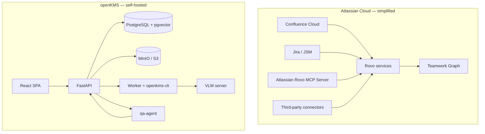

# Confluence AI vs openKMS

Comparative research on **Atlassian Confluence** with **Atlassian Intelligence** and **Rovo**, versus **openKMS** as a self-hosted knowledge platform. Sources: Atlassian product and support pages (2025–2026), openKMS repository docs (as of 2026-06).

**Related:** [Goals (vision)](../goals.md) · [Architecture](../architecture.md) · [Functionalities](../functionalities.md) · [RAGFlow vs openKMS](ragflow_vs_openkms.md) · [Operational Knowledge Fitness](km_dimension_operational_fitness.md)

---

## Executive summary

| | **Confluence + AI (Rovo)** | **openKMS** |
|---|---------------------------|-------------|
| **Primary identity** | Team wiki and collaboration hub inside the **Atlassian Cloud** stack | **Open**, self-hosted **knowledge management system** (documents, articles, wiki, KB, ontology) |
| **AI strategy** | **Teamwork Graph** + Rovo (search, chat, agents, studio) embedded where teams already work | **Dedicated RAG** (KB + qa-agent), **Wiki Copilot**, optional external **[openkms-skill](../features/opencode-openkms-skill.md)** |
| **Best when** | You are standardized on Atlassian Cloud and want AI on pages, Jira links, and ~50 SaaS connectors with minimal ops | You need **governed corpora**, **policy lifecycle**, **parse-heavy documents**, and **control of data residency** on your stack |
| **Deployment** | SaaS (Cloud); Data Center can sync to Cloud for AI via connectors | Docker / host; PostgreSQL, MinIO, optional Neo4j, separate VLM and qa-agent |

Confluence AI optimizes **collaboration velocity** inside Atlassian’s graph of work. openKMS optimizes **operational knowledge fitness** ([OKF dimension](km_dimension_operational_fitness.md)) across mixed content types with explicit **ACL, lifecycle, and evaluation**.

---

## What “Confluence AI” means (2025–2026)

Atlassian bundles several layers; names overlap in marketing.

### 1. Atlassian Intelligence (in-product)

Embedded generative AI **inside Confluence Cloud** (and other cloud apps), often surfaced through Rovo:

- **Create with Rovo** — draft pages, live docs, whiteboards, or databases from natural-language prompts and links.
- **Edit in place** — tone, grammar, simplify, translate; undo preserves original.
- **Summarize** — pages and comment threads; audio summary / read-aloud.
- **Definitions** — inline explanations of team-specific terms (uses wiki context).
- **Jira bridge** — turn highlights or scanned page content into Jira work items.

Docs: [Write or edit content using Rovo](https://support.atlassian.com/confluence-cloud/docs/write-or-edit-content-using-atlassian-intelligence/).

### 2. Rovo (cross-product AI teammate)

[Rovo](https://www.atlassian.com/software/rovo) spans Confluence, Jira, JSM, and connected third-party apps:

| Capability | What it does in practice |
|------------|-------------------------|
| **Rovo Search** | Enterprise search across Atlassian + connectors (Slack, Google Drive, etc.); positioned as often **unmetered** vs credit-consuming chat |
| **Rovo Chat** | Conversational Q&A and iteration in context |
| **Rovo Agents** | Task-oriented agents (e.g. meeting insights, brainstorm facilitator); **third-party MCP agents** (Figma, GitHub, …) after admin enablement |
| **Rovo Studio** | Low/no-code builder for custom agents and automations |
| **Remix** (Confluence) | Transform page content into charts, infographics, diagrams; partner flows to Lovable, Replit, Gamma via MCP |

Context is anchored in the **Teamwork Graph** (work items, people, links across Atlassian and indexed connectors)—not merely raw page text.

### 3. Atlassian Rovo MCP Server (outbound)

A **cloud MCP gateway** lets **external** AI clients (Claude, IDEs, etc.) search and fetch Jira/Confluence (and Compass) with the user’s **OAuth permissions**. Admins control allowed domains; the server acts as a proxy and does not cache page content long-term per Atlassian’s description.

Docs: [Use Atlassian Rovo MCP Server](https://support.atlassian.com/atlassian-rovo-mcp-server/docs/use-atlassian-rovo-mcp-server/).

### 4. Licensing and rollout

- **Plans:** Rovo rolls out on Confluence Cloud **Standard, Premium, Enterprise** (phased; Premium/Enterprise earlier).
- **Full feature set:** Marketing still emphasizes **Premium or Enterprise** for the complete Rovo experience (search, chat, agents, studio).
- **Org control:** Admins can **deactivate AI**; deactivation limits AI-powered chat/agents while some Rovo apps may remain.
- **Credits (2026):** Organization-pooled **Rovo credits** per user tier (e.g. 25 / 70 / 150 per user per month on Standard / Premium / Enterprise—verify on [Confluence pricing](https://www.atlassian.com/software/confluence/pricing)). **Rovo Chat** and **agent** requests consume credits (commonly cited ~10 each); **Deep Research** higher (~100). Overage billing policies have been described as delayed with admin opt-in—confirm current terms before capacity planning.
- **Data Center:** **Rovo Data Center connectors** sync DC content to Cloud so AI can run without full migration (infrastructure stays on-prem; AI processing in Atlassian Cloud).

---

## Positioning vs openKMS

### Confluence + AI

Typical journey: teams already write specs and runbooks in **spaces** → use **Create / summarize / Rovo Chat** for speed → **Rovo Search** finds answers across Atlassian + connected SaaS → **agents** automate meetings, brainstorming, or third-party actions → **Jira** carries execution.

Strengths: **low friction** for wiki-native teams, **unified search** across the toolstack, **mature collaboration** (comments, permissions, templates, analytics), and **vendor-managed** AI safety narrative (Responsible Technology Principles, admin toggles).

Limits for regulated or document-heavy KM:

- **Page-centric model** — PDF corpora and scanned policies are not the same as openKMS’s **parse → Markdown → version** pipeline.
- **Lifecycle** — Confluence has history and labels; openKMS emphasizes **series_id**, **effective dates**, **supersedes** relationships, and **current-for-RAG** semantics for policy domains.
- **RAG transparency** — Rovo cites sources in product flows; openKMS exposes **chunk_index**, **retrieval_mode**, and **retrieval_debug** on KB search/Q&A for operator-facing audit.
- **Vendor lock-in** — Cloud, credits, and graph live in Atlassian’s boundary unless you invest in DC + sync.

### openKMS

Typical journey: content lands in **document / article / wiki channels** → optional **KB index** and **qa-agent** Q&A → **knowledge map** and **glossary** for navigation → **resource ACL** and **evaluations** for governance and quality.

See [index](../index.md) and [Goals](../goals.md) for the user/org dual mandate.

---

## Architecture contrast

| Dimension | Confluence + Rovo | openKMS |
|-----------|-------------------|---------|
| **Knowledge unit** | Page, live doc, whiteboard, database | Document, article, wiki page, KB chunk, FAQ |
| **Search index** | Atlassian-managed (Rovo Search + graph) | pgvector + global search + optional wiki semantic index |
| **AI runtime** | Atlassian-hosted models / routing | Your chosen LLM providers via `api_models`; qa-agent LangGraph |
| **Cross-app context** | **Teamwork Graph** + ~50 connectors | Connectors **partial**; ontology datasets; manual linking |
| **External AI access** | **Atlassian Rovo MCP Server** (OAuth) | **Personal API keys**, **openkms-skill**, REST API |
| **Data residency** | Atlassian Cloud regions | Your infrastructure |

---

## Feature comparison

### Authoring and wiki

| Capability | Confluence + AI | openKMS |
|------------|-----------------|---------|
| Wiki spaces | **Spaces** (mature templates, analytics) | **Wiki spaces** (vault import, wikilinks, graph view) |
| AI drafting | Create with Rovo, inline edit, Remix visuals | **Wiki Copilot** (search, read, upsert with permission) |
| Whiteboards / live docs | Native | Not equivalent (wiki + articles) |
| Bulk import | Marketplace / migrations | Vault zip/folder import; document upload pipeline |

### Documents and parsing

| Capability | Confluence + AI | openKMS |
|------------|-----------------|---------|
| PDF / scan-heavy corpora | Attachments; AI reads page content; not a dedicated OCR pipeline | **PaddleOCR-VL** pipeline, editable Markdown, versions |
| Spreadsheet / mind map | Limited | **XLSX**, **XMIND** first-class paths |
| Channel / folder governance | Space permissions | **Document channels** + **resource ACL** inheritance |

### RAG and Q&A

| Capability | Confluence + AI | openKMS |
|------------|-----------------|---------|
| Grounded Q&A | Rovo Chat / Search over graph + connectors | **KB** hybrid search + **qa-agent** (`/ask`, streamed threads) |
| Chunk-level provenance | Product-dependent; less operator-oriented | `chunk_index`, `retrieval_debug`, chunk edit + re-embed |
| FAQs as first-class objects | Not emphasized | **KB FAQs** + LLM generate + batch save |
| Historical / superseded content | Page history; less RAG-specific | `include_historical_documents`, lifecycle, `is_current_for_rag` |
| Quality measurement | Admin analytics; less built-in eval harness | **Evaluation** runs (`search_retrieval`, `qa_answer`, `wiki_content_coverage`) |

### Agents and automation

| Capability | Confluence + AI | openKMS |
|------------|-----------------|---------|
| In-app agents | Rovo Agents, Studio, MCP partner agents, Remix | Wiki Copilot, KB Q&A, map HTML designer, eval assist |
| Visual agent builder | **Rovo Studio** | None (code-first LangGraph) |
| Jira / ITSM actions | **Strong** native | Via ontology/API; not Jira-native |
| MCP | Inbound (third-party tools) + outbound (Atlassian MCP server) | External skill; no Atlassian-style MCP server product |

### Governance and security

| Capability | Confluence + AI | openKMS |
|------------|-----------------|---------|
| Permissions | Space/page restrictions; Guard (add-on) for advanced | **Operation RBAC** + **resource ACL** ([Security design](../security.md)) |
| Admin ≠ read-all data | Confluence admin models differ by tier | **Admin does not bypass data ACL** for read/write |
| AI opt-out | Org-level AI deactivate | Self-hosted: control model endpoints and keys |
| Audit | Atlassian cloud audit logs | Your logging; API keys revocable in-app |

### Integration

| Capability | Confluence + AI | openKMS |
|------------|-----------------|---------|
| Ingest from Confluence | N/A (you are inside Confluence) | Potential **connector** target ([development plan](../development_plan.md#connectors-high)—sync jobs not shipped) |
| Export to RAG tools | Rovo MCP / search APIs | REST + **openkms-cli** + skill |
| Neo4j / ontology graph | Not core | **Object types**, links, Object Explorer |

---

## Teamwork Graph vs openKMS knowledge map

| | **Teamwork Graph** | **openKMS** |
|---|-------------------|-------------|
| **Purpose** | Relate people, issues, pages, and connector objects for AI context | Map **domain terms** to channels, wiki spaces, article channels |
| **Scope** | Whole Atlassian + connected SaaS | Curated taxonomy + optional **ontology** + wiki link graph |
| **Best for** | “Who owns this initiative?” across Jira and Confluence | “Where is the canonical material for this term?” for KM and RAG |

openKMS does not replicate a 100B-object enterprise graph; it offers **explicit, governable** navigation and structured data for agents ([knowledge map](../features/knowledge-map.md), [ontology](../features/ontology.md)).

---

## When to choose which

| Priority | Lean toward |
|----------|-------------|
| Already on Atlassian Cloud; Jira-centric delivery | **Confluence + Rovo** |
| Must keep knowledge in your VPC / air-gapped | **openKMS** |
| Policy PDFs, customs, legal corpora with parse + lifecycle | **openKMS** |
| Cross-app search (Slack + Drive + Jira) out of the box | **Confluence + Rovo** |
| Prove KB answers with chunk-level debug and eval regressions | **openKMS** |
| Whiteboards, live docs, Remix to slides/prototypes | **Confluence + Rovo** |
| Articles + wiki + KB in one ACL model you operate | **openKMS** |

### Coexistence patterns

| Pattern | Description |
|---------|-------------|
| **Confluence as author, openKMS as RAG plane** | Sync or export pages into openKMS document/wiki channels for parsing, lifecycle, and KB Q&A (connector backlog). |
| **Confluence as system of record, Rovo for daily search** | Teams keep writing in Confluence; openKMS holds regulated subsets with stricter ACL and eval gates. |
| **External agents** | Claude/Cursor use **Atlassian MCP** for Confluence; **openkms-skill** for openKMS—different corpora, different permission models. |

RAGFlow (see [comparison](ragflow_vs_openkms.md)) already lists **Confluence sync**; openKMS connectors are **not** at parity today.

---

## Gap analysis for openKMS

| Confluence AI strength | openKMS status |
|------------------------|----------------|
| Unified enterprise search across 50+ apps | Global search + KB; **connector sync** backlog |
| Teamwork Graph context | Knowledge map + ontology; no automatic work graph |
| Rovo Studio / no-code agents | LangGraph services only; **in-product agent** backlog |
| Remix / multimodal republishing | Not planned as equivalent |
| Credit-based AI metering | You bring your own models; ops cost, no per-chat credits |
| Native Jira issue creation from pages | Article/document relationships; not Jira |

| openKMS strength | Confluence AI gap |
|------------------|-------------------|
| Document parse pipeline + versions | Attachment-oriented; less VLM-native workflow |
| Resource ACL + admin-not-superuser | Space permissions; different compliance story |
| Evaluation module for KB/wiki | No first-class eval harness in Confluence |
| Self-hosted / Apache 2.0 stack | SaaS commitment |

---

## Mapping to Operational Knowledge Fitness (OKF)

Using the [OKF facets](km_dimension_operational_fitness.md):

| Facet | Confluence + Rovo | openKMS |
|-------|-------------------|---------|
| **Discoverability** | Strong Rovo Search + graph | Strong channel/map/search; weaker SaaS connector breadth |
| **Verifiability** | Citations in Rovo flows; black-box to operators | Chunk/source/debug fields; article print + versions |
| **Navigability** | Spaces, labels, definitions | Wiki, glossary, knowledge map |
| **Currency** | Page history; less policy-effective dating | Lifecycle fields, superseded RAG exclusion, impact workflow backlog |
| **Reuse** | High if wiki is habit; risk of private Rovo chats | Contribution paths + eval; ask→contribute backlog |

---

## References

| Source | URL |
|--------|-----|
| Rovo in Confluence | https://www.atlassian.com/software/confluence/ai |
| Rovo product | https://www.atlassian.com/software/rovo |
| Confluence — write/edit with Rovo | https://support.atlassian.com/confluence-cloud/docs/write-or-edit-content-using-atlassian-intelligence/ |
| Remix and partner agents (blog) | https://www.atlassian.com/blog/confluence/rovo-remix-3p-agents-confluence |
| Rovo MCP gallery (blog) | https://www.atlassian.com/blog/announcements/rovo-mcp-gallery |
| Atlassian Rovo MCP Server | https://support.atlassian.com/atlassian-rovo-mcp-server/docs/use-atlassian-rovo-mcp-server/ |
| Confluence pricing (credits tiers) | https://www.atlassian.com/software/confluence/pricing |
| openKMS architecture | [architecture.md](../architecture.md) |
| openKMS wiki / agents | [wiki-spaces.md](../features/wiki-spaces.md) |

---

*Research note written 2026-06. Atlassian feature names, credit rules, and rollout dates change frequently—validate against Atlassian Support before procurement or compliance sign-off.*
