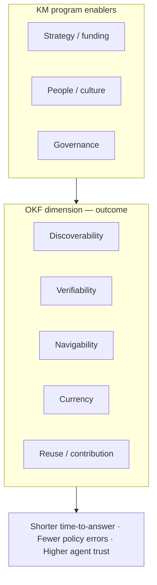

# Enterprise KM dimension: Operational Knowledge Fitness (OKF)

Research note on **one measurable dimension** for enterprise knowledge management (EKM), how it relates to established frameworks, and how a platform like openKMS can support assessment. Written for product, KM, and compliance stakeholders (2026-06).

**Related:** [Goals (vision)](../goals.md) · [Development plan](../development_plan.md) · [Evaluation](../features/evaluation.md) · [RAGFlow vs openKMS](ragflow_vs_openkms.md)

---

## Why this dimension

Enterprise KM programs are often judged on **activity** (pages created, licenses, training hours) or **technology** (search deployed, RAG pilot launched). Those inputs do not answer the question executives and frontline staff actually care about:

> *Can we use what is in the system for real work—today—with acceptable risk?*

[Goals](../goals.md) frames the same tension as **user adoption vs org governance**. Operational Knowledge Fitness (OKF) is a **single outcome-oriented dimension** that compresses that tension into something you can **score, trend, and tie to product capabilities**—without replacing full program assessments (strategy, culture, funding) that frameworks such as APQC’s KM CAT still cover.

OKF is deliberately **not** “RAG accuracy” or “search relevance” alone. It is **fitness for operational use** by humans and agents under permission, lifecycle, and compliance constraints.

---

## Definition

**Operational Knowledge Fitness (OKF)** — the extent to which an organization’s **managed knowledge corpus** (documents, articles, wiki, indexed KB content, governed terminology, and linked structured data) supports:

1. **Authorized discovery** — the right people find the right material quickly.  
2. **Verifiable use** — answers and deliverables can cite **source, version, and scope**.  
3. **Situational understanding** — newcomers and cross-functional staff can orient (what to read first, what terms mean).  
4. **Currency** — “current for purpose” is knowable; stale or superseded material is visible before misuse.  
5. **Reuse** — knowledge contributed once is **actually reused**, not trapped in private chats or individual drives.

OKF is **low** when staff still default to **ask-a-colleague**, **personal AI without citations**, or **uncontrolled file shares** for work the KMS was meant to support—matching user pains in [Goals](../goals.md) (e.g. search friction, answers without evidence, knowledge kept private).

OKF is **high** when the KMS is the **first stop** for operational questions *and* updates flow back into the corpus with measurable quality feedback.

---

## Position in common frameworks

OKF is not a replacement for APQC, ISO 30401, or SECI-style models. It is a **lens on outcomes** that cuts across several of their building blocks.

| Framework | Where OKF sits |
|-----------|----------------|
| **APQC KM CAT** (12 capabilities, 5 maturity levels) | Concentrates on **Knowledge flow processes**, **Content management process**, **KM approaches & tools**, and **Measurement**—not on budget or change management alone. |
| **ISO 30401:2018** (KMS requirements) | Aligns with **performance evaluation** and continual improvement: the organization must define indicators of KMS effectiveness; OKF proposes a structured indicator set. |
| **Classic KM lifecycle** (identify → collect → organize → share → use → improve) | OKF measures whether the **“use” and “improve”** stages close the loop, not whether repositories exist. |



---

## Facets (sub-scores)

OKF should be reported as **one headline score or level** plus **five facet scores** so teams know what to fix.

| Facet | Question it answers | Maps to [Goals](../goals.md) pains |
|-------|---------------------|-------------------------------------|
| **Discoverability** | Can authorized users find relevant material in one governed place? | Search friction (“can't find”) |
| **Verifiability** | Can they prove *what* they relied on (passage, file, version, date)? | Lack of verifiable sources (“can't trust”) |
| **Navigability** | Can they understand domain structure and entry paths? | Lack of orientation (“don't know where to start”) |
| **Currency** | Is it clear whether content is still valid for the task? | Obsolete content unnoticed |
| **Reuse** | Does contributed knowledge get used again by others (or agents)? | No time to contribute · answers kept private |

Facets are **partially independent**: a corpus can be **discoverable but untrustworthy** (stale PDFs, no citations in AI answers) or **trustworthy but unfindable** (good policies buried in email). That is why a single “we have search” metric is insufficient.

---

## Maturity rubric (1–5)

Use evidence-based levels (similar spirit to APQC Level 1–5). Advance only when **tangible evidence** exists, not when tools are merely purchased.

| Level | Label | OKF summary | Typical evidence |
|-------|--------|-------------|------------------|
| **1** | **Ad hoc** | Knowledge lives outside the KMS; tool is optional. | No shared taxonomy; no citation habit; shadow IT and oral norms dominate. |
| **2** | **Accessible** | Content is uploaded; search exists; trust is uneven. | Global search or folders used sometimes; few lifecycle fields; AI answers often without traceable sources. |
| **3** | **Traceable** | Structure, permissions, and citations are standard for critical domains. | Channels/maps defined; ACL on sensitive trees; Q&A or articles cite sources; versions on key documents. |
| **4** | **Adaptive** | Currency and quality are measured; gaps drive remediation. | Lifecycle/supersedes used; evaluations or audits on KB/wiki; connector/sync for major sources; role-based dashboards. |
| **5** | **Agent-ready** | Humans and agents share the same governed context layer with closed-loop improvement. | Agents use same ACL and “current for RAG” semantics; eval regressions block releases; contribution paths after Q&A are routine. |

Level **3** is a realistic **18–24 month** target for many enterprises; Level **5** requires product and process maturity beyond “RAG demo.”

---

## Indicators and metrics

Split indicators into **leading** (predict OKF) and **lagging** (confirm business effect). Prefer ratios and time-bounded samples over raw counts.

### Discoverability

| Indicator | Type | How to measure |
|-----------|------|----------------|
| Median time-to-first-relevant-asset | Lagging | Task-based study or instrumented search sessions |
| % operational queries resolved without escalation to expert | Lagging | Ticket tags / survey after KB or global search |
| Search success rate (click or “useful” within top-k) | Leading | Search logs + explicit feedback |
| Coverage: % of declared “golden” topics with ≥1 current asset | Leading | Knowledge map / taxonomy audit |

### Verifiability

| Indicator | Type | How to measure |
|-----------|------|----------------|
| % KB/Q&A answers with ≥1 inspectable source (chunk or page) | Leading | Agent or KB logs (`sources`, `retrieval_debug`) |
| % published customer/regulatory responses with linked internal source | Lagging | Sample audit of outbound packs |
| Chunk/document edit rate after parse (human correction load) | Leading | Version/commits per ingested page |

### Navigability

| Indicator | Type | How to measure |
|-----------|------|----------------|
| New-hire time-to-complete onboarding reading list | Lagging | HR/L&D milestone |
| % glossary/map terms with live links to channels or spaces | Leading | Knowledge map + glossary completeness |
| Wiki/graph or map usage vs raw search-only sessions | Leading | Analytics |

### Currency

| Indicator | Type | How to measure |
|-----------|------|----------------|
| % policy-tagged documents with `effective_to` / current-for-RAG set correctly | Leading | DB query on lifecycle fields |
| Mean age of assets in “current” retrieval set vs known change cadence | Leading | Metadata + channel review |
| Count of dependents flagged when a source document is superseded | Leading | Lifecycle graph (when workflow exists) |
| Incidents traced to obsolete internal knowledge | Lagging | Risk/compliance register |

### Reuse

| Indicator | Type | How to measure |
|-----------|------|----------------|
| Contributor/active-reader ratio on key channels | Leading | ACL-aware access logs |
| Repeat retrieval of same chunks/pages across users | Leading | Search/KB analytics |
| % expert Q&A sessions that produce a persisted FAQ/wiki/article | Leading | Product workflow (see [User experience backlog](../development_plan.md#user-experience-high)) |
| Duplicate question rate in support channels | Lagging | CRM / chat taxonomy |

ISO 30401 does not prescribe these names; it expects the organization to **select indicators appropriate to objectives** and review them in management review cycles.

---

## Assessment method

A practical OKF assessment blends **three inputs** (quarterly or per major release):

1. **Facet checklist interview** — KM, compliance, and line-of-business reps score maturity 1–5 with one evidence link per facet.  
2. **System sample** — e.g. 30 random operational questions; trace whether the KMS could answer with citation and current scope.  
3. **Automated snapshot** — queries run against DB and product APIs (coverage, lifecycle completeness, eval pass rates).

```text
OKF headline = weighted mean of facet scores (weights set per industry)

Suggested default weights (regulated enterprises):
  Verifiability 25% · Currency 25% · Discoverability 20% ·
  Navigability 15% · Reuse 15%

Suggested default weights (fast-moving ops teams):
  Discoverability 30% · Reuse 25% · Verifiability 20% ·
  Currency 15% · Navigability 10%
```

Document weights in the KM charter so scores are comparable year over year.

### Sample scorecard (illustration)

| Facet | Score (1–5) | Evidence snippet | Priority action |
|-------|-------------|------------------|-----------------|
| Discoverability | 3 | Global search used; 40% topics lack map link | Link top 20 terms in knowledge map |
| Verifiability | 2 | KB Q&A cites chunks; email still used for audits | Mandate article export with source links |
| Navigability | 3 | Glossary live; onboarding list manual | Publish wiki onboarding hub |
| Currency | 2 | Lifecycle fields on docs; no impact workflow | Ship policy-change dependent queue |
| Reuse | 2 | Low wiki edits; high repeat Slack questions | Ask→contribute shortcut after KB chat |

**Headline OKF (equal weights):** (3+2+3+2+2)/5 = **2.4 → Level 2–3 (“Accessible” trending toward “Traceable”)**.

---

## Mapping to openKMS (instrumentation today)

How the product supports each facet **now** vs **on the roadmap** ([Development plan](../development_plan.md)).

| Facet | Shipped signals in openKMS | Gaps / backlog |
|-------|---------------------------|----------------|
| **Discoverability** | Global search; channel trees; knowledge map; hybrid KB search | Connector sync jobs; richer analytics |
| **Verifiability** | KB search/Q&A `sources`, `chunk_index`, `retrieval_debug`; document/article versions; printable article view | Eval→fix loop; unified agent citations |
| **Navigability** | Wiki, glossaries, knowledge map, ontology browse | Onboarding paths; stronger map coverage metrics |
| **Currency** | Document/article lifecycle, relationships, `is_current_for_rag`, historical toggle in search | Policy change impact workflow |
| **Reuse** | Wiki Copilot upsert; articles; evaluations | Ask→FAQ/wiki; contribution nudges; usage dashboards |

**Evaluation module** ([evaluation.md](../features/evaluation.md)) is the closest **built-in OKF probe** today:

| Evaluation type | OKF facet primarily exercised |
|-----------------|------------------------------|
| `search_retrieval` | Discoverability + Verifiability (retrieval + judge) |
| `qa_answer` | Verifiability (end-to-end answer quality) |
| `wiki_content_coverage` | Navigability + Currency (does wiki support stated checklist) |

Running eval suites after corpus changes and **comparing runs** is a concrete Level **4** practice.

**Security model** ([Security design](../security.md), [Data security](../features/data-security.md)) affects OKF measurement: metrics must be computed **per access scope** (ACL), or aggregates will overstate fitness for restricted domains.

---

## What OKF does not measure

Keep scope honest to avoid false precision:

| Out of scope for OKF | Where to measure instead |
|----------------------|---------------------------|
| KM program funding, executive sponsorship | APQC Strategy / Business case |
| Culture of psychological safety to share | People / Change management assessments |
| Raw LLM benchmark scores (MMLU, etc.) | Model evaluation outside KMS |
| Total cost of ownership of IT | FinOps / architecture reviews |
| Innovation revenue attribution | Portfolio metrics with causal design |

---

## Using OKF in product decisions

When prioritizing openKMS backlog items, ask which facet moves most for target customers:

| If the customer pain is… | Prioritize facets | Example backlog themes |
|---------------------------|-------------------|-------------------------|
| “Nobody can find anything” | Discoverability | Connectors, search, map linking |
| “Legal won’t let us use AI answers” | Verifiability + Currency | Citations, lifecycle, impact workflow |
| “Wiki is empty after launch” | Reuse | Ask→contribute, Copilot drafts, eval feedback |
| “Agents hallucinate on old SOPs” | Currency + Verifiability | `is_current_for_rag`, dependent review, eval gates |

This aligns [Strategic priorities](../development_plan.md#strategic-priorities) (connectors, in-product agents, multimodal, evaluation, policy lifecycle) with a **single reporting dimension** executives can track.

---

## References

| Source | Notes |
|--------|--------|
| APQC, *Understanding the APQC KM CAT* | Five maturity levels; 12 capabilities including knowledge flow and measurement |
| [APQC Excellence in KM](https://www.apqc.org/expertise/knowledge-management/excellenceinkm) | Outcome framing (productivity, decision speed) |
| [ISO 30401:2018](https://www.iso.org/standard/68683.html) | KMS requirements; performance evaluation left to organization-defined indicators |
| [Goals](../goals.md) | User and organization pains; openKMS north star (vision doc) |
| Nonaka & Takeuchi, *SECI* (conceptual) | Socialization–externalization–combination–internalization—OKF emphasizes **combination/internalization** via managed artifacts |

---

*Research note: OKF is an openKMS-internal working dimension for assessment and roadmap alignment, not a published industry standard. Adapt weights and rubric to your sector (regulated vs high-velocity operations).*
