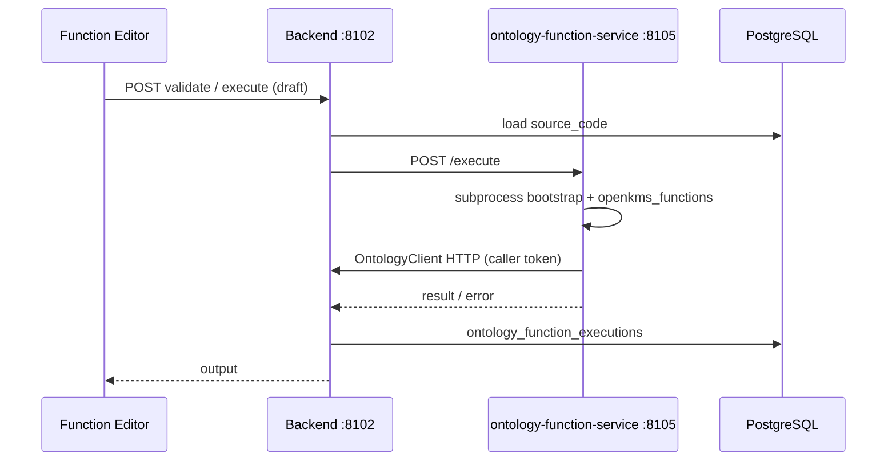

# Ontology Functions, Actions, and three Suite Apps

Research note for the Palantir-aligned **Ontology Logic** layer in openKMS: three Suite Apps, PostgreSQL-backed Functions, and the **ontology-function-service** (ofs) executor.

**Related:** [Ontology](../features/ontology.md) · [Object Explorer](../features/object-explorer.md) · [Goals — from retrieval to decision](../goals.md#goals-decision) · [ontology_manager_alignment.md](ontology_manager_alignment.md)

---

## Executive summary

| Area | Palantir analogue | openKMS choice |
|------|-------------------|----------------|
| Schema governance | Ontology Manager | **Ontology Manager** (`/ontology-manager`) |
| Instance browse + Cypher | Object Explorer | **Object Explorer** (`/object-explorer`) |
| Python Logic authoring | Code Repositories / Functions | **Function Editor** (`/function-editor`) |
| Function storage | Foundry versioned repos | **PostgreSQL** `ontology_functions` + `ontology_function_versions` |
| Execution | Restricted serverless | **ofs** subprocess on `:8105`; backend is system of record |
| Author SDK | `@foundry/ontology-api` in Functions | **`openkms_functions`** (`ExecuteContext`, `OntologyClient`) |

**Compute paths (Palantir):** Pipeline/Spark is **not** FaaS; OSDK + Functions are **FaaS-like** restricted serverless. openKMS MVP implements only the **Function** path.

---

## Three App responsibilities

### Ontology Manager

- **Groups** (P1): organize object types
- **Object types / Link types**: schema, datasets, sharing, index to Neo4j
- **Functions**: registry, publish, observability — **not** primary code editor
- **Actions** (P1): action types, rules, log
- **Datasets**: backing tables for object types

### Object Explorer

- **Objects** / **Links**: instance lists and CRUD (within ACL)
- **Explore**: Cypher / NL query page (existing `ObjectExplorer.tsx`)

### Function Editor

- **Create / Update / Delete** Python functions
- **Run** draft via backend → ofs (Live Preview)
- **Publish** only in Manager

---

## Data model

### `ontology_functions`

`id`, `api_name`, `display_name`, `description`, `source` (`code` | `web-api`), `object_type_id`, `development_status`, `status`, `published_version_id`, `web_api_config`, ACL fields.

### `ontology_function_versions`

`function_id`, `version`, `source_code`, `input_schema`, `output_schema`, `entrypoint` (default `execute`), `runtime` (`python3`), `validation_result`, `created_by`, `created_at`.

### `ontology_function_executions`

Audit: `function_id`, `version_id`, `caller_user_id`, `duration_ms`, `status`, truncated input/output.

### `ontology_groups` (P1)

`id`, `display_name`, `description`; M2M with object types via `ontology_group_object_types`.

### `ontology_action_types` / `ontology_action_log` (P1)

Action type metadata and submission audit.

---

## Execution model



- **No** same-process `importlib` of user code in the API gateway
- **Subprocess** with timeout (default 30s)
- User code may only use **`openkms_functions`** (validate import allowlist)

---

## Author SDK (`openkms_functions`)

```python
from openkms_functions import ExecuteContext

def execute(input: dict, ctx: ExecuteContext) -> dict:
    rows = ctx.ontology.search_objects("Employee", limit=10)
    return {"count": len(rows)}
```

| Module | Role |
|--------|------|
| `ExecuteContext` | Injected by ofs bootstrap |
| `OntologyClient` | Read-only ontology HTTP to backend |
| `testing.stub_context` | Local dev against backend |

**Caller OSDK** (apps calling published functions via `POST /api/ontology/functions/{apiName}/execute`) is separate — P3.

---

## API surface (MVP)

| Endpoint | App |
|----------|-----|
| `GET/POST /api/ontology/functions` | Manager / Editor |
| `GET/PATCH/DELETE /api/ontology/functions/{id}` | Manager / Editor |
| `POST .../versions` | Editor (save draft) |
| `POST .../validate` | Editor |
| `POST .../publish` | Manager |
| `POST .../execute` | Editor (draft) / callers (published) |
| `GET .../executions` | Manager Observability |
| `GET/POST /api/ontology/groups` | Manager (P1) |
| `GET/POST /api/ontology/action-types` | Manager (P1) |

---

## Phasing

| Phase | Deliverables |
|-------|----------------|
| **P0a** | Three App shells, route migration, NavRails |
| **P0b** | PG models, ofs, SDK, Function CRUD + Run + Manager Publish |
| **P1** | Groups, Actions, Explorer Home |
| **P2** | Discover, ontology-level draft review |
| **P3** | Web API functions, multi-file, caller OSDK |

---

## Non-goals (MVP)

- Generic Git multi-repo IDE
- Pipeline / Spark in Function Editor
- Arbitrary `pip install` in user functions
- Ontology global draft transaction (P2)
