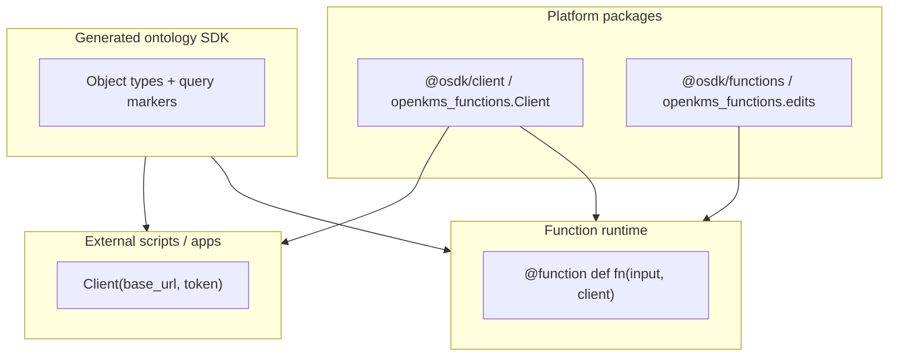
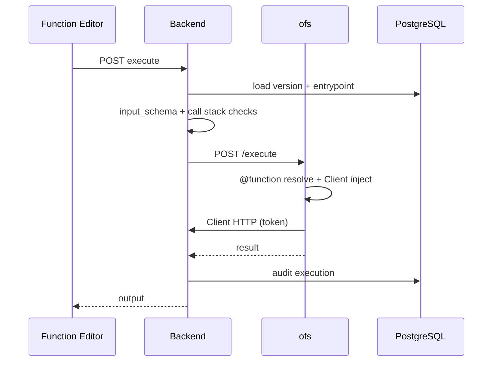

# Ontology Functions, Actions, and three Suite Apps

Research note for the Palantir-aligned **Ontology Logic** layer in openKMS: three Suite Apps, PostgreSQL-backed Functions, and the **ontology-function-service** (ofs) executor.

**Related:** [Ontology](../features/ontology.md) · [Ontology Functions](../features/ontology-functions.md) · [Ontology SDK](../features/ontology-sdk.md) · [Object Explorer](../features/object-explorer.md) · [ontology_manager_alignment.md](ontology_manager_alignment.md)

---

## Executive summary

| Area | Palantir analogue | openKMS choice |
|------|-------------------|----------------|
| Schema governance | Ontology Manager | **Ontology Manager** (`/ontology-manager`) |
| Instance browse + Cypher | Object Explorer | **Object Explorer** (`/object-explorer`) |
| Python Logic authoring | Code Repositories / Functions | **Function Editor** (`/function-editor`) |
| Function storage | Foundry versioned repos | **PostgreSQL** `ontology_functions` + versions |
| Execution | Restricted serverless | **ofs** subprocess on `:8105` |
| Author + caller SDK | `@osdk/client` + generated ontology SDK | **`openkms_functions.Client`** + **`openkms_ontology_sdk`** |
| Entry registration | `@function` / `export default` | **`@function`** + DB `entrypoint` |

**Core Palantir lesson:** function authors and external apps share one client language (`client(Entity).method(...)`). Only construction differs (injected vs explicit token).

---

## Palantir OSDK model (two layers)



| Concern | Palantir | openKMS |
|---------|----------|---------|
| Register entry | `@function(api_name=…)` / TS default export | `@function` + `entrypoint` column |
| Ontology read | `client(Aircraft).fetchOne` | `client(Employee).fetch_one` / `.search` |
| Compose functions | `client(query).executeFunction` | `client(query).execute_function` |
| Dependencies | `@Uses` / resource imports | `@function(uses=[…])` publish gate |
| Writes | Edit batch → Action | `create_edit_batch` (apply via Actions next) |

`execute` as a function name is **not** required by Palantir; openKMS keeps it as the default entrypoint for templates and legacy code.

---

## Three App responsibilities

### Ontology Manager

- Groups, object/link types, datasets
- Functions: registry, publish (triggers SDK regen), Observability tab
- Actions: types, execute, logs

### Object Explorer

- Instance browse / CRUD; can trigger Actions

### Function Editor

- Author `@function` Python code, Live Preview, published-queries sidebar
- Publish only in Manager

---

## Backend structure (clean architecture)

| Layer | Module |
|-------|--------|
| HTTP | Thin routers in `app/api/ontology_*.py` |
| Shared deps | `app/api/ontology/deps.py` — token, api_name, JWT user |
| Services | `function_service.py`, `execution_service.py`, `sdk_codegen.py` |
| Runtime | `function_runtime.py` → ofs HTTP |
| Validation | `function_templates.py`, `input_schema.py` |

---

## Author SDK

```python
from openkms_functions import Client, function, create_edit_batch
from openkms_ontology_sdk import helloGreeting

@function(uses=["helloGreeting"])
def execute(input: dict, client: Client) -> dict:
    greeting = client(helloGreeting).execute_function({"name": input.get("name", "")})
    return {"greeting": greeting}
```

Legacy `def execute(input, ctx)` still works (deprecation warning).

**Composition safety:** max call depth 5; `X-OpenKMS-Function-Call-Stack` cycle detection.

---

## Execution model



---

## Phasing status

| Phase | Status |
|-------|--------|
| Three Apps + PG + ofs MVP | Done |
| Service-layer refactor + tests | Done |
| `@function` + unified Client + composition | Done |
| Codegen + regenerate on publish | Done |
| Editor hooks / queries sidebar / Observability tab | Done |
| External same-package Client | Done (docs + path) |
| Edit batch apply via Actions | Foundation only (`create_edit_batch`) |
| Web API function source / TS runtime / Dev Console apps | Out of scope |

---

## Non-goals

- Generic Git multi-repo IDE
- Pipeline / Spark in Function Editor
- Arbitrary `pip install` in user functions
- TypeScript Function runtime
- Per-app Developer Console SDK subsets
