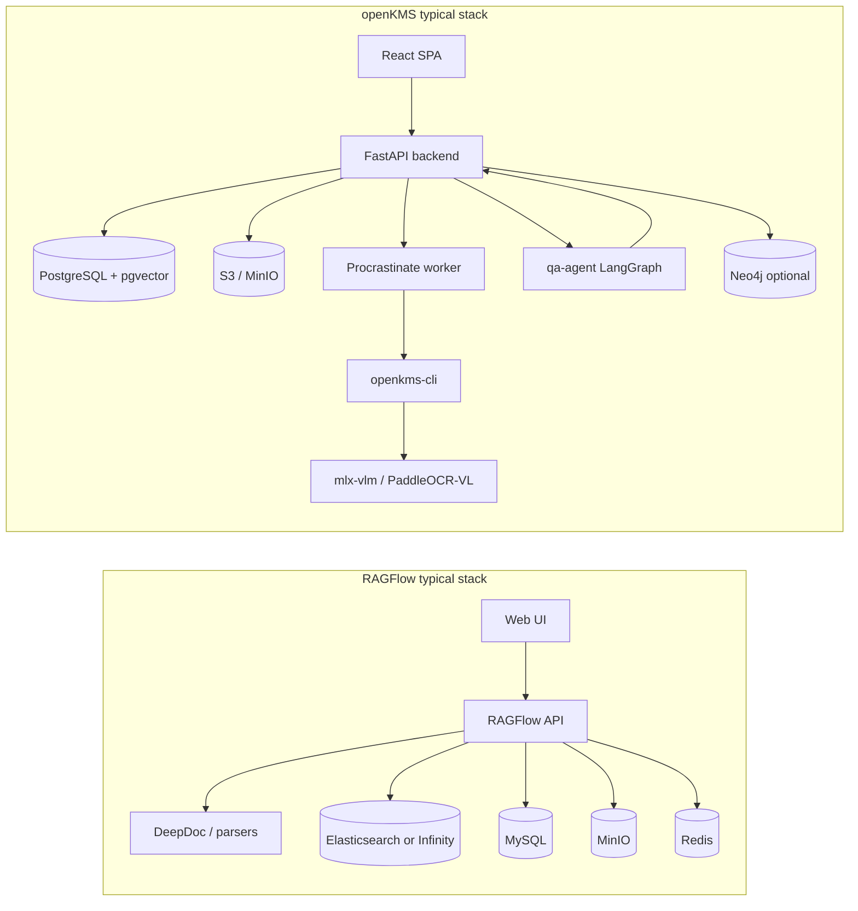

# RAGFlow vs openKMS

Comparative research for product and architecture decisions. **openKMS** is described from this repository’s docs and code (as of 2026-06). **RAGFlow** is described from its public README, documentation site, and release notes ([infiniflow/ragflow](https://github.com/infiniflow/ragflow), [ragflow.io](https://ragflow.io/)).

**Related:** [Goals (vision)](../goals.md) · [Architecture](../architecture.md) · [Functionalities](../functionalities.md) · [Development plan](../development_plan.md) · [LLM wiki vs openKMS](llm_wiki_comparison.md)

---

## Executive summary

| | **RAGFlow** | **openKMS** |
|---|-------------|-------------|
| **Primary identity** | Open-source **RAG engine** + agent/context layer for LLMs | Open **knowledge management system** with RAG, wiki, and governance |
| **Center of gravity** | Datasets, chunks, retrieval quality, agent workflows | Channels, authored content, lifecycle, permissions, org knowledge map |
| **Best when** | You need a mature, UI-driven RAG stack with strong PDF/layout parsing and GraphRAG out of the box | You need governed enterprise KM (documents + articles + wiki + ontology) with RAG as one surface |
| **License** | Apache 2.0 | Apache 2.0 |

Neither fully substitutes for the other: RAGFlow optimizes the **retrieval pipeline**; openKMS optimizes the **knowledge product** (who may see what, how content is maintained, and how it connects to policy and agents).

---

## Positioning

### RAGFlow

InfiniFlow positions RAGFlow as a **“context engine”**: deep document understanding, template-based chunking with human-visible chunk boundaries, hybrid recall + rerank, grounded citations, and increasingly **agentic** features (workflows, MCP, memory, code executor, external data sync). It targets teams that want to stand up **production RAG** quickly with a polished web UI and REST/Python SDK.

Typical user journey: create a **knowledge base (dataset)** → ingest files or sync from Confluence/S3/Notion/etc. → tune chunking → chat or build an **agent** on top.

### openKMS

openKMS is a **channel-based knowledge platform** (see [index](../index.md)): **document channels** (parsed corpora), **article channels** (markdown CMS), **wiki spaces** (vault-style notes), and **knowledge bases** (RAG indexes over linked documents/wiki). Around that sit **knowledge map**, **glossaries**, **ontology** (optional Neo4j), **evaluation**, and **Console** governance (permissions, ACL, connectors).

Typical user journey: organize content in **channels/spaces** → parse or author → optionally link into a **KB** for Q&A → maintain **versions, relationships, and sharing** for compliance and operations.

Alignment with [Goals](../goals.md): openKMS explicitly couples **user adoption** (retrieve/contribute) with **org governance** (lifecycle, ACL, audit-friendly admin model). RAGFlow’s docs emphasize **quality in, quality out** for RAG and agent context, with less first-class modeling of CMS/wiki/policy workflows.

---

## Architecture

| Dimension | RAGFlow | openKMS |
|-----------|---------|---------|
| **App server** | Python RAGFlow server + task executors | FastAPI monolith + separate **qa-agent** service |
| **Search / vectors** | **Elasticsearch** (default) or **Infinity**; hybrid FTS + dense | **PostgreSQL + pgvector**; hybrid BM25 + dense + RRF in qa-agent path |
| **Metadata DB** | MySQL | PostgreSQL (same DB as vectors) |
| **Object storage** | MinIO | S3/MinIO |
| **Job queue** | Redis-backed task pipeline | **Procrastinate** on PostgreSQL |
| **Parsing** | **DeepDoc** (+ MinerU, Docling, multimodal PDF/DOCX) | **openkms-cli** + **PaddleOCR-VL** (mlx-vlm server); LibreOffice/MuPDF pre-convert |
| **Graph** | **GraphRAG** on document corpora | **Ontology** object/link types + optional **Neo4j**; wiki link graph; knowledge map tree (not GraphRAG-equivalent) |
| **Deploy footprint** | Heavier (ES + MySQL + Redis + MinIO + app); official images **linux/amd64** | Moderate (Postgres + MinIO + backend + worker + optional Neo4j, VLM, qa-agent) |

---

## Feature comparison

### Document ingestion and chunking

| Capability | RAGFlow | openKMS |
|------------|---------|---------|
| Complex PDF / tables / layout | **Core strength** (DeepDoc, layout templates, visual chunk review) | Strong via PaddleOCR-VL pipeline; human edit Markdown + versions |
| Office formats | Broad (Word, Excel, slides, etc.) | PDF, images, DOCX/PPTX (via LibreOffice), XLSX/XMIND special paths, EPUB |
| Chunking strategy | Template-based, explainable, UI-inspectable | Per-KB: fixed_size, markdown_header, paragraph; chunk edit + re-embed |
| External parsers | MinerU, Docling (recent) | Baidu Cloud API optional; VLM server pluggable URL |
| Ingestion orchestration | **Orchestrable ingestion pipeline** (2025+) | Per-channel **pipelines** + procrastinate jobs; `kb-index` CLI |

**Takeaway:** For **raw retrieval fidelity on messy PDFs**, RAGFlow is ahead in productized parsing/chunk UX. openKMS trades some of that for **editable canonical Markdown**, explicit **document versions**, and **channel-level metadata extraction** tied to ontology labels.

### Retrieval and Q&A

| Capability | RAGFlow | openKMS |
|------------|---------|---------|
| Hybrid search | Multi-channel recall + fused reranking (cross-encoder) | pgvector + BM25 + RRF; optional rerank in qa-agent |
| Citations / provenance | Grounded citations, chunk visualization | Search/Q&A sources with chunk index, retrieval_debug; KB provenance UI |
| FAQs | Not a first-class openKMS-style FAQ table | **FAQs** with LLM generate + batch save; indexed alongside chunks |
| Historical / superseded docs | Product-specific | `include_historical_documents`, lifecycle + `is_current_for_rag` |
| Graph-augmented retrieval | **GraphRAG** | Ontology Cypher tool in qa-agent; not document GraphRAG |
| Cross-language query | Supported (2025+) | Depends on models; not marketed as core |

### Knowledge surfaces (beyond “one dataset”)

| Surface | RAGFlow | openKMS |
|---------|---------|---------|
| File corpus → RAG | **Primary** (datasets) | **Document channels** + KB membership |
| Markdown CMS | Limited / via imports | **Article channels**, relationships, bulk import API |
| Team wiki | Not equivalent | **Wiki spaces**, vault import, wikilinks, graph view, Copilot |
| Terminology / navigation | Via chunks + GraphRAG | **Glossaries**, **Knowledge map** → channels/wiki/articles |
| Structured enterprise data | Agents/tools, DB connectors in agent layer | **Ontology**, datasets, Neo4j Object Explorer |
| Policy / version lineage | Weaker as a product theme | **series_id**, effective dates, **document_relationships**, article lineage |

### Agents and automation

| Capability | RAGFlow | openKMS |
|------------|---------|---------|
| Built-in chat on KB | Yes | KB Q&A + FAQ assist (qa-agent); streamed threads |
| Visual agent builder | **Agentic workflows**, templates, MCP, code sandbox (gVisor) | No visual builder; LangGraph in **qa-agent** + **Wiki Copilot** in API |
| Agent memory | **Memory** (2025-12+) | Conversation persistence per surface; no unified “memory” product |
| External agent integration | REST + Python SDK; OpenClaw skill (2026) | **Personal API keys**, **openkms-skill**, Bearer CLI |
| In-app unified assistant | Evolving inside RAGFlow agents | **Partial** — per-surface agents; global assistant on [roadmap](../development_plan.md#in-product-agents-high) |

### Data connectors

| Capability | RAGFlow | openKMS |
|------------|---------|---------|
| Cloud / SaaS sync | **Confluence, S3, Notion, Discord, Google Drive** (2025-11+) | **Connectors** UI + kinds (e.g. Tushare); **sync jobs not shipped** |
| Output to structured store | Pipelines into datasets | Connector **output slots** → ontology **datasets** (planned loop) |

### Security and governance

| Capability | RAGFlow | openKMS |
|------------|---------|---------|
| Auth | Product auth model (see RAGFlow docs) | **OIDC** or **local**; session + Bearer |
| Feature permissions | Role/team features in product | **Operation RBAC** (`security_permissions`) + optional strict API patterns |
| Data-plane isolation | Dataset/team scoped (product-dependent) | **Resource ACL** (r/w/m), groups, container inheritance; admin ≠ data superuser ([Security design](../security.md)) |
| Evaluation / quality gates | Less emphasized in positioning | **Evaluation** datasets/runs (experimental); wiki coverage checks |

See [Data security](../features/data-security.md) for openKMS’s two-layer model.

### Operations and maturity

| Signal | RAGFlow | openKMS |
|--------|---------|---------|
| GitHub stars (approx.) | ~76k+ | Smaller project |
| Hosted offering | **RAGFlow Cloud** | Self-host / Docker per repo |
| Community / velocity | Large contributor base, frequent releases | Single-product repo, enterprise KM focus |
| Resource requirements | README: ≥16 GB RAM, ≥50 GB disk for self-host | Lighter baseline; VLM is optional separate host |

---

## Where they overlap

Both systems:

- Ingest unstructured documents, chunk, embed, and answer questions with citations.
- Support configurable LLM and embedding providers.
- Use MinIO-compatible object storage.
- Ship Docker Compose–style deployments.
- Target **enterprise** document Q&A and agent context.

Integration pattern (if desired): treat RAGFlow as a **specialized parse+retrieve service** for a subset of corpora, while openKMS remains **system of record** for channels, ACL, lifecycle, wiki, and ontology—or use openKMS KB pipeline only and borrow RAGFlow ideas (chunk UI, GraphRAG) without merging codebases.

---

## Where they diverge (decision guide)

| Your priority | Lean toward |
|---------------|-------------|
| Fastest path to polished RAG chat on PDFs with minimal custom app code | **RAGFlow** |
| Governed multi-format KM (articles, wiki, policies) + compliance-friendly sharing | **openKMS** |
| GraphRAG on documents without building it | **RAGFlow** |
| Document supersession, effective dates, audit of “which version was cited” | **openKMS** |
| Visual agent workflow builder + MCP + sandboxed code | **RAGFlow** |
| Ontology + Neo4j + KB tools in one permissioned platform | **openKMS** |
| Mature third-party source sync (Notion, Confluence, …) | **RAGFlow** today |
| Unified org narrative (Goals) tying user adoption to governance | **openKMS** |

---

## Gap analysis: openKMS relative to RAGFlow

Items RAGFlow emphasizes that openKMS does **not** yet match at product level (see [Development plan](../development_plan.md)):

1. **Chunking UX** — visual chunk inspection and template gallery (openKMS has chunk list/edit but not RAGFlow-style intervention UI).
2. **GraphRAG** — document-level knowledge graph retrieval (openKMS has ontology graph and wiki link graph, different semantics).
3. **Ingestion sync** — scheduled multi-source sync (openKMS connectors backlog).
4. **Agent orchestration UI** — visual workflows, MCP, sandbox executor (openKMS uses code-first LangGraph services).
5. **Retrieval scale patterns** — Elasticsearch/Infinity split for very large corpora (openKMS stays on Postgres/pgvector unless architecture changes).

Items openKMS provides that RAGFlow does **not** center:

1. **Article CMS** and **wiki workspace** with Copilot.
2. **Resource ACL** + catalog RBAC with “admin cannot read all channels by default.”
3. **Knowledge map** linking terms to channels/spaces.
4. **Document/article lifecycle** and relationship types for policy domains.
5. **Evaluation** framework wired to wiki/KB quality (experimental but native).

---

## Possible borrowings (design only)

Without implying implementation commitment:

| RAGFlow idea | openKMS touchpoint |
|--------------|-------------------|
| Chunk visualization + merge/split in UI | KB detail / document parse review |
| Orchestrable ingestion DAG | Worker + `pipelines` / connector sync jobs |
| GraphRAG pass on document sets | New pipeline stage or ontology-linked retrieval |
| Cross-language retrieval flag | KB search / qa-agent settings |
| Agent memory layer | Unified in-app agent ([roadmap](../development_plan.md#in-product-agents-high)) |

---

## References

| Source | URL |
|--------|-----|
| RAGFlow repository | https://github.com/infiniflow/ragflow |
| RAGFlow documentation | https://ragflow.io/docs/dev/ |
| RAGFlow roadmap 2026 | https://github.com/infiniflow/ragflow/issues/12241 |
| openKMS architecture | [architecture.md](../architecture.md) |
| openKMS knowledge bases | [knowledge-bases.md](../features/knowledge-bases.md) |
| openKMS goals (中文) | [goals.md](../goals.md) |

---

*Research note written 2026-06. Revisit when either product ships major connector, GraphRAG, or unified-agent milestones.*
