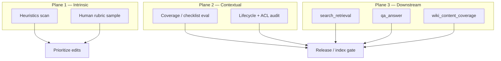

# Evaluating text content (articles, wiki pages, and related corpora)

Research note on **how to measure the quality of written knowledge artifacts**—articles, wiki pages, and similar markdown-first content—in enterprise KM and RAG systems. Synthesizes published work and maps findings to openKMS (as of 2026-06).

**Related:** [Evaluation](../features/evaluation.md) · [Operational Knowledge Fitness](km_dimension_operational_fitness.md) · [Goals](../goals.md) · [Articles](../features/articles.md) · [Wiki spaces](../features/wiki-spaces.md)

---

## Executive summary

“Text content evaluation” is not one metric. Research and practice distinguish at least **three evaluation planes**:

| Plane | Question | Typical methods |
|-------|----------|-----------------|
| **Intrinsic content quality** | Is the page itself well-formed, complete, readable, and well-structured? | Rubrics, structural features, readability, link checks, human review |
| **Contextual fitness** | Is this the right material for *this* task, audience, and time? | Relevancy, timeliness, lifecycle metadata, coverage checklists |
| **Downstream usefulness** | When retrieved or cited, does it support correct answers? | RAG retrieval metrics, faithfulness / claim-level judges, Q&A eval |

openKMS today emphasizes **plane 3** ([Evaluation](../features/evaluation.md): `search_retrieval`, `qa_answer`, `wiki_content_coverage`). Plane 1–2 are largely **manual** (editing, lifecycle fields, knowledge map) with room to add **automated content scores** on articles and wiki pages before indexing.

---

## What is being evaluated?

| Artifact in openKMS | Unit of evaluation | Natural “ground truth” |
|---------------------|-------------------|-------------------------|
| **Article** | Whole page (+ versions, relationships) | Editorial rubric, policy template, SME sign-off |
| **Wiki page** | Path-addressed markdown body | Checklist of required topics, onboarding syllabus, Copilot-authored draft review |
| **Document** (parsed) | Markdown + layout metadata | Parse QA, human correction rate, lifecycle |
| **KB chunk / FAQ** | Retrieval unit | Query–passage relevance, entailment vs chunk text |

Evaluating a **wiki page** like a **Wikipedia article** is methodologically sound (shared problems: structure, references, completeness). Evaluating it like a **RAG passage** is sound when the goal is **Agent 可用** ([Goals](../goals.md)). The same page may score high on structure but fail a coverage checklist—or vice versa.

---

## Theoretical foundations

### 1. Information quality beyond “accuracy” (Wang & Strong, 1996)

Wang and Strong (*Beyond Accuracy: What Data Quality Means to Data Consumers*, JMIS 1996) show that consumers care about more than correctness. Their framework groups **data quality dimensions** into four categories—directly transferable to **knowledge content**:

| Category | Meaning for text content | Example dimensions |
|----------|--------------------------|--------------------|
| **Intrinsic** | Quality in the text itself | Accuracy, objectivity, believability, reputation of source |
| **Contextual** | Fit for the task | Relevancy, completeness, timeliness, appropriate amount |
| **Representational** | How content is presented | Interpretability, consistency of format, conciseness |
| **Accessibility** | Can the right user get it | Access security, findability (systems layer) |

**Implication:** An evaluation program that only checks “is it true?” under-measures what [OKF](km_dimension_operational_fitness.md) calls **Navigability**, **Currency**, and **Reuse**.

### 2. Wikipedia automatic quality assessment (literature review)

Warncke-Wang et al. (*Automatic Quality Assessment of Wikipedia Articles: A Systematic Literature Review*, arXiv:2310.02235, 2023) surveys **149 studies**. Common patterns:

| Approach | Description | Typical features |
|----------|-------------|------------------|
| **Classical ML (CL)** | Random forest, SVM, gradient boosting on hand-crafted features | Length, refs, wikilinks, headings, categories, talk-page signals |
| **Deep learning (DL)** | CNN/LSTM/BiLSTM on text or embeddings | Full article text, sentence sequences |
| **Metric-based (MB)** | Weighted composite scores | Language-agnostic structural weights (see ORES below) |

**Frequently used article features** (also in Hu & Lim, CIKM 2007; Dang & Ignat, deep learning surveys):

- **Structure:** section count (H2/H3), infobox/templates, categories  
- **Verifiability proxies:** reference count per length, external links, citation templates  
- **Connectivity:** internal wikilinks per length, orphan status  
- **Text:** length, readability (Flesch-Kincaid, SMOG, Gunning-Fog), lexical diversity  
- **Collaboration (wiki-native):** edit count, contributor count, revert patterns—*less applicable to corporate wiki with fewer editors*

**Metrics for automatic assessors:** accuracy/F1 vs human quality classes, **Spearman rank correlation** with editor-assigned classes (standard in Wikimedia **ORES** production models).

**Gap noted in the review:** ML quality tools are still **underused in production Wikipedia** despite extensive research—enterprise wikis face the same adoption barrier.

### 3. Language-agnostic Wikipedia quality (ORES / Wikimedia)

Wikimedia’s **article quality** model (Meta-Wiki, language-agnostic features) predicts a **0–1 quality score** from structure-heavy signals: normalized page length, references per length, section headings per length, wikilinks per length—then maps to classes (stub → featured). Scores are **relative per language wiki**, not cross-language comparable.

**Lesson for openKMS:** Structural proxies work **without** expensive LLM calls and align with “is this a stub or a developed article?”—useful as a **triage** signal on wiki spaces and articles, not as sole truth.

### 4. RAG and grounded-answer evaluation (2023–2025)

When text is evaluated **through retrieval and generation**, literature shifts to **claim-level** and **multi-metric** frameworks:

| Work / practice | Contribution |
|-----------------|--------------|
| **Shahul et al., WikiEval** | Human judgments on faithfulness of answers given Wikipedia contexts; benchmark for evaluators |
| **RAG-Zeval** (EMNLP 2025) | Rule-guided reasoning; claim decomposition + evidence grounding; strong correlation with human faithfulness/correctness preferences |
| **QAS** (OpenReview) | Composite **reference-free** score: grounding, retrieval coverage, faithfulness, context efficiency, relevance |
| **Industry guides** (e.g. Evidently, Deepchecks) | Operational split: retrieval (precision@k, MRR) vs generation (faithfulness, answer relevance, completeness) |

**Faithfulness** (answer supported by retrieved context) differs from **content accuracy** (page matches world). A faithful RAG answer can still cite an **outdated** wiki page; lifecycle evaluation belongs in plane 2.

**ROUGE/BLEU:** Still appear in older pipelines but are **weak** for abstractive RAG; modern work prefers **entailment**, **NLI**, or **LLM judges** on decomposed claims.

---

## A practical dimension set for enterprise articles and wiki

Synthesizing Wikipedia research, Wang & Strong, and technical-documentation practice, the following dimensions apply to **articles** and **wiki pages** in openKMS:

### Intrinsic (the page on its own)

| Dimension | What to check | Automated? |
|-----------|---------------|------------|
| **Completeness** | Required sections/topics present; no empty placeholders | Partial (template/heading checklist) |
| **Accuracy** | Matches authoritative source / SME review | Human or LLM+source (high risk alone) |
| **Clarity** | Readable by target role; defined terms | Readability formulas + glossary links |
| **Structure** | Headings, lists, logical flow; Diataxis type fit (tutorial vs reference) | Heading depth, section count |
| **Verifiability** | Links to sources, citations, linked docs | Link resolver, reference count |
| **Consistency** | Terminology, style, formatting | Linter, style guide rules |

### Contextual (fit for purpose)

| Dimension | What to check | Automated? |
|-----------|---------------|------------|
| **Relevancy** | Page matches intended topic / map term | Manual map linking; semantic similarity to taxonomy |
| **Timeliness** | `updated_at`, lifecycle, review date | Rules on age + `effective_to` (articles/documents) |
| **Coverage** | Checklist items in body (openKMS `wiki_content_coverage` pattern) | LLM judge vs expected bullets |
| **Appropriate scope** | Not too shallow / not overly long | Length bands per content type |

### System / operational (openKMS-specific)

| Dimension | What to check | openKMS today |
|-----------|---------------|---------------|
| **Discoverability** | In graph, map, search index | Global search, wiki semantic index, KB link |
| **Permission fit** | Visible to intended audience | Resource ACL |
| **Agent usability** | Chunkable, citable, current-for-RAG | KB index, `is_current_for_rag`, provenance fields |

---

## Measurement methods (how to score)

### A. Structural and readability heuristics (low cost)

Suitable for **batch scans** over all wiki pages and articles:

```text
structural_score = f(
  word_count,
  heading_count,
  internal_link_count,
  external_link_count,
  has_frontmatter_metadata,
  broken_link_count,
  days_since_update
)
readability = Flesch-Kincaid | SMOG | …  # interpret with audience in mind
```

**Caveats:** Long pages score high on length but may be rambling; reference counts can be gamed. Use as **triage**, not compliance pass/fail.

### B. Rubric-based human review (gold standard for plane 1)

Wikipedia’s **featured article criteria** and enterprise **QC documentation** rubrics use explicit scales (1–5 or met/not met) across completeness, accuracy, clarity, and organization—often **staged review** (technical → clarity → operational).

**Ready Tensor–style rubrics** (four questions: purpose, value, trust, usability) generalize to internal playbooks and SOPs.

### C. Checklist / coverage evaluation (plane 2)

Given an **expected answer** as a bullet list (requirements, audit questions, onboarding outcomes):

1. Retrieve candidate pages (title/path match → semantic top-k).  
2. Judge whether **each bullet** is supported by retrieved text.

This is exactly openKMS **`wiki_content_coverage`** ([evaluation.md](../features/evaluation.md)): decomposition of expected statements, LLM judge per item, pages ranked from query field.

**Extension:** Store rubric templates per wiki space or article channel; version them when policies change.

### D. LLM-as-judge (planes 2–3)

| Task | Prompt pattern | Risk |
|------|----------------|------|
| Holistic quality | “Rate 1–5 on completeness/clarity/accuracy” | Position bias, leniency drift |
| Claim support | Decompose page into claims; verify each vs sources | Cost; needs good decomposition |
| Compare two drafts | Pairwise preference | Useful for A/B after Copilot edit |
| Faithfulness (RAG) | Answer vs retrieved passages only | Ignores world truth if corpus stale |

**Mitigations:** Fixed judge model, rubric anchoring with examples, **human calibration** on a gold set, report **pass@k** not single scores.

### E. Retrieval and Q&A evaluation (plane 3)

openKMS implemented types:

| Type | Measures | Ground truth |
|------|----------|--------------|
| `search_retrieval` | Hybrid KB search + judge on snippets | `expected_answer` as reference text |
| `qa_answer` | End-to-end `/ask` + judge | Same |
| `wiki_content_coverage` | Wiki pages support checklist | `expected_answer` as bullet checklist |

Aligns with RAG evaluation practice: separate **retrieval** failure from **generation** failure using logged `retrieval_debug` and compare runs after corpus edits.

### F. Regression over time

Quality is **not static**. Wikipedia studies use **revision history**; openKMS should:

- Re-run evaluation suites after bulk import, index job, or policy change.  
- Use **`GET .../runs/compare`** for pass-rate and score deltas.  
- Tie failures to **action** (edit page, re-index KB, update lifecycle)—per [development plan](../development_plan.md#evaluation--knowledge-quality-high) backlog.

---

## Wikipedia vs enterprise wiki vs openKMS articles

| Factor | Wikipedia | Corporate wiki / articles |
|--------|-----------|---------------------------|
| **Quality labels** | Community classes (stub → FA) | Often **no** public labels; implicit “approved” |
| **Collaboration signals** | Edit history, many editors | Few editors; owner or champion |
| **Verifiability** | Strict citation culture | Variable; internal “see policy PDF” |
| **Structure** | Wikitext + templates | Markdown; channel templates optional |
| **Evaluation goal** | Prioritize editor cleanup | **Compliance**, onboarding, **Agent 可用** |

openKMS should **not** copy Wikipedia class thresholds blindly. Prefer **domain rubrics** (legal, SOP, runbook) + **OKF-linked** metrics.

---

## Recommended evaluation stack for openKMS



| Priority | Action | Effort |
|----------|--------|--------|
| **Now** | Keep evaluation datasets per KB/wiki; compare runs after changes | Shipped |
| **Short** | Add **article/wiki heuristic report** (structure, links, staleness) in Console or CLI | Medium |
| **Short** | Document **rubric templates** per content type in `docs/` or evaluation metadata | Low |
| **Medium** | **Split judges**: retrieval-only vs coverage vs end-to-end Q&A (already separate types—expand item tagging) | Medium |
| **Medium** | Sample **human audit** on judge disagreements (calibrate LLM judge) | Ongoing process |
| **Long** | **Claim-level** article evaluation (RAG-Zeval-style) for high-risk domains | Research / LLM cost |

---

## Mapping to Operational Knowledge Fitness (OKF)

| OKF facet | Primary evaluation plane | Example metric |
|-----------|-------------------------|----------------|
| Discoverability | System + plane 3 | Search success @k; map link coverage |
| Verifiability | Plane 1 + 3 | Reference/link count; faithfulness % on Q&A eval |
| Navigability | Plane 1 + 2 | Required sections present; onboarding checklist pass rate |
| Currency | Plane 2 | % pages past review SLA; lifecycle correctness |
| Reuse | Plane 3 + analytics | Repeat retrieval; eval pass rate trend |

---

## Key references

| Reference | Why it matters |
|-----------|----------------|
| Wang & Strong (1996), *Beyond Accuracy* — [JMIS](https://www.tandfonline.com/doi/abs/10.1080/07421222.1996.11518099) | Foundational IQ dimensions for “content quality” |
| Warncke-Wang et al. (2023), [arXiv:2310.02235](https://arxiv.org/abs/2310.02235) | Systematic map of Wikipedia automatic QA methods |
| Hu et al. (2007), *Measuring article quality in Wikipedia* — CIKM | Classic feature set and evaluation methodology |
| Dang & Ignat, deep learning for Wikipedia QA — ASIST / ACM surveys | Feature taxonomy: text, structure, network, history |
| [Wikimedia ORES article quality](https://meta.wikimedia.org/wiki/Machine_learning_models/Production/Language-agnostic_Wikipedia_article_quality) | Production structural scoring |
| Shahul et al., WikiEval — faithfulness benchmarks for RAG evaluators | Cited in RAG-Zeval line of work |
| RAG-Zeval (2025), EMNLP — [ACL Anthology](https://aclanthology.org/2025.emnlp-main.1267/) | Claim-level faithfulness/correctness evaluation |
| QAS — composite RAG metrics — [OpenReview](https://openreview.net/forum?id=m1MQndRhBZ) | Multi-dimensional RAG scoring |
| Evidently AI, [RAG evaluation guide](https://www.evidentlyai.com/llm-guide/rag-evaluation) | Practitioner-oriented metric split |
| openKMS [Evaluation](../features/evaluation.md) | Shipped eval types and maintenance rules |

---

## Limitations of this note

- Not a systematic review on par with arXiv:2310.02235; focused on strands most relevant to **markdown articles/wiki + RAG**.  
- LLM-judge reliability varies by model, language, and domain—always calibrate on local gold samples.  
- **Multilingual** enterprise content: Wikipedia models trained primarily on English; Chinese or mixed corpora need separate validation (see [Goals (vision)](../goals.md); eval copy may be EN/zh-CN in UI).

---

*Research note written 2026-06. Use for product design and evaluation backlog; not a normative standard.*
