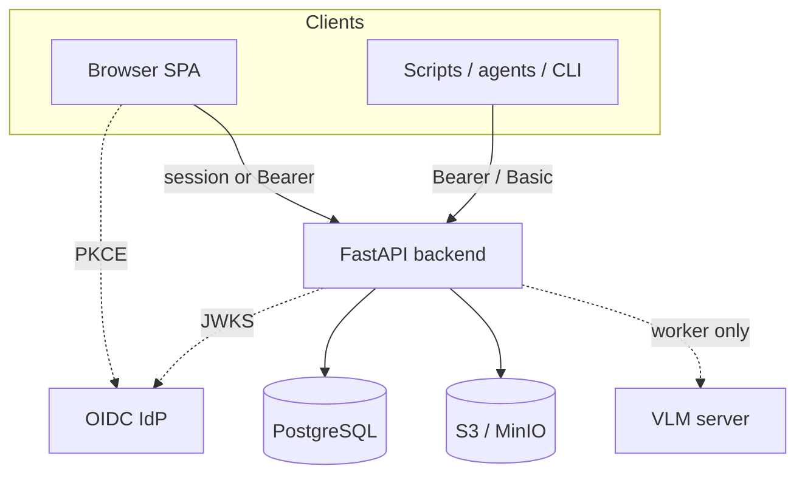

# Security design

How openKMS thinks about security: principles and trust boundaries. For **mechanics** (login flows, env vars, curl examples, sharing tables), use the linked feature pages—not this one.

---

## Principles

1. **Authenticate before data** — Product APIs require a known principal. The public surface is intentionally small (marketing home, health, `public-config`, system name).

2. **Two layers, both must pass** — **Operation permissions** answer “may this user use Documents / Console / …?” **Resource ACL** answers “may this user see *this* channel, KB, or wiki?” Coarse gates do not replace per-resource sharing. See [Data security](features/data-security.md).

3. **Restrict data by explicit choice** — With **no** ACL rows on a resource or its container chain, any authenticated user who holds the right operation key can access it. Turning on sharing is **opt-in closure**, not opt-in openness.

4. **Platform admin ≠ data superuser** — JWT `admin` / catalog key `all` can run Console and configure sharing, but **read and write on content** still follow resource ACL when sharing is configured. That supports least-privilege and audit-friendly deployments.

5. **Identity outside, authorization inside** — In OIDC mode the IdP proves *who* someone is; PostgreSQL holds the permission catalog, roles, groups, and ACL. Realm role names map to `security_roles.name`; API keys snapshot that mapping at creation time.

6. **Least privilege in the catalog** — Keys are feature-sized (`documents:read`, `console:groups`, …). The built-in `all` key is for bootstrap; operators are nudged toward granular keys via the Console permission reference.

7. **Secrets stay out of git and argv** — Credentials live in environment or a secret store. The CLI never accepts cloud storage keys on the command line. Object access uses presigned URLs after authorization checks.

8. **Power paths are visible** — Arbitrary read-only Cypher (Object Explorer), internal model credential routes, and service subjects (`local-cli`) are separate trust decisions—not “just another API.”

---

## Trust boundaries

| Boundary | Responsibility |
|----------|----------------|
| **Browser** | Route gate from `permission-catalog` patterns; backend remains authoritative on every `/api/*` call. |
| **Backend** | Verify JWT/session/API key; apply operation checks and resource ACL; issue presigned URLs only after access checks. |
| **IdP** (OIDC) | Authentication and realm roles; not the ACL catalog. |
| **Object storage** | Bytes at rest; access mediated by the backend, not direct public buckets for documents. |
| **VLM server** | Parsing only; keep off the public internet; workers call it internally. |

---

## Two-layer model (summary)

| Layer | Question | Detail |
|-------|----------|--------|
| **Operation RBAC** | Can the user open this *feature* or Console tool? | [Data security — Layer 1](features/data-security.md#layer-1-operation-rbac), [Console & authentication](features/console-and-auth.md) |
| **Resource ACL** | Can the user read/write *this instance*? | [Data security — Layer 2](features/data-security.md#layer-2-resource-acl) |

Optional strict mode (`OPENKMS_ENFORCE_PERMISSION_PATTERNS_STRICT`) tightens Layer 1 so every `/api/*` path must match catalog patterns—documented in [Configuration](features/configuration.md).

---

## Identity modes

| Mode | Typical use | Design intent |
|------|-------------|---------------|
| **OIDC** (default) | Enterprise SSO | Single sign-on; map IdP realm roles to openKMS roles; no passwords in openKMS. |
| **Local** | Dev, air-gapped, small installs | openKMS stores users and issues JWTs; still require TLS and strong secrets in production. |

Login behaviour, API keys, and token examples: [Console & authentication](features/console-and-auth.md#authentication).

---

## Deliberate non-goals (today)

- **No** implicit “admin sees every channel” for regulated tenants.
- **No** automatic ACL filtering on arbitrary Object Explorer Cypher—gate with operation permissions and deployment policy instead.
- **No** committed secrets or long-lived tokens treated as low risk—see [Tech debt — API tokens](tech_debt.md#api-tokens-machine-auth).

---

## Where to read next

| You need… | Read |
|-----------|------|
| Sharing, groups, inheritance, enforcement code | [Data security](features/data-security.md) |
| Console, catalog, OIDC/local login, **obtaining tokens** | [Console & authentication](features/console-and-auth.md) |
| Env vars and toggles | [Configuration](features/configuration.md) |
| Deploy and auth-mode alignment | [Docker operations](operations/docker.md) |
| Schemas | [Data models — Data security](features/data-models.md#data-security-access-groups-resource-acl) |

---

## Reporting vulnerabilities

If you find a security issue, report it **privately** (do not open a public issue with exploit details).
