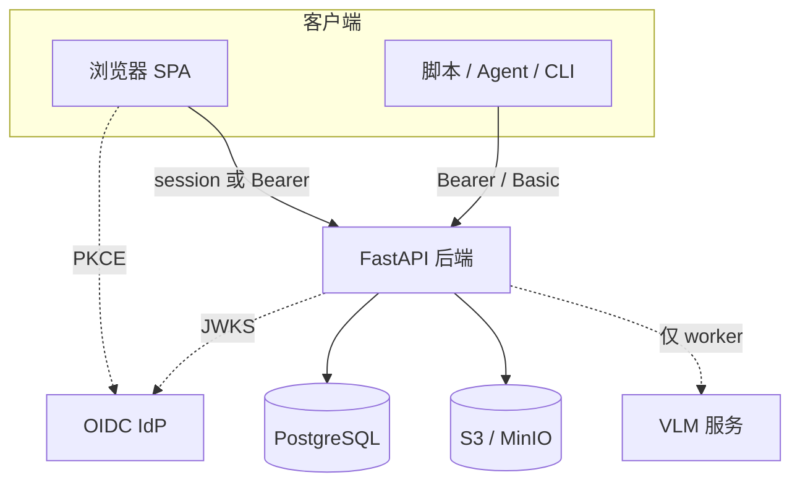

# 安全设计

openKMS 的安全思路：原则与信任边界。关于**机制**（登录流程、环境变量、curl 示例、共享表），请用链接的功能页——不在本文展开。

---

## 原则

1. **先认证再访问数据** — 产品 API 要求已知主体。公开面 intentionally 很小（营销首页、健康检查、`public-config`、系统名称）。

2. **两层都要通过** — **操作权限**回答「该用户能否使用文档 / Console / …？」**资源 ACL** 回答「该用户能否看到*这一*通道、知识库或维基？」粗粒度门控不能替代按资源共享。见 [数据安全](features/data-security.md)。

3. **默认开放、显式收紧** — 资源或其容器链上**没有** ACL 行时，持有正确操作键的任意已认证用户可访问。开启共享是**主动收窄**，而非主动开放。

4. **平台管理员 ≠ 数据超级用户** — JWT `admin` / 目录键 `all` 可运行 Console 并配置共享，但**内容的读写在配置共享后仍遵循资源 ACL**。支持最小权限与可审计部署。

5. **身份在外、授权在内** — OIDC 模式下 IdP 证明*是谁*；PostgreSQL 存权限目录、角色、组与 ACL。Realm 角色名映射到 `security_roles.name`；API 密钥在创建时快照该映射。

6. **目录中最小权限** — 键按功能粒度划分（`documents:read`、`console:groups` 等）。内置 `all` 用于引导；Console 权限参考引导运维使用细粒度键。

7. **密钥不进 git、不进 argv** — 凭据放在环境或密钥库。CLI 不接受云存储密钥作为命令行参数。对象访问在授权检查后通过 presigned URL。

8. **高权限路径可见** — 任意只读 Cypher（Object Explorer）、内部模型凭据路由、服务主体（`local-cli`）是独立的信任决策——不是「又一个普通 API」。

---

## 信任边界

| 边界 | 职责 |
|------|------|
| **浏览器** | 由 `permission-catalog` 模式做路由门控；每次 `/api/*` 调用后端仍为权威。 |
| **后端** | 校验 JWT/session/API 密钥；应用操作检查与资源 ACL；仅在访问检查通过后签发 presigned URL。 |
| **IdP**（OIDC） | 认证与 realm 角色；不是 ACL 目录。 |
| **对象存储** | 静态字节；访问由后端中介，文档桶不对公网直开。 |
| **VLM 服务** | 仅解析；勿暴露公网；worker 内网调用。 |

---

## 双层模型（摘要）

| 层 | 问题 | 详情 |
|----|------|------|
| **操作 RBAC** | 用户能否打开该*功能*或 Console 工具？ | [数据安全 — 第 1 层](features/data-security.md#layer-1-operation-rbac)、[控制台与认证](features/console-and-auth.md) |
| **资源 ACL** | 用户能否读/写*该实例*？ | [数据安全 — 第 2 层](features/data-security.md#layer-2-resource-acl) |

可选严格模式（`OPENKMS_ENFORCE_PERMISSION_PATTERNS_STRICT`）收紧第 1 层，要求每个 `/api/*` 路径匹配目录模式——见 [配置](features/configuration.md)。

---

## 身份模式

| 模式 | 典型场景 | 设计意图 |
|------|----------|----------|
| **OIDC**（默认） | 企业 SSO | 单点登录；IdP realm 角色映射 openKMS 角色；openKMS 不存密码。 |
| **Local** | 开发、隔离网、小型安装 | openKMS 存用户并签发 JWT；生产仍须 TLS 与强密钥。 |

登录行为、API 密钥与 token 示例：[控制台与认证](features/console-and-auth.md#authentication)。

---

## 当前刻意不做 {#deliberate-non-goals-today}

- **没有** 受监管租户下隐式「管理员可见所有通道」。
- **没有** 对任意 Object Explorer Cypher 自动 ACL 过滤——用操作权限与部署策略门控。
- **没有** 将已提交密钥或长期 token 视为低风险——见 [技术债 — API token](tech_debt.md#api-tokens-machine-auth)。

---

## 延伸阅读

| 你需要… | 阅读 |
|---------|------|
| 共享、组、继承、enforcement 代码 | [数据安全](features/data-security.md) |
| Console、目录、OIDC/本地登录、**获取 token** | [控制台与认证](features/console-and-auth.md) |
| 环境变量与开关 | [配置](features/configuration.md) |
| 部署与 auth 模式对齐 | [Docker 运维](operations/docker.md) |
| Schema | [数据模型 — 数据安全](features/data-models.md#data-security-access-groups-resource-acl) |

---

## 漏洞报告

如发现安全问题，请**私下**报告（勿公开 issue 附带 exploit 细节）。
