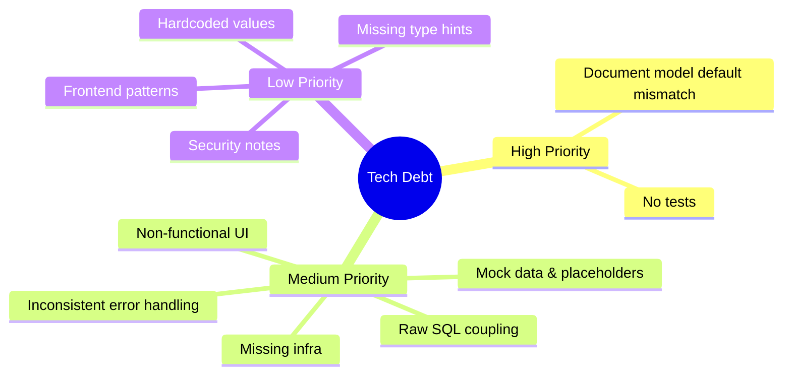
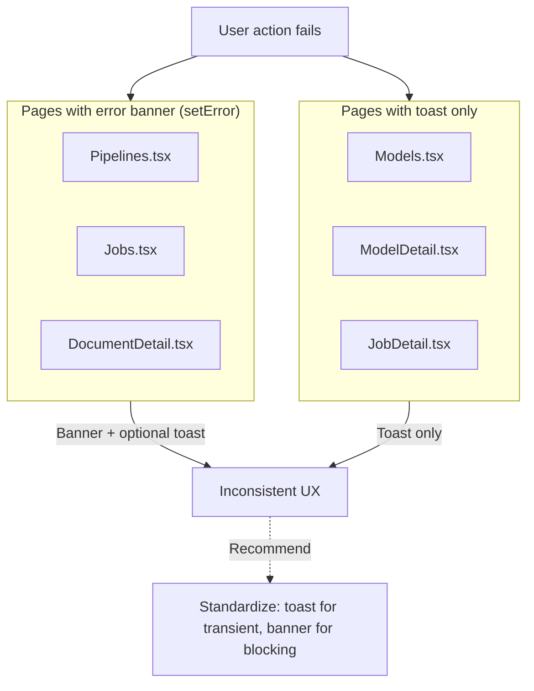
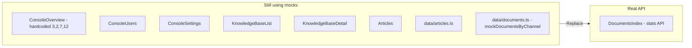
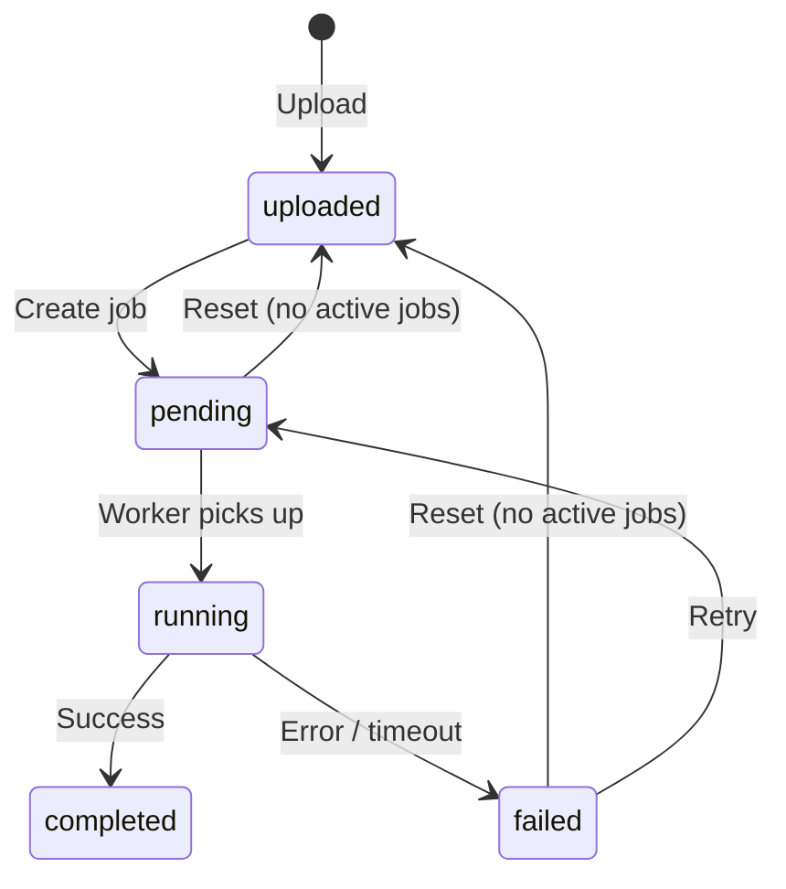
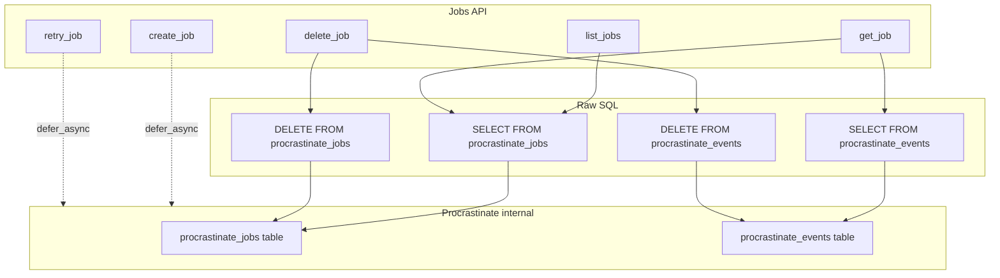

# Technical Debt

Last updated: 2026-03-10

---

## Overview



---

## Diagram Index

| Diagram | Section | Purpose |
|---------|---------|---------|
| [Tech debt categories](#overview) | Overview | Mind map of debt by priority |
| [Document status flow](#12-document-status--raw-sql) | §12 | Document lifecycle state machine |
| [Jobs API coupling](#13-jobs-api-raw-sql-coupling) | §13 | Procrastinate internal schema coupling |
| [Error handling inconsistency](#3-inconsistent-error-handling-in-frontend) | §3 | Frontend error UX patterns |
| [Frontend mock data map](#4-frontend-mock-data-not-replaced-with-real-apis) | §4 | Files with mocks vs real API |

---

## High Priority

### 1. No tests

There is no test framework or test suite for either backend or frontend. No `tests/` directory, no pytest/unittest config, no Jest/Vitest config. The frontend `package.json` has no `test` or type-check scripts.

### 2. Document model default mismatch (new)

**File:** `backend/app/models/document.py`

The `status` column has conflicting defaults:

```python
status: Mapped[str] = mapped_column(..., default="uploaded", server_default="completed")
```

- **Python default**: `"uploaded"` (used when creating new documents in code)
- **DB server_default**: `"completed"` (used when DB applies default on insert)

This can cause inconsistent behavior if raw inserts bypass the Python layer. Standardize on a single source of truth (e.g. use only `default="uploaded"` and ensure migrations align).

---

## Medium Priority

### 3. Inconsistent error handling in frontend

- Some pages use `setError` + UI banner (`Pipelines.tsx`, `Jobs.tsx`, `DocumentDetail.tsx`)
- Others use `toast.error` only (`Models.tsx`, `ModelDetail.tsx`, `JobDetail.tsx`)



Consider standardizing on one pattern project-wide.

### 4. Frontend mock data not replaced with real APIs



| File | Description |
|------|-------------|
| `pages/console/ConsoleOverview.tsx` | Hardcoded stats (3, 2, 7, 12) |
| `pages/console/ConsoleUsers.tsx` | Mock users; Add User button is non-functional |
| `pages/console/ConsoleSettings.tsx` | Form inputs are not wired to any API |
| `pages/DocumentsIndex.tsx` | Uses `fetchDocumentStats()` (real); document count is from API |
| `pages/KnowledgeBaseList.tsx` | Mock KB list |
| `pages/KnowledgeBaseDetail.tsx` | All tabs use mocks; all actions are no-ops |
| `pages/Articles.tsx` | Mock articles; action buttons do nothing |
| `data/documents.ts` | `mockDocumentsByChannel` is empty `{}` (unused) |
| `data/articles.ts` | Mock article data |

### 5. Non-functional buttons

Several UI buttons have no `onClick` handlers:

- `DocumentChannel.tsx` – Edit, Move, Download actions on documents
- `Articles.tsx` – New Article, Edit, Move, Duplicate, Delete
- `KnowledgeBaseDetail.tsx` – Add document/article, Generate FAQ, View, Remove
- `KnowledgeBaseList.tsx` – New Knowledge Base
- `ConsoleUsers.tsx` – Add User
- `Header.tsx` – Profile, Settings dropdown items

### 6. Missing infrastructure

- No `docker-compose.yml` for local development (Postgres, MinIO, Keycloak, VLM must be started manually)
- No `Makefile` or task runner for common operations (install, migrate, run, test)
- No root `.env.example`; `vlm-server/` also missing `.env.example`

---

## Architecture & Coupling

### 12. Document status & raw SQL

Document status is represented as string literals across backend and frontend. No shared enum or constants.



**Locations:** `documents.py`, `jobs.py`, `tasks.py`, `DocumentChannel.tsx`, `DocumentDetail.tsx`, `Jobs.tsx`, schemas. Consider adding `DocumentStatus` enum and centralizing values.

### 13. Jobs API raw SQL coupling

The Jobs API reads/writes directly from `procrastinate_jobs` and `procrastinate_events` using raw SQL instead of procrastinate's public API.



**Risks:** Breaking changes when procrastinate schema changes; no ORM validation. Consider using procrastinate's `Job` model or its query helpers if available.

**Files:** `backend/app/api/jobs.py`, `backend/app/api/documents.py` (reset-status checks `procrastinate_jobs`).

---

## Low Priority

### 7. Hardcoded values that could be configurable

| File | Value |
|------|-------|
| `backend/app/main.py` | Session cookie `max_age=86400 * 7` |
| `backend/app/services/storage.py` | Presigned URL `expires_in=3600` |
| `backend/app/services/model_testing.py` | HTTP timeout `timeout=120.0` |
| `backend/app/jobs/tasks.py` | Subprocess `timeout=600` |
| `backend/app/config.py` | Both `vlm_server_url` and `paddleocr_vl_server_url` default to `http://localhost:8101` (duplicate config) |
| `backend/app/config.py` | `paddleocr_vl_max_concurrency` is defined but never used |

### 8. Missing type hints

| File | Function |
|------|----------|
| `backend/app/api/models.py` | `get_categories()` |
| `backend/app/api/pipelines.py` | `get_template_variables()` |
| `backend/app/api/jobs.py` | `_row_to_response(row)` |
| `backend/app/services/storage.py` | `_client()`, `get_object_stream()` |

### 9. Frontend accessibility: ConsoleSettings form controls

Form controls in `ConsoleSettings.tsx` lack proper `id`/`htmlFor` linkage for screen readers.

### 10. Frontend patterns to consolidate

- CRUD table pattern (`Models.tsx`, `Pipelines.tsx`, `Jobs.tsx`) shares load/fetch/modal/table/actions logic – could extract a `useCrudList<T>` hook
- Search input pattern repeated across many pages – could be a shared `SearchInput` component
- `KnowledgeBaseDetail.tsx` has four near-identical tab sections

### 11. Security notes

| Item | Details |
|------|---------|
| Default secret key | `backend/app/config.py` – `secret_key = "openkms-dev-secret-change-in-production"` |
| CORS single origin | `backend/app/main.py` – only `keycloak_frontend_url` is allowed |
| Legacy logout | `GET /logout` endpoint is marked as legacy; consider removing |
| Migration seed data | Alembic migrations seed `http://localhost:8101/` and fixed IDs – not environment-aware |

---

## Additional Items (from scan)

### 14. PipelineCreate.command has no validation

**File:** `backend/app/schemas/pipeline.py`

`PipelineCreate.command` accepts any string; long or malformed commands can be stored. Consider adding max length and basic format validation.

### 15. Synchronous subprocess in async task

**File:** `backend/app/jobs/tasks.py`

`run_pipeline` uses `subprocess.run()` (blocking) inside an async function. For high throughput, consider `asyncio.create_subprocess_exec()` to avoid blocking the event loop.

### 16. Metadata extraction code duplication

Metadata extraction logic exists in both:

- `backend/app/services/metadata_extraction.py` – async, used by `POST /extract-metadata`
- `openkms-cli/openkms_cli/extract.py` – sync wrapper around async, used during pipeline run

Schema building and pydantic-ai setup are duplicated. Consider a shared library or backend API for extraction that the CLI calls.
