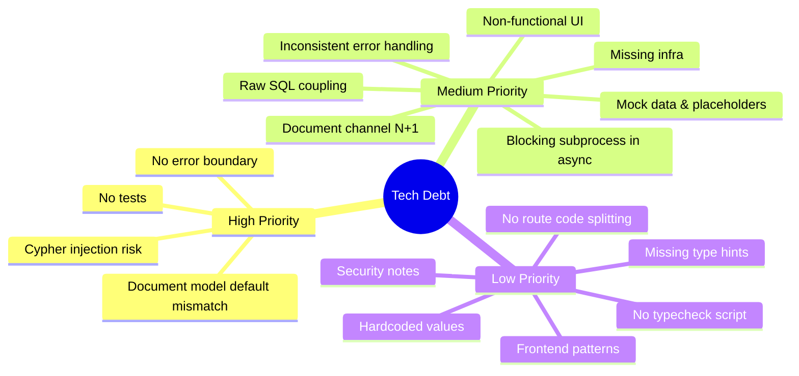
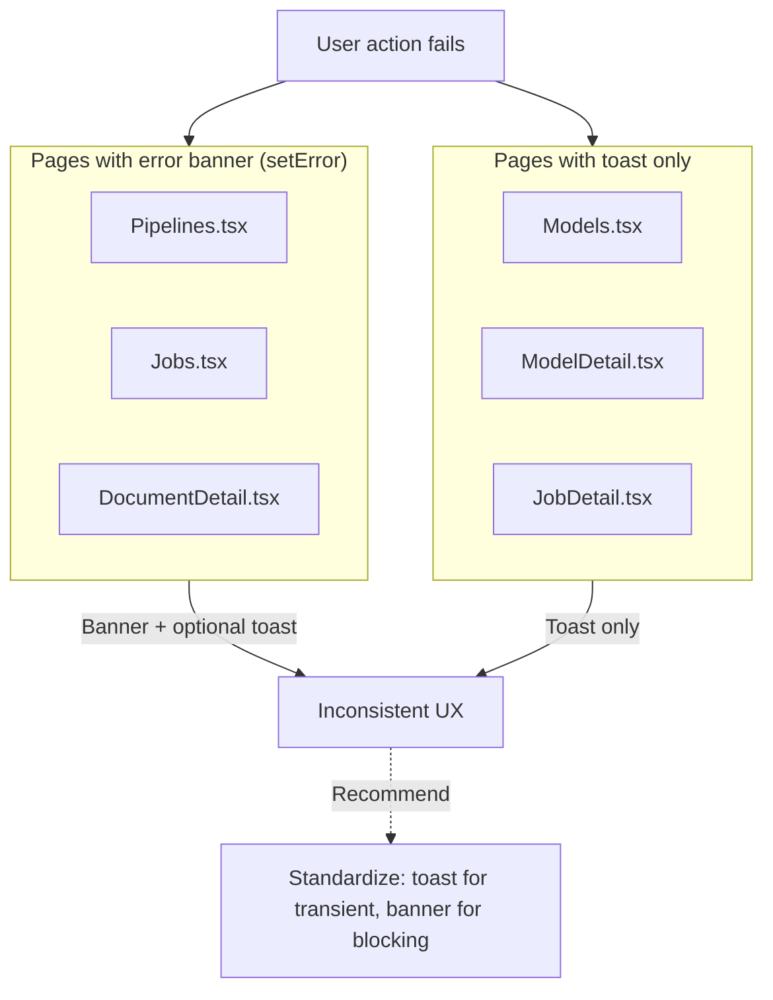
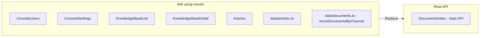
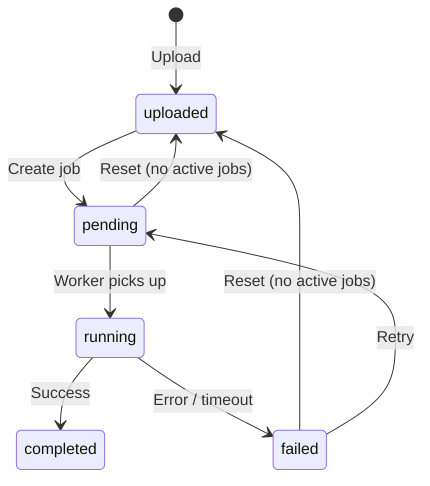
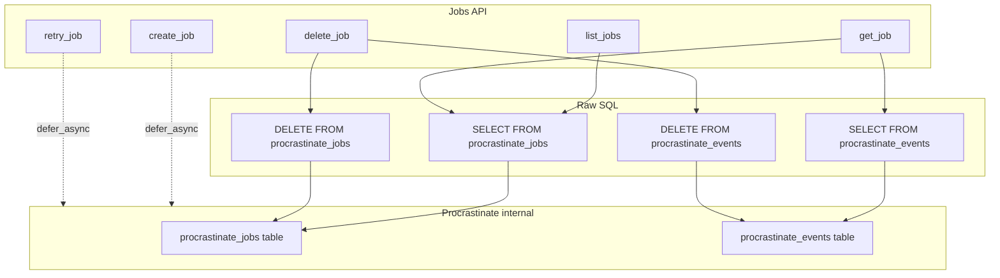

# Technical Debt

Last updated: 2026-03-17

## Recent Mitigations (2026-03-17)

The following items were addressed:

- §1 No tests → pytest + Vitest added
- §2 Document model default → migration p1q2r3s4t5u6, model uses DocumentStatus
- §3 No error boundary → ErrorBoundary in App.tsx
- §4 Cypher injection → allowlist: block CALL, apoc., dbms.; require RETURN
- §6 Missing infra → `docker/docker-compose.yml`, `.env.example`
- §11 No typecheck script → added to package.json
- §13 Security → reject default secret in production; PipelineCreate max_length
- §15 Pipeline command validation → done
- §16 Blocking subprocess → asyncio.create_subprocess_exec in run_pipeline
- §14 Document channel N+1 → merged channel fetches into one query
- §7 VLM config → consolidated; removed paddleocr_vl_max_concurrency
- §12 DocumentStatus enum → constants.py
- §10 Route code splitting → React.lazy for heavy routes
- §9 Accessibility → ConsoleSettings id/htmlFor
- §3 Error UX → ErrorBanner component; Pipelines uses it

---

## Overview



---

## Diagram Index

| Diagram | Section | Purpose |
|---------|---------|---------|
| [Tech debt categories](#overview) | Overview | Mind map of debt by priority |
| [Document status flow](#12-document-status--raw-sql) | §12 (Architecture) | Document lifecycle state machine |
| [Jobs API coupling](#13-jobs-api-raw-sql-coupling) | §13 (Architecture) | Procrastinate internal schema coupling |
| [Error handling inconsistency](#3-inconsistent-error-handling-in-frontend) | §3 | Frontend error UX patterns |
| [Frontend mock data map](#4-frontend-mock-data-not-replaced-with-real-apis) | §4 | Files with mocks vs real API |

---

## High Priority

### 1. No tests

There is no test framework or test suite for either backend or frontend. No `tests/` directory, no pytest/unittest config, no Jest/Vitest config. The frontend `package.json` has no `test` or type-check scripts.

### 2. Document model default mismatch

**File:** `backend/app/models/document.py`

The `status` column has conflicting defaults:

```python
status: Mapped[str] = mapped_column(..., default="uploaded", server_default="completed")
```

- **Python default**: `"uploaded"` (used when creating new documents in code)
- **DB server_default**: `"completed"` (used when DB applies default on insert)

This can cause inconsistent behavior if raw inserts bypass the Python layer. Standardize on a single source of truth (e.g. use only `default="uploaded"` and ensure migrations align).

### 3. No error boundary

**File:** `frontend/src/App.tsx`

There is no React ErrorBoundary wrapping the main routes. An uncaught error in any child component will unmount the entire app and show a blank screen.

**Action:** Add an ErrorBoundary around main routes with a fallback UI (retry button, error message).

### 4. Cypher injection risk

**File:** `backend/app/api/ontology_explore.py`

The ontology explore API executes user-supplied Cypher. Current regex blocks `CREATE`, `MERGE`, `DELETE`, etc., but Neo4j procedures (e.g. `CALL apoc.load.json`, `dbms.procedures()`) could still be exploitable.

**Action:** Use an allowlist approach – only permit patterns like `MATCH ... RETURN`; block `CALL`, `PROCEDURE`, and other mutation/admin constructs.

---

## Medium Priority

### 3. Inconsistent error handling in frontend

- Some pages use `setError` + UI banner (`Pipelines.tsx`, `Jobs.tsx`, `DocumentDetail.tsx`)
- Others use `toast.error` only (`Models.tsx`, `ModelDetail.tsx`, `JobDetail.tsx`)



Consider standardizing on one pattern project-wide.

### 4. Frontend mock data not replaced with real APIs



| File | Description |
|------|-------------|
| `pages/console/ConsoleUsers.tsx` | Mock users; Add User button is non-functional |
| `pages/console/ConsoleSettings.tsx` | Form inputs are not wired to any API |
| `pages/DocumentsIndex.tsx` | Uses `fetchDocumentStats()` (real); document count is from API |
| `pages/KnowledgeBaseList.tsx` | Mock KB list |
| `pages/KnowledgeBaseDetail.tsx` | All tabs use mocks; all actions are no-ops |
| `pages/Articles.tsx` | Mock articles; action buttons do nothing |
| `data/documents.ts` | `mockDocumentsByChannel` is empty `{}` (unused) |
| `data/articles.ts` | Mock article data |

### 5. Non-functional buttons

Several UI buttons have no `onClick` handlers:

- `DocumentChannel.tsx` – Edit, Move, Download actions on documents
- `Articles.tsx` – New Article, Edit, Move, Duplicate, Delete
- `KnowledgeBaseDetail.tsx` – Add document/article, Generate FAQ, View, Remove
- `KnowledgeBaseList.tsx` – New Knowledge Base
- `ConsoleUsers.tsx` – Add User
- `Header.tsx` – Profile, Settings dropdown items

### 6. Missing infrastructure

- ~~No `docker-compose.yml`~~ — `docker/docker-compose.yml` (Postgres, MinIO); Keycloak/VLM still manual if needed
- ~~No `Makefile`~~ — use `docker compose -f docker/docker-compose.yml` from repo root (see `docker/README.md`)
- ~~No root `.env.example`~~ — root `.env.example` points contributors to `backend/.env.example`; **`vlm-server/.env.example`** documents optional `PORT`

---

## Architecture & Coupling

### 12. Document status & raw SQL

Document status is represented as string literals across backend and frontend. No shared enum or constants.



**Locations:** `documents.py`, `jobs.py`, `tasks.py`, `DocumentChannel.tsx`, `DocumentDetail.tsx`, `Jobs.tsx`, schemas. Consider adding `DocumentStatus` enum and centralizing values.

### 13. Jobs API raw SQL coupling

The Jobs API reads/writes directly from `procrastinate_jobs` and `procrastinate_events` using raw SQL instead of procrastinate's public API.



**Risks:** Breaking changes when procrastinate schema changes; no ORM validation. Consider using procrastinate's `Job` model or its query helpers if available.

**Files:** `backend/app/api/jobs.py`, `backend/app/api/documents.py` (reset-status checks `procrastinate_jobs`).

### 14. Document channel N+1-style queries

**File:** `backend/app/api/documents.py` (lines 61–67)

`list_documents` fetches the target channel, all channels (for tree), then documents in multiple round-trips. Consider a recursive CTE or single query for channel subtree + documents.

---

## Low Priority

### 7. Hardcoded values that could be configurable

| File | Value |
|------|-------|
| `backend/app/main.py` | Session cookie `max_age=86400 * 7` |
| `backend/app/services/storage.py` | Presigned URL `expires_in=3600` |
| `backend/app/services/model_testing.py` | HTTP timeout `timeout=120.0` |
| `backend/app/jobs/tasks.py` | Document pipeline timeout configurable via **`OPENKMS_PIPELINE_TIMEOUT_SECONDS`** (default 1800s); KB index still fixed 1800s |
| `backend/app/config.py` | Both `vlm_url` and `paddleocr_vl_server_url` default to `http://localhost:8101` (duplicate config – consolidate VLM config) |
| `backend/app/config.py` | `paddleocr_vl_max_concurrency` is defined but never used (remove or use) |

### 8. Missing type hints

| File | Function |
|------|----------|
| `backend/app/api/models.py` | `get_categories()` |
| `backend/app/api/pipelines.py` | `get_template_variables()` |
| `backend/app/api/jobs.py` | `_row_to_response(row)` |
| `backend/app/services/storage.py` | `_client()`, `get_object_stream()` |

### 9. Frontend accessibility: ConsoleSettings form controls

Form controls in `ConsoleSettings.tsx` lack proper `id`/`htmlFor` linkage for screen readers. Add consistent `id`/`htmlFor` on forms; ensure focus and labeling for modal flows.

### 10. No route-level code splitting

**File:** `frontend/src/App.tsx`

All routes are eager-loaded; no `React.lazy()` or code splitting. Heavy routes (ObjectExplorer, KnowledgeBaseDetail, Models, etc.) increase initial bundle size and TTI.

**Action:** Add `React.lazy()` for heavy routes.

### 11. No frontend typecheck script

**File:** `frontend/package.json`

TypeScript compilation (`tsc -b`) is only invoked via `build`; there is no standalone `typecheck` script for development or CI.

**Action:** Add `"typecheck": "tsc --noEmit"` and run in CI.

### 12. Frontend patterns to consolidate

- CRUD table pattern (`Models.tsx`, `Pipelines.tsx`, `Jobs.tsx`) shares load/fetch/modal/table/actions logic – could extract a `useCrudList<T>` hook
- Search input pattern repeated across many pages – could be a shared `SearchInput` component
- `KnowledgeBaseDetail.tsx` has four near-identical tab sections

### 13. Security notes

| Item | Details |
|------|---------|
| Default secret key | `backend/app/config.py` – `secret_key = "openkms-dev-secret-change-in-production"`. Require explicit `secret_key` in production; reject startup with default secret. |
| CORS single origin | `backend/app/main.py` – only `OPENKMS_FRONTEND_URL` (`settings.frontend_url`) is allowed |
| Legacy logout | `GET /logout` endpoint is marked as legacy; consider removing |
| Migration seed data | Alembic migrations seed `http://localhost:8101/` and fixed IDs – not environment-aware |

### 18. API documentation

FastAPI exposes `/docs` and `/redoc`; README mentions `http://localhost:8102/docs`. Keep and document these; optionally add `openapi.json` export for external tooling.

---

## Additional Items

### 15. PipelineCreate.command has no validation

**File:** `backend/app/schemas/pipeline.py`

`PipelineCreate.command` accepts any string; long or malformed commands can be stored. Consider adding max length and basic format validation.

### 16. Synchronous subprocess in async task

**File:** `backend/app/jobs/tasks.py`

`run_pipeline` uses `subprocess.run()` (blocking) inside an async function. For high throughput, consider `asyncio.create_subprocess_exec()` to avoid blocking the event loop.

### 17. Metadata extraction code duplication

Metadata extraction logic exists in both:

- `backend/app/services/metadata_extraction.py` – async, used by `POST /extract-metadata`
- `openkms-cli/openkms_cli/extract.py` – sync wrapper around async, used during pipeline run

Schema building and pydantic-ai setup are duplicated. Consider a shared library or backend API for extraction that the CLI calls.
