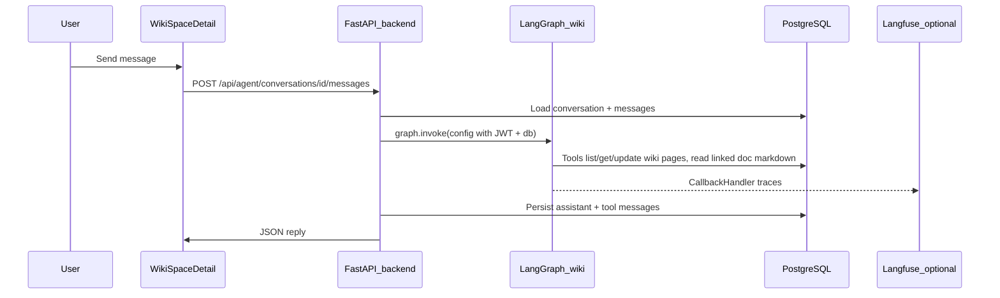

# Wiki space: linked documents and embedded agent (prototype design)

This document is the **single spec** for wiki–document associations, the wiki-space **Documents** tab + **Wiki assistant** UI, and the future **in-process LangGraph agent** in the openKMS backend. It complements [architecture.md](./architecture.md).

**Shipped UI (prototype, no backend links/agent yet)**

- [WikiSpaceDetail](../frontend/src/pages/WikiSpaceDetail.tsx): **grid** with toolbar row spanning both columns (assistant top-aligns with main); main + **wide** sticky right rail (`~640px` / `44vw` cap); **Pages | Documents** tabs; **dense** page rows (15 per page via `WIKI_PAGES_LIST_PAGE_SIZE` in `wikiSpacesApi.ts`); **Linked documents** + **Add documents** modal (`GET /api/documents`). Linked rows: **`sessionStorage`** (`openkms_wiki_space_linked_docs_{spaceId}`).
- [WikiSpaceAgentPanel](../frontend/src/components/wiki/WikiSpaceAgentPanel.tsx): local-only chat shell; **no** `/api/agent` calls.

## Two services (do not conflate)

| Piece | Role |
|-------|------|
| **qa-agent** | Separate deployable: KB RAG over HTTP to openKMS; LangGraph + optional Langfuse. Unchanged by wiki assistant work. |
| **Backend embedded agent** | Same FastAPI process as openKMS: `/api/agent/...`, LangGraph + tools with DB/session + JWT; optional Langfuse `CallbackHandler`. Not split to its own container in the first build phase. |

## Goals

1. **Wiki space**: Tabs **Pages** | **Documents**; documents are channel **Document** rows **linked** to the space (reference-only). Users add/remove links only for documents they can already read (enforced server-side when API exists).
2. **Wiki assistant** (right rail): Chat aligned with the [wiki-skills](https://github.com/kfchou/wiki-skills) *pattern* (init / ingest / query / lint / update) via system prompt + tools—not bundled Claude SKILL files.
3. **Multi-surface**: Same agent **shell** pattern can mount on other routes later with different `surface` and skill packs.

## Request path (target)

## Data model (build phase)

| Table | Purpose |
|-------|---------|
| **wiki_space_documents** | `wiki_space_id`, `document_id`, `created_at`; unique `(wiki_space_id, document_id)`; FKs to `wiki_spaces`, `documents`; cascade row on space delete; on document delete remove link or CASCADE. |
| **agent_conversations** | `id`, `user_id` (sub), `surface`, `context` JSONB (`wiki_space_id`, …), optional `title`, timestamps. |
| **agent_messages** | `id`, `conversation_id`, `role`, `content`, optional `tool_calls` JSONB, `created_at`. |

## REST API (build phase)

**Wiki–document links**

| Method | Path | Body / notes |
|--------|------|----------------|
| GET | `/api/wiki-spaces/{id}/documents` | List linked document summaries. |
| POST | `/api/wiki-spaces/{id}/documents` | `{ "document_id" }`; wiki write + document in scope. |
| DELETE | `/api/wiki-spaces/{id}/documents/{document_id}` | Unlink. |

**Agent**

| Method | Path | Notes |
|--------|------|--------|
| POST | `/api/agent/conversations` | `{ "surface": "wiki_space", "context": { "wiki_space_id" } }` |
| GET | `/api/agent/conversations/{id}` | Metadata. |
| GET | `/api/agent/conversations/{id}/messages` | Paginated history. |
| POST | `/api/agent/conversations/{id}/messages` | User text; run LangGraph loop; non-streaming JSON in v1. |

## Permissions (target)

| Action | Requirement |
|--------|-------------|
| Link / unlink document | `wikis:write` + wiki in scope; document must pass same scope rules as `GET /api/documents`. |
| Open assistant / read | `wikis:read` + space in scope. |
| Tools that mutate wiki pages | `wikis:write`. |
| Tool: read linked `Document.markdown` | Document read scope. |

## LangGraph + Langfuse (build phase)

- **Graph**: `StateGraph` with `messages` (`add_messages`), `generate` node (`ChatOpenAI` + wiki tools), `ToolNode`, conditional **tools → generate** until no tool calls (pattern aligned with [qa-agent/qa_agent/agent.py](../qa-agent/qa_agent/agent.py)).
- **Tools**: Request context via `config["configurable"]` (`AsyncSession`, JWT, `wiki_space_id`); never trust model for auth.
- **Langfuse**: Optional `LANGFUSE_SECRET_KEY`, `LANGFUSE_PUBLIC_KEY`, `LANGFUSE_BASE_URL`; `langfuse.langchain.CallbackHandler` on `invoke`, `flush()` after run; trace metadata: `surface`, `wiki_space_id`, `conversation_id`, user `sub`.

## Build-phase backlog (ordered)

1. Alembic: `wiki_space_documents`, `agent_conversations`, `agent_messages`; register models in `alembic/env.py`.
2. Wiki-space document link API + permission checks; replace **sessionStorage** in [WikiSpaceDetail](../frontend/src/pages/WikiSpaceDetail.tsx) with `fetch` to new endpoints.
3. Backend: `langgraph`, `langchain-openai`, `langfuse` in [backend/pyproject.toml](../backend/pyproject.toml); `app/services/agent/` (surfaces, wiki graph, wiki tools); `app/api/agent.py`; `config.py` Langfuse settings.
4. Frontend: `agentApi.ts`; wire **WikiSpaceAgentPanel** to create conversation + POST messages; remove prototype-only copy when live.
5. Docs: env examples; expand **functionalities** / **architecture** for shipped agent.

## Out of scope (later)

- Extracting embedded agent to a separate microservice.
- SSE streaming (optional follow-up).
- Global floating agent in `MainLayout`.
- Merging qa-agent into the monolith.
