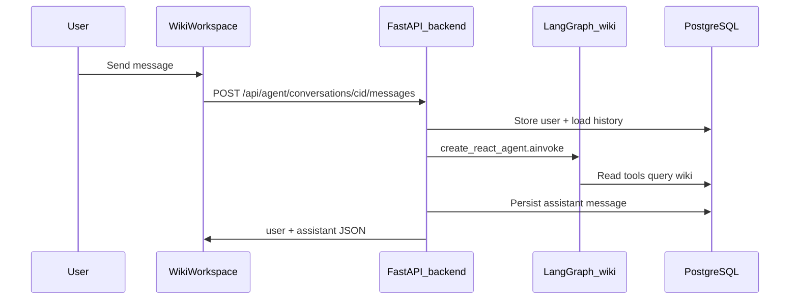
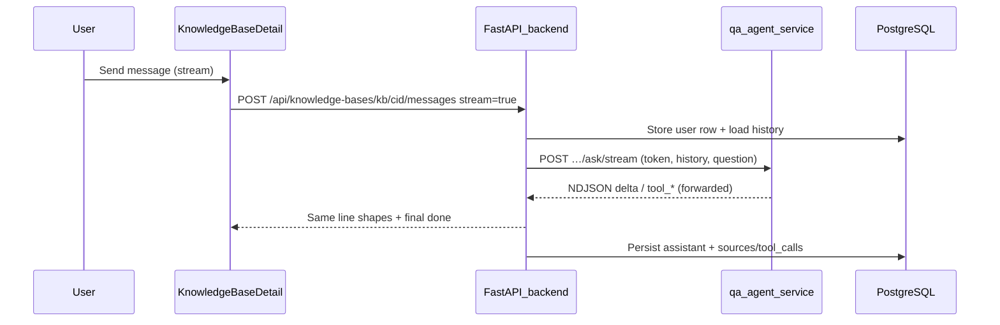

# Wiki space: linked documents and embedded agent (prototype design)

This document is the **single spec** for wiki–document associations, the wiki-space **Documents** tab (settings), **Wiki Copilot** in the **wiki workspace**, and the **in-process LangGraph agent** in the openKMS backend. It complements [architecture.md](./architecture.md).

**Shipped (MVP v1)**

- [WikiSpaceSettings](https://github.com/yingrui/openKMS/blob/main/frontend/src/pages/wiki/WikiSpaceSettings.tsx): sectioned **space settings** (space, imports, pages, linked documents); **15** per page on the admin list; **Linked documents** uses `GET/POST/DELETE` **`/api/wiki-spaces/{id}/documents`** (replaces `sessionStorage`). **Wiki Copilot** lives in [WikiWorkspace](https://github.com/yingrui/openKMS/blob/main/frontend/src/pages/wiki/WikiWorkspace.tsx) (toolbar toggle, **WikiSpaceAgentPanel**).
- [WikiSpaceAgentPanel](https://github.com/yingrui/openKMS/blob/main/frontend/src/components/wiki/WikiSpaceAgentPanel.tsx): **`/api/agent`** create conversation, post message, list messages, **list conversations** (per space), **delete** conversation, **new draft** (no conversation until first send). `sessionStorage` stores active `conversationId` per space. **GFM** rendering ([WikiAgentMessageBody](https://github.com/yingrui/openKMS/blob/main/frontend/src/components/wiki/WikiAgentMessageBody.tsx): `react-markdown` + `remark-gfm`); **auto-scroll** on new content while streaming. Uses **read-only** wiki tools: `list_wiki_pages`, **`search_wiki_pages`** (title/path substring, then semantic matches when the space is indexed), `get_wiki_page`, `list_linked_channel_documents`. First user message in a new chat can set **title** (server) when still empty.
- **Backend** [app/api/agent.py](https://github.com/yingrui/openKMS/blob/main/backend/app/api/agent.py) + [app/services/agent/](https://github.com/yingrui/openKMS/blob/main/backend/app/services/agent/): `langgraph` + `create_react_agent` + [wiki_runner.py](https://github.com/yingrui/openKMS/blob/main/backend/app/services/agent/wiki_runner.py). LLM from [api_models](https://github.com/yingrui/openKMS/blob/main/backend/app/models/api_model.py) (`OPENKMS_AGENT_MODEL_ID` or the **default** `llm` model: **Models** in the app → category **LLM** → **Set as default**). The NDJSON “stream” response uses LangGraph **`astream_events` (v2)** with **`ChatOpenAI(streaming=True)`** so **`delta`** parts arrive as the model streams; **`tool_start` / `tool_end` / `tool_error`** are emitted from the same event loop. If no text deltas appear (rare), the server falls back to one **`ainvoke`** and sends a single **`delta`**. The **`_replay_wiki_invoke_to_stream`** helper remains for tests and any future replay path. **Wiki Copilot does not support** provider thinking / `reasoning_content` round-trip: every request sets **`extra_body.enable_thinking = false`** (after merging **`OPENKMS_AGENT_LLM_EXTRA_BODY`**); for **base_url** values other than **`api.openai.com`** (or when **`OPENKMS_AGENT_LLM_REASONING_CONTENT_SHIM`** forces it), the wiki LLM client also sets **`reasoning_content`** on each outgoing assistant message so some OpenAI-compatible gateways do not return **400** in tool loops. A **pre-model hook** strips thinking-shaped blocks from in-memory history before each LLM call. Upstream [wiki-skills](https://github.com/kfchou/wiki-skills) is **vendored** at [third-party/wiki-skills/](https://github.com/yingrui/openKMS/tree/main/third-party/wiki-skills) (`git subtree`); [vendored_wiki_skills.py](https://github.com/yingrui/openKMS/blob/main/backend/app/services/agent/vendored_wiki_skills.py) loads `skills/*/SKILL.md` into [build_wiki_space_system_prompt()](https://github.com/yingrui/openKMS/blob/main/backend/app/services/agent/prompts.py) with an **openKMS mapping** (tools vs on-disk `SCHEMA.md` / `wiki/…`).

## Two services (do not conflate)

| Piece | Role |
|-------|------|
| **qa-agent** | Separate deployable: KB RAG over HTTP to openKMS; LangGraph + optional Langfuse. Unchanged by Wiki Copilot work. |
| **Backend embedded agent** | Same FastAPI process as openKMS: `/api/agent/...`, LangGraph + tools with `AsyncSession` + JWT. Optional Langfuse **not** wired yet. |

## Goals

1. **Wiki space**: **Pages** | **Documents**; documents are **linked** to the space (DB `wiki_space_documents`). Add/remove with **document in user scope** (enforced in API).
2. **Wiki Copilot** (wiki **workspace** rail): Aligned with the [wiki-skills](https://github.com/kfchou/wiki-skills) *pattern* (init / ingest / query / lint / update) via system prompt + tools.
3. **Multi-surface**: `agent_conversations.surface` — **`wiki_space`** (Wiki Copilot, embedded LangGraph in the backend); **`knowledge_base`** (KB full-page Q&A: same tables and NDJSON event shapes, but **`POST …/knowledge-bases/{id}/agent-conversations/{cid}/messages`** forwards the turn to the **qa-agent** at `{kb.agent_url}/ask` or **`/ask/stream`** and persists the final assistant row + **`kb_qa_sources_v1`** / tool traces on `tool_calls`). Later: **`evaluation`**, **`kb_faq`**, or other surfaces if needed.

## Request path (implemented, v1)

### Wiki Copilot (embedded agent)

### KB Q&A (qa-agent proxy + persistence)

## Data model (implemented)

| Table | Purpose |
|-------|---------|
| **wiki_space_documents** | `id`, `wiki_space_id`, `document_id`, `created_at`; unique pair; `ON DELETE CASCADE` on space or document. |
| **agent_conversations** | `user_sub` (OIDC/ local JWT `sub`), `surface` (`wiki_space`, `knowledge_base`, …), `context` JSONB (`wiki_space_id` or `knowledge_base_id`), `title?`, timestamps. |
| **agent_messages** | `role` (`user` \| `assistant` \| `tool` reserved), `content` (user-visible assistant text), `tool_calls?` JSONB — wiki Copilot stores **`wiki_tool_traces_v1`** (tool name + output) for **model replay** on later turns and for the **workspace rail** to rebuild tool rows when loading `GET …/messages` (order is approximate: completed tools, then final `content` as one text block—not the live interleaving). KB Q&A may add **`kb_qa_sources_v1`** (and optional **`wiki_tool_traces_v1`** when the qa-agent streams tool lines) on assistant rows for persisted references + tool rail after reload. |

## REST API (implemented, v1)

**KB Q&A threads** (same `agent_conversations` / `agent_messages` model; `surface=knowledge_base`, `context.knowledge_base_id`)

| Method | Path | Notes |
|--------|------|--------|
| GET | `/api/knowledge-bases/{id}/agent-conversations` | Current user, this KB, `updated_at` desc. |
| POST | `/api/knowledge-bases/{id}/agent-conversations` | Optional `{ "title" }`. |
| PATCH | `/api/knowledge-bases/{id}/agent-conversations/{cid}` | Title. |
| DELETE | `/api/knowledge-bases/{id}/agent-conversations/{cid}` | 204. |
| GET | `/api/knowledge-bases/{id}/agent-conversations/{cid}/messages` | Full list (v1, no offset). |
| DELETE | `/api/knowledge-bases/{id}/agent-conversations/{cid}/messages/from/{mid}` | Truncate from message (regenerate). |
| POST | `/api/knowledge-bases/{id}/agent-conversations/{cid}/messages` | `{ "content", "stream"?, "session_id"? }` — same streaming contract as wiki **`POST …/agent/…/messages`** when `stream: true` (proxied agent lines + terminal **`done`** / **`error`** with persisted ids). Requires **`agent_url`** on the KB. |

**Wiki–document links**

| Method | Path | Body / notes |
|--------|------|-------------|
| GET | `/api/wiki-spaces/{id}/documents` | `WikiSpaceDocumentListResponse`. |
| POST | `/api/wiki-spaces/{id}/documents` | `{ "document_id" }` |
| DELETE | `/api/wiki-spaces/{id}/documents/{document_id}` | Unlink. |

**Wiki page embeddings (offline semantic index)**

| Method | Path | Notes |
|--------|------|--------|
| POST | `/api/wiki-spaces/{id}/semantic-index` | `wikis:write`. Embeds every **wiki_page** in the space (title + path + body, truncated per request) via the default **embedding** ApiModel (**Models** → category **Embedding** → **Set as default**). Writes `embedding`, `embedding_model_id`, `embedded_at` on each row. Does **not** run automatically on page save (v1). |

**Agent (Wiki Copilot)**

| Method | Path | Notes |
|--------|------|--------|
| POST | `/api/agent/conversations` | `surface: "wiki_space"`, `context: { "wiki_space_id" }` |
| GET | `/api/agent/conversations?wiki_space_id=…&surface=wiki_space&limit=50` | Current user’s conversations for that space, **`updated_at` desc** (1–100). |
| GET | `/api/agent/conversations/{id}` | |
| PATCH | `/api/agent/conversations/{id}` | `{"title": "…"}` (optional; UI may not expose yet). |
| DELETE | `/api/agent/conversations/{id}` | **204**; ownership + scope. |
| GET | `/api/agent/conversations/{id}/messages` | Full list (v1, no offset—OK for small chats). |
| DELETE | `/api/agent/conversations/{id}/messages/from/{message_id}` | Delete this **message and all that follow** (order: `created_at`, `id`). Use to **restart from** a user turn; SPA puts the user text back in the composer. |
| POST | `/api/agent/conversations/{id}/messages` | `{ "content", "stream"?: false }` → JSON `{ message, assistant }`. With `{ "content", "stream": true }` → **`application/x-ndjson`**: one `user` row, then `delta` rows (`t` = text chunk), then `done` (or `error` with the persisted assistant error). |

**Configuration**

- `OPENKMS_AGENT_MODEL_ID` — optional; otherwise the default **`llm`** [api_model](https://github.com/yingrui/openKMS/blob/main/backend/app/models/api_model.py) (`is_default_in_category` for that category: set on the **Models** page, not under Console).
- `OPENKMS_AGENT_MAX_OUTPUT_TOKENS` — default `65537`; cap on **output** (completion) per model call, sent as `max_tokens` (OpenAI-style; token count, not character length). Kept **moderate by default** so providers/models that reject very large `max_tokens` do not error; raise in `.env` if your model’s output limit is higher. Each ReAct step is a separate call. If replies truncate, set higher (within the model’s true limit) or check the provider.
- `OPENKMS_AGENT_RECURSION_LIMIT` — default `200` (was effectively ~25 in LangGraph if unset in code). The ReAct agent **stops** after this many graph supersteps. Bulk work (e.g. 14× get + 14× upsert) needs a **high** limit or **smaller batches** (3–5 pages per user message) so the UI is not “stuck” with no streamed tokens for a long time while tools run.

## Permissions (implemented, v1)

| Action | Requirement |
|--------|-------------|
| Link / unlink | `wikis:write` + space in scope; document must pass [document scope rules](https://github.com/yingrui/openKMS/blob/main/backend/app/api/wiki_spaces.py) (same as document list). |
| Agent chat, read tools | `wikis:read` + space in scope. |
| Agent **upsert** (`upsert_wiki_page` tool) | `wikis:write` + space in scope; same transaction as the chat request (commit at end of `POST .../messages`). |
| Read `Document.markdown` in tools | (Future) `documents:read` scope. |

## wiki-skills → openKMS (v1 tools)

| wiki-skills | openKMS (this build) |
|-------------|----------------------|
| wiki-init | *Prompt* (vendored SKILL + mapping); *no* on-disk bootstrap tool. |
| wiki-ingest | Vendored playbook; actual ingest = UI / CLI, not a server tool. |
| wiki-query | Vendored playbook + `search_wiki_pages`, `list_wiki_pages`, `get_wiki_page` (DB is source of truth) |
| wiki-lint | Vendored playbook + read tools; with **wikis:write**, can **save** a report or fixed page via `upsert_wiki_page` (openKMS path, not a local `wiki/` tree). |
| wiki-update | `upsert_wiki_page` replaces full page body; or UI / CLI. |

**Updating the vendored tree** (from repo root, after adding the subtree once):

`git subtree pull --prefix=third-party/wiki-skills https://github.com/kfchou/wiki-skills.git main --squash`

## LangGraph + Langfuse (status)

- **v1** uses [langgraph.prebuilt.create_react_agent](https://github.com/langchain-ai/langgraph) with `langchain_openai.ChatOpenAI`.
- **Langfuse**: not integrated yet; optional `CallbackHandler` as in backlog.
- **Streaming**: `POST .../messages` with `stream: true` returns **NDJSON**; assistant completion bumps **`updated_at`** for conversation ordering.

## Implementation constraints (Copilot + agent)

For implementers changing the workspace rail, NDJSON client, or wiki LangGraph paths:

1. **NDJSON `done` merge (SPA)** — In `frontend/src/components/wiki/WikiSpaceAgentPanel.tsx`, the stream sends `type: user` first, which rewrites the optimistic user row to the **server** message id. When applying `done`, remove in-flight rows by **`e.user.id`**, the pre-stream **`tempUserId`**, and the assistant placeholder id. Filtering only `tempUserId` **duplicates** the user bubble.
2. **Stream failure rollback** — If `type: user` already ran, rollback must also remove the row whose id is the **persisted** user id, not only `tempUserId`.
3. **Stream lifecycle** — Use **`AbortSignal`** on the stream request; abort when `spaceId` changes or the panel unmounts. Avoid updating chat state from stream callbacks after the panel’s wiki space no longer matches the in-flight request (use a ref or equivalent guard).
4. **Reloaded threads + tool rail** — `GET /api/agent/conversations/{id}/messages` returns `tool_calls` including **`wiki_tool_traces_v1`**. Rebuild assistant `streamParts` in `frontend/src/components/wiki/wikiCopilotStreamParts.ts` so the tool rail appears after reload. Persisted order is approximate (completed tools, then final `content` as text—not token-level interleaving). Keep **`WIKI_TOOL_TRANSCRIPTS_KEY`** / `wiki_tool_traces_v1` aligned between `backend/app/services/agent/wiki_runner.py` and `wikiCopilotStreamParts.ts`.
5. **`sessionStorage` + NDJSON parsing** — In `frontend/src/data/agentApi.ts`, conversation id helpers must tolerate missing storage and thrown errors (quota, private mode): **`try/catch`** on get/set/remove. Parse each NDJSON line safely; do not silently ignore corrupt lines—surface failure so the user can retry.
6. **Streaming media type** — `POST .../messages` with `stream: true` returns **`application/x-ndjson`**, not SSE (`text/event-stream`).
7. **Schema or persisted message shape** — Use Alembic and update `docs/` per project rules (`.cursor/rules/alembic-migrations.mdc`, `.cursor/rules/docs-before-commit.mdc`).

## Build backlog (next)

- [x] Alembic + `wiki_space_documents`, `agent_conversations`, `agent_messages`
- [x] Wiki link API; FE
- [x] Agent router + `create_react_agent` + read tools; FE [agentApi.ts](https://github.com/yingrui/openKMS/blob/main/frontend/src/data/agentApi.ts) + panel
- [ ] Optional: Langfuse env in [config](https://github.com/yingrui/openKMS/blob/main/backend/app/config.py) + `invoke` hook
- [x] Write tool: `upsert_wiki_page` (gated by `wikis:write`)
- [x] **`knowledge_base` surface**: KB agent-conversations API + full-page Q&A UI (threads, stream persist, sources); see [knowledge-bases.md](./features/knowledge-bases.md)
- [ ] Read `Document.markdown` in tools (linked channel documents)
- [ ] (Later) `evaluation` and `kb_faq` **surfaces**; see [development_plan](./development_plan.md)
- [ ] Server-side pagination for `GET .../agent/.../messages` and **`GET …/knowledge-bases/.../agent-conversations/.../messages`** if threads grow large

## Out of scope (later)

- Standalone microservice (same as embedded agent in-process).
- SSE (optional follow-up).
- Merging **qa-agent** into the monolith (still discouraged).
